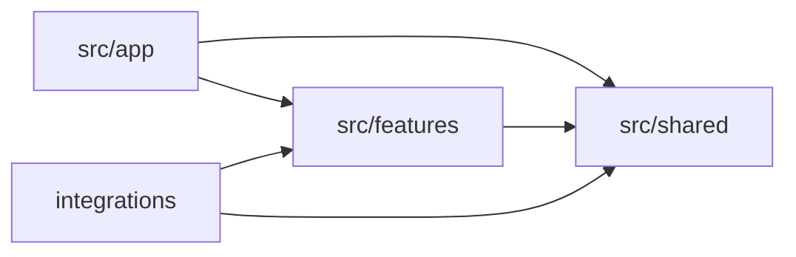

# 폴더 구조와 의존성

## 핵심 결정

Next.js는 `app` 내부 코드 배치를 허용하지만, 이 프로젝트는 라우팅과 구현을 분리한다.

```text
src/
├── app/                           # URL, 레이아웃, Route Handler, 메타데이터
├── features/                      # 사용자 가치 또는 비즈니스 기능 단위
│   └── refund-request/
│       ├── actions/               # Server Action 진입점
│       ├── api/                   # 외부/내부 API 어댑터
│       ├── components/            # 기능 전용 UI
│       ├── constants/             # 기능 전용 상수
│       ├── hooks/                 # 기능 전용 Client hook
│       ├── lib/                   # 순수 계산과 기능 내부 유틸리티
│       ├── schemas/               # 입출력 검증 스키마
│       ├── server/                # DB, 비밀값, 서버 전용 로직
│       ├── types/                 # 기능 전용 타입
│       └── index.ts               # 다른 feature에 공개하는 유일한 진입점
└── shared/                        # 비즈니스 의미가 없는 공용 코드
    ├── components/
    │   ├── ui/                    # Button, Input 등 공용 UI primitive
    │   └── layout/                # 공용 shell과 비즈니스 중립 조합 UI
    ├── config/                    # 공용 설정
    ├── constants/                 # 전역 상수
    ├── hooks/                     # 범용 Client hook
    ├── lib/                       # 범용 순수 유틸리티
    ├── schemas/                   # 공용 기반 스키마
    ├── server/                    # 범용 서버 인프라
    ├── styles/                    # 전역 스타일 자원
    └── types/                     # 비즈니스 의미가 없는 공용 타입
integrations/
└── google-apps-script/            # Apps Script로 별도 배포하는 외부 실행 경계
    └── <integration-name>/
        ├── src/                   # 테스트 가능한 TypeScript 원본
        ├── Code.gs                # 원본에서 생성한 배포 artifact
        ├── appsscript.json        # Apps Script manifest
        └── README.md              # 설정, 배포, 운영 절차
```

아직 필요하지 않은 디렉터리는 미리 만들지 않는다.

## 레이어 책임

### `src/app`

- 폴더 이름으로 URL과 route group을 정의한다.
- `page.tsx`, `layout.tsx`, `loading.tsx`, `error.tsx`, `not-found.tsx`, `route.ts` 등 Next.js 특수 파일만 둔다.
- 페이지는 데이터를 준비하고 feature를 조합하는 얇은 진입점으로 유지한다.
- 재사용 가능한 UI, 비즈니스 규칙, 데이터 접근 코드를 직접 구현하지 않는다.
- Route Handler는 HTTP 계약만 처리하고 실제 처리는 feature의 server/lib로 위임한다.

### `src/features/<feature>`

- 하나의 사용자 행동, 비즈니스 능력, 변경 이유를 소유한다.
- 기능 폴더 이름은 `kebab-case`를 사용한다.
- 기능 내부 코드는 같은 feature 안에서 자유롭게 참조할 수 있다.
- 다른 feature가 사용할 계약만 루트 `index.ts`에서 명시적으로 내보낸다.
- `server/`의 모든 모듈은 `import "server-only"`를 선언한다.
- `actions/`의 모든 모듈은 파일 첫 문장에 `"use server"`를 선언한다.

### `src/shared`

- 환불, 주문, 사용자처럼 비즈니스 용어를 소유하지 않는다.
- 두 곳에서 사용된다는 이유만으로 이동하지 않는다. 변경 이유가 같은 범용 코드일 때만 shared로 승격한다.
- app이나 feature를 import하지 않는다.
- 범용 서버 클라이언트는 모듈 로드 시 초기화하지 않고 getter 내부에서 지연 초기화한다.

### `integrations/google-apps-script`

- Google Apps Script에 독립적으로 배포하는 코드와 manifest를 소유한다.
- 각 integration은 `kebab-case` 이름의 폴더 하나로 격리한다.
- 테스트 가능한 원본은 `src/`에 두고 `Code.gs`는 build script가 생성한다.
- 계산·schema 등 제품 규칙은 소유 feature의 공개 `index.ts`로만 참조한다.
- Sheet ID, Script ID, 배포 URL과 계정 자격 증명을 저장소에 기록하지 않는다.
- 테스트는 integration 원본 옆에 `*.test.ts`로 두고 실제 개인정보 fixture를 사용하지 않는다.

### 컴포넌트 공통화

- 한 feature 안에서 재사용하면 해당 feature의 `components`가 소유한다.
- 다른 feature가 사용하더라도 비즈니스 의미가 남아 있으면 소유 feature가 `index.ts`로 공개한다.
- 비즈니스 의미가 없는 UI primitive와 layout만 `shared/components`로 이동한다.
- 단순히 JSX 모양이 같다는 이유로 공통화하지 않는다. 의미, 동작, 접근성, 변경 이유가 같아야 한다.
- 공통 컴포넌트의 세부 판단과 props 설계는 `code-conventions.md`의 “공통 컴포넌트 판단”을 따른다.

## 의존성 방향



역방향 참조는 허용하지 않는다.

- `shared -> features/app` 금지
- `feature -> app` 금지
- feature 간 내부 경로 직접 참조 금지
- 다른 feature는 `@/features/<feature>`만 import
- integration도 feature 내부 경로 대신 `@/features/<feature>` 공개 진입점만 import
- 레이어를 넘을 때 `../../` 대신 `@/` 절대 경로 사용

## 파일 배치 결정표

| 질문                                                    | 배치                                        |
| ------------------------------------------------------- | ------------------------------------------- |
| URL, 레이아웃, HTTP Route Handler인가                   | `app`                                       |
| 특정 사용자 행동이나 비즈니스 규칙에 속하는가           | 해당 `feature`                              |
| 기능 전용 UI, hook, schema, 타입인가                    | 해당 `feature`                              |
| 비즈니스 의미가 없고 여러 기능이 같은 이유로 사용하는가 | `shared`                                    |
| 여러 feature가 같은 비즈니스 UI를 사용하는가            | 소유 `feature`에서 공개                     |
| 공용 UI primitive 또는 비즈니스 중립 layout인가         | `shared/components`                         |
| 브라우저 상태나 이벤트가 필요한가                       | feature/shared의 Client Component 또는 hook |
| 비밀값, DB, 서버 SDK를 사용하는가                       | feature/shared의 `server`                   |
| 외부 시스템이 호출하는 API인가                          | `app/**/route.ts` + feature 처리 로직       |
| Apps Script로 별도 배포하는 저장·전송 경계인가          | `integrations/google-apps-script/<name>`    |

판단이 어려우면 우선 feature 내부에 둔다. shared 승격은 실제 공통 변경 이유가 확인된 뒤 수행한다.

## 이름 규칙

- 일반 폴더와 파일은 `kebab-case`
- React 컴포넌트, 타입, 클래스 식별자는 `PascalCase`
- 함수, 변수, hook 식별자는 `camelCase`
- hook은 `use-*.ts` 또는 `use-*.tsx`
- 테스트는 대상 옆에 `*.test.ts` 또는 `*.test.tsx`
- Client/Server 경계를 강조할 필요가 있으면 `*.client.tsx`, `*.server.ts`
- Next.js 특수 파일 이름은 프레임워크 규칙을 그대로 사용

## 자동 검사 범위

`npm run check:architecture`는 다음을 실패 처리한다.

- 합의되지 않은 `src` 최상위 디렉터리
- `app` 안의 일반 구현 파일
- feature/shared의 합의되지 않은 하위 디렉터리
- 일반 소스 파일의 이름 규칙 위반
- 역방향 의존성
- 다른 feature 내부 경로 직접 참조
- 서버 경계 선언 누락

검사가 표현하지 못하는 “페이지가 충분히 얇은가”, “공통화 기준을 만족하는가”, “shared가 정말 범용인가”는 PR 리뷰에서 판단한다.
