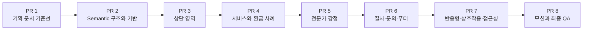

# 랜딩 페이지 PR 로드맵

## 문서 목적

이 문서는 [랜딩 페이지 구현 기획](landing-page-implementation.md)을 실제 코드 변경으로 옮길 때 사용할 PR 단위 실행 계획이다. 각 PR은 하나의 주된 검토 목적을 가지며, 독립적으로 `npm run check`를 통과하고 다음 PR이 의존할 수 있는 안정적인 기준선을 남겨야 한다.

구현 PR은 한 번에 하나씩 진행한다. 앞 PR이 merge된 뒤 `main`을 최신 상태로 갱신하고 다음 branch를 만든다. 별도 합의 없이 여러 PR을 병렬 또는 stacked 상태로 열지 않는다.

## 분할 원칙

- 폴더·콘텐츠·공개 계약은 시각 세부 구현보다 먼저 고정한다.
- 각 section의 에셋과 스타일은 해당 section을 구현하는 PR에서 함께 추가한다.
- Figma 컴포넌트 모음을 기준으로 shared UI PR을 별도로 만들지 않는다.
- `shared/components`는 모든 PR에서 비워 둔다.
- 연락처 값처럼 실제 변경 이유가 같은 데이터만 feature 내부 상수로 공유한다.
- desktop 정적 화면이 완성되기 전에 motion을 추가하지 않는다.
- 반응형·접근성은 특정 section의 후처리가 아니라 전체 페이지 계약으로 한 PR에서 검수한다.
- PR 설명과 checklist에는 실제 diff와 실행한 검사만 기록한다.
- 각 PR이 merge되기 전에는 다음 PR을 시작하지 않는 것을 기본으로 한다.

## 전체 순서



| PR   | 검토 목적                          | 주요 결과물                                  | 선행 PR |
| ---- | ---------------------------------- | -------------------------------------------- | ------- |
| PR 1 | 구현 기준 문서 확정                | 구현 기획과 PR 로드맵                        | 없음    |
| PR 2 | URL·콘텐츠·레이어 계약 확정        | 전체 semantic section과 feature 공개 진입점  | PR 1    |
| PR 3 | 상단 desktop 시각 구현             | 헤더, 히어로, 센터 소개                      | PR 2    |
| PR 4 | 서비스와 실적 desktop 시각 구현    | 혜택, 환급 사례                              | PR 3    |
| PR 5 | 전문가 강점 desktop 시각 구현      | 도입부와 세 강점 section                     | PR 4    |
| PR 6 | 하단 desktop 시각 구현과 화면 완성 | 환급 절차, 문의 CTA, 푸터                    | PR 5    |
| PR 7 | 모든 viewport와 조작 방식 완성     | 반응형, active 상태, keyboard, 접근성        | PR 6    |
| PR 8 | Figma motion과 최종 시각 완성      | CSS 타임라인, reduced motion, 전체 visual QA | PR 7    |

PR 1부터 PR 7까지는 motion이 없는 상태를 정상 상태로 간주한다. PR 8이 merge되기 전에도 모든 콘텐츠와 연락 동작은 사용할 수 있어야 한다.

## 공통 PR 규칙

### Branch와 commit

- branch는 PR 목적 하나만 표현한다.
- commit은 Conventional Commits 형식을 사용하고 제목은 한국어로 작성한다.
- 한 PR 안에 무관한 정리, dependency update, 설정 변경을 섞지 않는다.
- 다음 PR을 쉽게 만들기 위한 미사용 component나 추측성 abstraction을 앞 PR에 넣지 않는다.

### 필수 검사

모든 PR에서 아래 명령을 실행한다.

```bash
npm run check
git diff --check
```

UI를 변경한 PR은 추가로 해당 PR의 viewport와 Figma node를 수동 비교한다. 실행하지 않은 검사를 PR 본문에서 완료했다고 표시하지 않는다.

### 공통 비범위

- 문의 폼, Server Action, Route Handler
- 이메일 발송, CRM, 데이터베이스
- 관리자 페이지
- analytics와 광고 script
- 별도 모바일 디자인 시스템
- 아이콘 package
- `motion/react` 등 motion dependency
- Figma 컴포넌트 목록을 근거로 한 shared UI library

## PR 1. 랜딩 페이지 구현 계획 문서화

### Metadata

| 항목        | 값                                                   |
| ----------- | ---------------------------------------------------- |
| 권장 branch | `docs/landing-page-plan`                             |
| 권장 제목   | `랜딩 페이지 구현 계획 문서화`                       |
| 권장 commit | `docs(planning): 랜딩 페이지 구현 및 PR 계획 문서화` |
| 선행 PR     | 없음                                                 |

### 목적

코드를 작성하기 전에 Figma 해석, 콘텐츠 계약, 공통화 금지 원칙, 반응형·접근성·motion 정책과 PR 순서를 review 가능한 기준선으로 확정한다.

### 포함 변경

- `docs/planning/landing-page-implementation.md`
- `docs/planning/landing-page-pr-roadmap.md`
- 두 문서 사이의 상호 링크
- Figma node와 source 우선순위
- 공개 전 콘텐츠 확인 항목

### 제외 변경

- `src` 변경
- 에셋 다운로드
- dependency와 package script 변경
- application runtime 변경

### Reviewer 확인점

- `37:512`를 공통 component 기준으로 사용하지 않는 원칙이 명확한가
- 전화번호 `010-2225-0555`와 이메일 계약이 일관적인가
- 모바일 디자인을 발명하지 않는 responsive 정책이 명확한가
- motion이 마지막 PR로 분리되어 있는가
- 콘텐츠 확인 필요 항목이 숨겨지지 않았는가

### 완료 조건

- 두 문서만 변경되어 있다.
- Markdown link와 Figma node link가 올바르다.
- `npm run check`와 `git diff --check`가 통과한다.

## PR 2. 랜딩 페이지 Semantic 구조와 콘텐츠 기반 구현

### Metadata

| 항목        | 값                                                   |
| ----------- | ---------------------------------------------------- |
| 권장 branch | `feat/landing-semantic-foundation`                   |
| 권장 제목   | `랜딩 페이지 구조 및 콘텐츠 기반 구현`               |
| 권장 commit | `feat(landing): 랜딩 페이지 구조와 콘텐츠 기반 추가` |
| 선행 PR     | PR 1                                                 |

### 목적

시각 세부 구현 전에 `/`의 전체 정보 구조, section 순서, anchor, 연락 링크, feature 공개 API와 Server/Client 기본 경계를 고정한다.

### 포함 변경

- `src/app/page.tsx`를 `LandingPage` 조합만 담당하는 route로 변경
- `src/features/landing-page/index.ts`에서 `LandingPage`만 공개
- 구현 기획에 정의된 9개 section의 semantic component 생성
- `header`, `nav`, `main`, `section`, `footer`, `address` landmark 구성
- `#top`, `#about`, `#services`, `#strengths`, `#process`, `#contact` anchor 생성
- 전화번호, 이메일, 상담시간과 section 콘텐츠 상수 정의
- `tel:01022250555`, `mailto:iwillceo@naver.com` 링크 연결
- `layout.tsx`의 한국어 문서 언어와 페이지 metadata 정리
- 반복 근거가 확인된 brand color와 1280px container token 기반 추가
- 내보내는 함수와 상수에 필요한 TSDoc 작성

이 PR에서는 전체 텍스트가 DOM에 존재해야 하지만 Figma의 정밀한 이미지, card, background, motion은 구현하지 않는다.

### 예상 변경 영역

```text
src/app/
├── layout.tsx
└── page.tsx

src/features/landing-page/
├── components/
├── constants/
└── index.ts

src/shared/styles/
└── theme.css
```

필요한 폴더만 생성한다. `types`, `hooks`, `lib` 등 사용하지 않는 폴더를 미리 만들지 않는다.

### 공개 계약

```ts
export { LandingPage } from "./components/landing-page";
```

- 다른 feature가 내부 component나 콘텐츠 상수를 import할 수 없게 한다.
- `page.tsx`는 `@/features/landing-page` 공개 진입점만 사용한다.
- backend API, form action, query parameter는 추가하지 않는다.

### 제외 변경

- Figma 래스터와 SVG 에셋
- 정밀 desktop 레이아웃
- 혜택 active 상태
- 환급 사례 자동 이동
- responsive grid
- motion

### Reviewer 확인점

- section 순서와 heading 계층이 구현 기획과 일치하는가
- `app`에 일반 UI 구현이 들어가지 않았는가
- 연락처가 중복 literal이 아니라 feature 상수에서 공급되는가
- `LandingPage` 외 feature 공개 API가 불필요하게 넓지 않은가
- Client Component가 아직 필요하지 않은 곳에 추가되지 않았는가

### 검수

- `/`에서 모든 section heading과 콘텐츠를 순서대로 확인
- 모든 header anchor의 대상 `id` 존재 확인
- 전화·이메일 링크의 `href` 확인
- `h1` 하나와 `h2`·`h3` 계층 확인
- `npm run check`

### 완료 조건

- `/`가 전체 콘텐츠를 semantic 순서로 제공한다.
- 모든 anchor와 연락 링크가 동작한다.
- Figma parity가 아직 완료되지 않았음을 PR 본문에 명시한다.
- build와 architecture 검사를 통과한다.

## PR 3. 랜딩 페이지 상단 영역 구현

### Metadata

| 항목        | 값                                               |
| ----------- | ------------------------------------------------ |
| 권장 branch | `feat/landing-upper-sections`                    |
| 권장 제목   | `랜딩 페이지 상단 영역 구현`                     |
| 권장 commit | `feat(landing): 헤더와 히어로 및 센터 소개 구현` |
| 선행 PR     | PR 2                                             |

### 목적

헤더, 히어로, 센터 소개를 1920px Figma 기준으로 구현해 랜딩 페이지의 브랜드, 첫 전환 경로, 신뢰 정보 영역을 완성한다.

### 포함 변경

- Figma `37:559` 헤더 시각 구현
- Figma `37:589` 히어로 배경, overlay, heading, 전화·이메일 CTA 구현
- Figma `84:1269` 센터 소개, 구성원, 센터장 소개 구현
- 상단 영역에서 사용하는 SVG와 PNG만 MCP 원본으로 추가
- Pretendard 원본 확보 여부를 확인하고 font stack 적용
- Noto Sans KR fallback 적용
- `next/image`의 width, height 또는 fill container 설정
- desktop 1920px와 1280px container 정렬
- 상단 영역의 장식 이미지와 센터장 사진 alt 정책 적용

### 에셋 범위

```text
public/assets/landing/icons/
├── logo.svg
├── phone.svg
├── chat.svg
├── email.svg
└── more.svg

public/assets/landing/images/
├── hero-refund-desk.png
├── center-introduction-background.png
├── center-member-placeholder.svg
└── center-director.png
```

실제 export 결과에 따라 확장자는 원본 형식을 유지한다. 동일 의미 파일을 PNG와 SVG로 중복 저장하지 않는다.

### 제외 변경

- 서비스·혜택 이하 section의 정밀 스타일
- 모바일 재배치
- 혜택 Client 상태
- motion
- sticky header
- 모바일 hamburger menu

### Reviewer 확인점

- header menu가 button이 아니라 anchor인가
- logo, phone, email, free diagnosis 링크가 기존 공개 계약을 사용하는가
- 배경 이미지가 정보 이미지로 중복 노출되지 않는가
- 센터장 사진에만 정보성 alt가 있는가
- Figma component reference를 공통 button API로 번역하지 않았는가

### 시각 검수

- 전체 페이지 상단을 Figma `27:373`과 비교
- 헤더 `37:559`
- 히어로 `37:589`
- 센터 소개 `84:1269`
- 배경 `84:949`
- 센터장 이미지 `83:711`

### 완료 조건

- 1920px에서 상단 세 영역의 위치, 크기, 이미지 crop, overlay가 Figma와 일치한다.
- 전화·이메일 링크가 유지된다.
- viewport 1280px에서 페이지 전체 가로 스크롤이 발생하지 않는다.
- `npm run check`가 통과한다.

## PR 4. 서비스 혜택과 환급 사례 구현

### Metadata

| 항목        | 값                                            |
| ----------- | --------------------------------------------- |
| 권장 branch | `feat/landing-services-cases`                 |
| 권장 제목   | `주요 서비스 및 환급 사례 구현`               |
| 권장 commit | `feat(landing): 서비스 혜택과 환급 사례 구현` |
| 선행 PR     | PR 3                                          |

### 목적

센터의 네 가지 서비스 혜택과 8개 익명 환급 사례를 desktop 정적 화면으로 구현한다.

### 포함 변경

- Figma `38:1054`, `38:1023` 혜택 section 시각 구현
- 네 가지 혜택 이미지와 제목 렌더링
- 첫 혜택이 활성화된 desktop 기본 상태
- Figma `130:540`의 8개 사례 데이터와 card 시각 구현
- 사례 card 646 × 416px, 24px gap, overlay와 환급 금액 capsule 적용
- 사례 목록 내부 native 가로 overflow 제공
- 혜택과 사례 이미지 variant를 개별 semantic 파일로 export
- 카드 background는 장식 이미지로 처리

이 PR에서 혜택은 Figma의 첫 active 상태를 정적으로 표시한다. hover, keyboard, touch에 따른 active 변경은 PR 7에서 Client 경계와 함께 추가한다.

### 에셋 범위

```text
public/assets/landing/images/
├── benefit-hidden-premium.png
├── benefit-labor-attorney-review.png
├── benefit-maximum-refund.png
├── benefit-aftercare.png
├── refund-case-office.png
├── refund-case-construction.png
├── refund-case-service.png
└── refund-case-records.png
```

### 제외 변경

- 혜택 active 상태 변경
- 사례 자동 이동과 복제 track
- hover 또는 focus pause
- reduced motion
- 768px·375px 최종 레이아웃

### Reviewer 확인점

- 혜택과 사례가 하나의 generic card component로 합쳐지지 않았는가
- 8개 사례의 업종, 기업명 마스킹, 금액이 기획과 일치하는가
- Figma sprite 대신 개별 variant asset을 사용하는가
- 가로 overflow가 사례 section 내부로 제한되는가
- 카드 이미지 alt가 중복 정보를 만들지 않는가

### 시각 검수

- 혜택 `38:1023`
- 혜택 이미지 `57:135`
- 사례 track `130:540`
- 사례 이미지 `130:642`

### 완료 조건

- desktop에서 혜택 4개와 사례 8개가 모두 표시된다.
- 사례 목록을 수동 가로 스크롤로 탐색할 수 있다.
- 페이지 root에 가로 스크롤이 생기지 않는다.
- `npm run check`가 통과한다.

## PR 5. 전문가 강점 섹션 구현

### Metadata

| 항목        | 값                                     |
| ----------- | -------------------------------------- |
| 권장 branch | `feat/landing-expert-strengths`        |
| 권장 제목   | `전문가 강점 섹션 구현`                |
| 권장 commit | `feat(landing): 전문가 강점 섹션 구현` |
| 선행 PR     | PR 4                                   |

### 목적

전문가 도입부와 비대면 상담, 성공 보수형 수수료, 정보 보안의 세 강점을 desktop 기준으로 구현한다.

### 포함 변경

- Figma `41:1880` 전문가 도입부
- `비대면 전국 상담`, `성공 보수형 수수료`, `100% 정보 보안` badge
- Figma `41:2038`, `42:2058`, `42:2067` 텍스트 section
- 세 강점의 이미지·텍스트 교차 desktop 배치
- `globe.svg`, `percent.svg`, `lock.svg` 추가
- `60:2462`–`60:2465` 이미지 variant 추가
- DOM은 heading, 설명, 이미지 순서로 유지하고 CSS에서 desktop 위치만 교차

### 제외 변경

- reveal animation
- 이미지 bounce
- responsive 1열 최종 배치
- 보안 claim 내용 변경
- shared `FeatureSection` 또는 generic alternating component 승격

구조가 같은 세 강점은 `ExpertStrengthsSection` feature 내부에서 data-driven rendering을 사용할 수 있다. 다만 환급 절차나 다른 feature와 합치지 않는다.

### Reviewer 확인점

- 세 강점의 정보 구조와 문구가 Figma와 일치하는가
- CSS 시각 순서와 무관하게 DOM 읽기 순서가 자연스러운가
- 아이콘과 이미지가 인접 텍스트를 중복해서 읽히지 않는가
- 96px·48px typography가 desktop 기준을 유지하는가
- motion library가 추가되지 않았는가

### 시각 검수

- 전문가 도입부 `41:1880`
- 비대면 상담 `41:2038`
- 성공 보수형 수수료 `42:2058`
- 정보 보안 `42:2067`

### 완료 조건

- desktop에서 도입부와 세 강점이 Figma 순서로 보인다.
- section heading 계층이 유지된다.
- 자동 motion 없이 모든 콘텐츠가 최종 위치에서 보인다.
- `npm run check`가 통과한다.

## PR 6. 환급 절차와 문의·푸터 구현

### Metadata

| 항목        | 값                                             |
| ----------- | ---------------------------------------------- |
| 권장 branch | `feat/landing-process-contact`                 |
| 권장 제목   | `환급 절차 및 문의 영역 구현`                  |
| 권장 commit | `feat(landing): 환급 절차와 문의 및 푸터 구현` |
| 선행 PR     | PR 5                                           |

### 목적

환급 4단계, 사후관리, 하단 문의 CTA, 법률·사업자 푸터를 구현해 desktop 정적 페이지를 완성한다.

### 포함 변경

- Figma `41:1789`, `41:1797`, `41:1805`, `41:1813` 절차 카드
- 사후관리 컨설팅 안내
- `ol` 기반 단계 semantics
- Figma `42:2560` 전화·이메일 문의 CTA
- CTA 전화번호를 `010-2225-0555`로 정규화
- Figma `42:2638` 푸터
- 연락처, 주소, 법률 서비스 고지, 사업자 정보
- process, CTA, footer에 필요한 이미지와 icon 추가
- desktop 전체 section 순서와 간격 조정

### 에셋 범위

```text
public/assets/landing/icons/
├── arrow-up-right.svg
└── location.svg

public/assets/landing/images/
├── process-consultation.png
├── process-analysis.png
├── process-documents.png
├── process-refund-complete.png
└── process-background.png
```

### 제외 변경

- 절차 card pulse
- CTA와 footer의 최종 모바일 적층
- 주소 지도 링크
- 문의 form
- 개인정보 저장 또는 제출

### Reviewer 확인점

- 절차가 순서 있는 목록으로 구현되었는가
- CTA card 전체가 실제 `<a>`인가
- 모든 전화·이메일 link가 단일 연락처 상수를 사용하는가
- footer 주소에 임의 지도 URL이 추가되지 않았는가
- `010-2225-0005`가 코드나 콘텐츠에 남지 않았는가

### 시각 검수

- 절차 card `41:1789`, `41:1797`, `41:1805`, `41:1813`
- CTA `42:2560`
- 푸터 `42:2638`
- 1920px 전체 페이지 `27:373`

### 완료 조건

- 9개 section의 desktop 정적 화면이 모두 구현되어 있다.
- 페이지의 모든 연락 동작이 연결되어 있다.
- footer 사업자 정보가 줄임 없이 표시된다.
- motion 없이 Figma 전체 순서와 정적 상태를 검수할 수 있다.
- `npm run check`가 통과한다.

## PR 7. 반응형·상호작용·접근성 구현

### Metadata

| 항목        | 값                                             |
| ----------- | ---------------------------------------------- |
| 권장 branch | `feat/landing-responsive-a11y`                 |
| 권장 제목   | `랜딩 페이지 반응형 및 접근성 구현`            |
| 권장 commit | `feat(landing): 반응형 레이아웃과 접근성 적용` |
| 선행 PR     | PR 6                                           |

### 목적

완성된 desktop 정적 화면을 1280px, 768px, 375px에서 안전하게 재배치하고 mouse, keyboard, touch로 동일한 콘텐츠와 기능에 접근할 수 있게 한다.

### 포함 변경

- 컨테이너 padding을 `clamp(20px, 2.35vw, 45px)` 기준으로 조정
- 1280px, 768px breakpoint의 section grid 전환
- 375px에서 헤더, CTA, 주소, 긴 한국어의 overflow 방지
- header를 logo, 2열 메뉴, 연락 액션 순서로 wrap
- 모바일 hamburger를 만들지 않고 모든 메뉴를 노출
- 구성원 6열 → 3열 → 2열
- 혜택 4열 → 2열 → 1열
- 환급 사례 card 유동 폭과 touch 가로 스크롤
- 강점 교차 배치 → 1열
- 절차 4열 → 2열 → 1열
- CTA와 footer 1열 적층
- `BenefitsSection`에만 `"use client"` 적용
- 혜택 첫 항목 기본 active, hover·focus·click/tap 상태 변경
- `aria-expanded`, `aria-controls` 연결
- 모든 link와 button의 `focus-visible`
- heading, landmark, address, image alt 최종 점검
- 200% 확대와 keyboard tab 순서 확인

### 공개 계약

anchor와 연락 링크 계약은 변경하지 않는다. 이 PR의 Client 경계는 `BenefitsSection` 내부 상태에만 한정한다.

### 제외 변경

- 자동 motion
- 사례 자동 이동
- scroll-trigger JavaScript
- hamburger menu와 navigation drawer
- 전역 상태와 Context
- motion dependency

### Reviewer 확인점

- `"use client"`가 혜택 section보다 넓게 전파되지 않았는가
- hover가 없어도 touch와 keyboard로 active 콘텐츠를 확인할 수 있는가
- CSS `order`가 keyboard 읽기 순서를 바꾸지 않는가
- 사례 목록 외 페이지 가로 스크롤이 없는가
- 이미지 alt와 `aria-hidden`이 기획과 일치하는가

### viewport 검수

| viewport | 필수 확인                                                                |
| -------- | ------------------------------------------------------------------------ |
| 1920px   | 기존 desktop parity가 회귀하지 않음                                      |
| 1280px   | 컨테이너 수축, heading·card 겹침 없음                                    |
| 768px    | grid 전환과 논리적 읽기 순서                                             |
| 375px    | 연락처·주소·사업자 정보 줄바꿈, 최소 touch 영역, root 가로 overflow 없음 |

### 기능·접근성 검수

- anchor 6개 동작
- 전화·이메일 link 동작
- 혜택 mouse, keyboard, touch 선택
- `h1` 하나와 heading 순서
- landmark 중첩
- focus-visible
- 200% zoom
- 장식 이미지와 정보 이미지 구분

### 완료 조건

- 1920px에서 desktop 시각이 유지된다.
- 1280px, 768px, 375px에서 콘텐츠 손실이 없다.
- hover 없이 모든 동작을 수행할 수 있다.
- 사례 목록을 제외한 root 가로 스크롤이 없다.
- `npm run check`가 통과한다.

## PR 8. 랜딩 페이지 모션과 최종 시각 검수

### Metadata

| 항목        | 값                                                |
| ----------- | ------------------------------------------------- |
| 권장 branch | `feat/landing-motion`                             |
| 권장 제목   | `랜딩 페이지 모션 및 시각 완성`                   |
| 권장 commit | `feat(landing): Figma 모션과 최종 시각 상태 반영` |
| 선행 PR     | PR 7                                              |

### 목적

Figma MCP의 28.020507초 motion timeline을 CSS로 구현하고 전체 페이지의 마지막 시각 차이와 reduced-motion 동작을 검수한다.

### 포함 변경

- `--landing-motion-duration: 28.020507s`
- 혜택 section opacity·translate reveal
- 환급 사례 track `translateX(0)` → `translateX(-2679px)` linear infinite
- 전문가 도입 텍스트와 이미지의 좌우 reveal
- 세 강점 이미지의 20px vertical 강조
- 세 강점 텍스트 reveal
- 절차 카드의 순차 1.08배 pulse
- 공통 keyframes와 section별 animation timing
- 사례 track의 hover·focus pause
- `prefers-reduced-motion: reduce` 정적 최종 상태
- 1920px 전체 페이지와 section별 최종 Figma 비교
- 1280px, 768px, 375px motion 회귀 확인

동일 animation class를 재사용하더라도 의미가 다른 business component를 합치지 않는다.

### 제외 변경

- `motion/react`
- JavaScript animation controller
- IntersectionObserver 기반 scroll trigger
- 새 carousel package
- layout과 content의 대규모 재설계
- Figma에 없는 decorative motion 추가

### Reviewer 확인점

- CSS만으로 motion이 구현되었는가
- `prefers-reduced-motion`에서 opacity와 transform이 최종 정적 상태인가
- 사례 자동 이동이 focus와 touch 조작을 방해하지 않는가
- duplicate 사례가 screen reader와 tab 순서에서 제외되는가
- animation이 layout shift를 만들지 않는가
- motion을 위해 Server Component가 Client Component로 바뀌지 않았는가

### 최종 검수

- Figma 전체 페이지 `27:373`
- Figma `get_motion_context`의 14개 animated node
- 1920px 전체 screenshot
- section별 screenshot
- 1280px, 768px, 375px
- `prefers-reduced-motion: reduce`
- keyboard navigation과 focus pause
- `npm run check`
- `git diff --check`

### 완료 조건

- 새 runtime dependency 없이 Figma motion을 재현한다.
- reduced motion에서 모든 콘텐츠가 보이고 자동 반복이 없다.
- desktop parity와 responsive layout이 회귀하지 않는다.
- 이 PR 이후 구현 기획의 모든 범위가 완료된다.

## PR별 완료 추적표

PR을 열 때 실제 상태에 맞게 아래 표를 갱신한다. 구현하거나 검증하지 않은 항목은 완료로 표시하지 않는다.

| PR   | 상태         | `npm run check` | Figma 비교       | Merge SHA |
| ---- | ------------ | --------------- | ---------------- | --------- |
| PR 1 | 병합 (#3)    | 통과            | 문서 검토        | `f9e5151` |
| PR 2 | 병합 (#4)    | 통과            | 원문 대조        | `9015c58` |
| PR 3 | 병합 (#5)    | 통과            | 상단 비교        | `d88c002` |
| PR 4 | 병합 (#6)    | 통과            | 서비스·사례 비교 | `070dcd6` |
| PR 5 | 검토 중 (#7) | 통과            | 전문가 강점 비교 | 해당 없음 |
| PR 6 | 예정         | 미실행          | 미실행           | 해당 없음 |
| PR 7 | 예정         | 미실행          | 회귀 비교        | 해당 없음 |
| PR 8 | 예정         | 미실행          | 미실행           | 해당 없음 |

이 표는 실제 PR 번호, 실행 명령, merge 결과가 생긴 시점에만 갱신한다. 계획 단계에서 PR 번호나 test 성공을 미리 기록하지 않는다.
