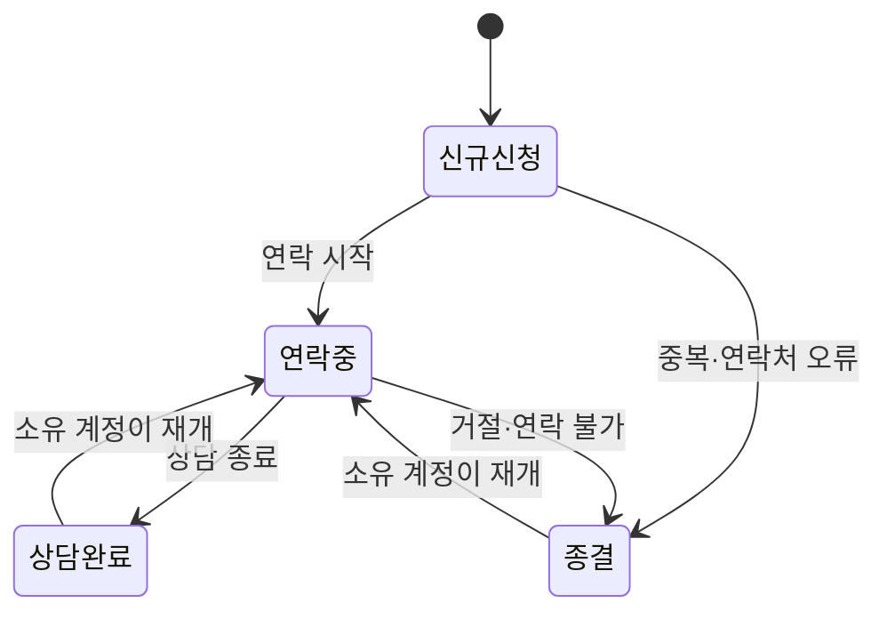
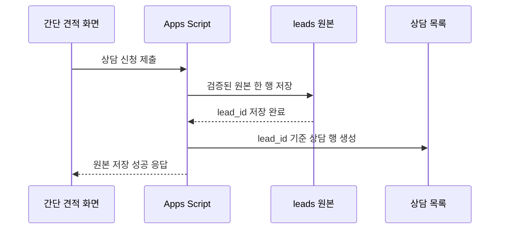

# 간단 견적 상담 목록 설계

## 문서 목적

이 문서는 간단 견적 신청을 저장하는 기술 원본 `leads`와 상담 담당자가 실제 업무에 사용하는 `상담 목록`을 분리하는 기준을 정의한다. 상담 담당자는 영문 컬럼명, 내부 코드, 계산 규칙 버전을 해석하지 않고도 신규 신청을 확인하고 담당자를 배정하며 연락 상태를 관리할 수 있어야 한다.

이 문서는 사람용 Google Sheets 화면의 정보 구조, 한글 용어, 수정 권한, 상태 전이, 원본 동기화와 알림 경계를 다룬다. 현재 운영 Sheet를 즉시 변경하거나 상담 계정에 접근 권한을 부여하는 문서는 아니다. 실제 Sheet 변경과 권한 부여는 후속 구현·운영 PR과 별도 승인을 거친다.

## 관련 문서

- [간단 견적 리드 수집 기능 기획](quick-estimate-lead-collection.md)
- [간단 견적 리드 수집 기술 설계](quick-estimate-technical-design.md)
- [간단 견적 기능 PR 로드맵](quick-estimate-pr-roadmap.md)
- [간단 견적 운영 runbook](../operations/quick-estimate-runbook.md)
- [Google Apps Script integration 운영 문서](../../integrations/google-apps-script/quick-estimate/README.md)

## 확정한 방향

- `leads`는 Apps Script와 개발자가 사용하는 제출 원본·동의 증빙으로 유지한다.
- 상담 담당자가 `leads`의 24개 영문 컬럼을 직접 업무 화면으로 사용하지 않는다.
- 같은 Spreadsheet에 사람용 `상담 목록` 탭을 추가한다.
- 상담 목록의 탭 이름, 컬럼 이름, 선택값, 안내와 오류는 한글을 기본으로 한다.
- 영문 코드와 기술 식별자는 내부 동기화에만 사용하고 상담 담당자 화면에서는 숨긴다.
- 기존 `leads` header 순서와 의미를 변경하지 않는다.
- 자유 입력 상담 메모를 기본 제공하지 않는다.
- 상담 담당자는 원본 제출값을 수정하지 않고 배정·상태·연락 일정·결과만 운영한다.

## 현재 구조의 한계

현재 Spreadsheet는 다음 두 탭으로 구성된다.

```text
간단 견적 리드 저장소
├── leads       # 24개 영문 컬럼의 제출 원본과 동의 증빙
└── codebook    # 기술 컬럼과 허용 코드 설명
```

`leads`에는 중복 방지 식별자, 계산 난수, 규칙 버전, 동의 버전처럼 접수 증빙과 장애 조사에 필요한 값이 포함된다. 이 값은 상담 업무에서 매번 확인할 필요가 없고 영문 코드와 UTC 시각을 그대로 노출하면 다음 문제가 생긴다.

- 상담에 필요한 회사명과 연락처를 찾기 어렵다.
- `NEW`, `TRUE`, 업종 코드처럼 내부 값을 상담 담당자가 직접 해석해야 한다.
- 원본 제출값과 상담 담당자가 수정할 값을 구분하기 어렵다.
- 여러 상담 담당자가 같은 신청에 중복 연락할 수 있다.
- 다음 연락 일정과 상담 결과를 구조화해서 관리할 수 없다.
- 기술 원본을 정렬하거나 수정하는 과정에서 동의 증빙이 훼손될 수 있다.

## 목표 구조

```text
간단 견적 리드 저장소
├── 상담 목록   # 상담 담당자가 매일 사용하는 한글 업무 화면
├── leads       # Apps Script가 저장하는 기술 원본, 직접 수정 금지
└── codebook    # 개발·운영용 내부 코드 설명
```

`상담 목록`은 원본 데이터의 복사본이 아니라 `lead_id`로 원본과 연결되는 업무용 투영이다. 원본 제출과 동의의 단일 기준은 `leads`, 담당자 배정과 상담 처리의 단일 기준은 `상담 목록`으로 분리한다.

### 책임 구분

| 구분      | 단일 기준   | 수정 주체               | 주요 내용                                   |
| --------- | ----------- | ----------------------- | ------------------------------------------- |
| 접수 원본 | `leads`     | Apps Script             | 연락처, 견적 입력·결과, 계산·동의 버전      |
| 상담 업무 | `상담 목록` | 상담 담당자·Apps Script | 배정, 상담 상태, 최초 연락, 다음 연락, 결과 |
| 내부 설명 | `codebook`  | 소유 계정               | 원본 컬럼, 내부 코드, 보유·파기 정책        |

`leads`의 기존 `lead_status`, `handled_at`은 현재 계약과의 호환을 위해 상담 목록의 상태와 최초 연락 시각을 반영하는 값으로 유지한다. 상담 담당자는 두 컬럼도 원본 탭에서 직접 수정하지 않고 상담 목록을 통해 변경한다.

## 한글 중심 용어 원칙

상담 화면에서는 업무상 통용되는 이메일과 Google 같은 고유 명칭을 제외하고 불필요한 영어 표현을 사용하지 않는다. 영문 내부 값이 필요한 경우 Apps Script가 한글 표시값과 상호 변환한다.

| 내부 표현          | 상담 화면 표시   | 표시 원칙                                      |
| ------------------ | ---------------- | ---------------------------------------------- |
| `lead`             | 상담 신청        | 리드라는 영업 용어를 노출하지 않는다.          |
| `lead_status`      | 상담 상태        | 컬럼명과 안내에서 같은 표현을 사용한다.        |
| `assigned_to`      | 상담 담당자      | 고객 측 담당자와 구분한다.                     |
| `contact_name`     | 고객 담당자      | 내부 상담 담당자와 혼동하지 않게 한다.         |
| `handled_at`       | 최초 연락 일시   | 최초 처리보다 실제 업무 행동을 명확히 적는다.  |
| `next_action_at`   | 다음 연락 예정일 | 후속 조치, 팔로업 같은 표현을 사용하지 않는다. |
| `marketing_agreed` | 마케팅 활용 동의 | `TRUE`, `FALSE`를 표시하지 않는다.             |
| `NEW`              | 신규 신청        | 아직 연락하지 않은 신청을 뜻한다.              |
| `CONTACTING`       | 연락 중          | 한 번 이상 연락을 시작한 상태다.               |
| `COMPLETED`        | 상담 완료        | 요청한 상담이 완료된 상태다.                   |
| `CLOSED`           | 종결             | 더 이상 연락하지 않는 상태다.                  |

업종도 `industrial_manufacturing` 같은 내부 코드 대신 `제조·자동차·반도체`처럼 사용자 화면과 같은 한글 이름을 표시한다.

## 상담 목록 컬럼

상담 담당자가 자주 확인하는 순서대로 왼쪽부터 배치한다. 내부 식별자는 동기화에 필요하지만 일상 업무에서는 숨긴다.

| 순서 | 상담 화면 컬럼   | 값·표시 형식                                 | 수정 주체   | 원본·내부 연결        |
| ---- | ---------------- | -------------------------------------------- | ----------- | --------------------- |
| 1    | 상담 상태        | 한글 선택 목록                               | 상담 담당자 | `lead_status`         |
| 2    | 상담 담당자      | 승인된 담당자 한글 이름                      | 상담 담당자 | 상담 목록 전용        |
| 3    | 접수 일시        | `2026. 08. 10. 오전 10:18`                   | 수정 금지   | `submitted_at`        |
| 4    | 회사명           | 제출한 회사명                                | 수정 금지   | `company_name`        |
| 5    | 고객 담당자      | 제출한 담당자 이름                           | 수정 금지   | `contact_name`        |
| 6    | 전화번호         | `010-0000-0000` 형태의 텍스트                | 수정 금지   | `phone`               |
| 7    | 이메일           | 제출한 이메일                                | 수정 금지   | `email`               |
| 8    | 업종             | 사용자에게 표시한 한글 업종명                | 수정 금지   | `industry_code`       |
| 9    | 사원 수          | `100명`                                      | 수정 금지   | `employee_count`      |
| 10   | 예상 환급액      | `10,870,000원`                               | 수정 금지   | `estimate_amount_krw` |
| 11   | 최초 연락 일시   | 상태가 처음 `연락 중`이 된 한국 시각         | Apps Script | `handled_at`          |
| 12   | 다음 연락 예정일 | 한국 날짜·시각                               | 상담 담당자 | 상담 목록 전용        |
| 13   | 상담 결과        | 승인된 한글 선택 목록                        | 상담 담당자 | 상담 목록 전용        |
| 14   | 마케팅 활용 동의 | `동의` 또는 `미동의`                         | 수정 금지   | `marketing_agreed`    |
| 15   | 마케팅 허용 방법 | `이메일`, `문자`, `이메일·문자`, `해당 없음` | 수정 금지   | `marketing_channels`  |
| 16   | 상담 신청 번호   | 기본 숨김                                    | 수정 금지   | `lead_id`             |

### 표시하지 않는 원본 값

다음 값은 접수 증빙과 장애 조사에는 필요하지만 상담 목록에는 표시하지 않는다.

- `request_id`
- 계산 난수
- 계산 규칙 버전
- 외부 기준 버전
- 개인정보 처리 근거 코드
- 개인정보·마케팅 고지 버전
- 동의 접수 시각
- 유입 경로

기술 지원이 필요할 때는 숨겨진 `상담 신청 번호`를 기준으로 소유 계정이 원본을 확인한다. 상담 담당자가 `request_id`나 원본 행 번호를 전달하도록 요구하지 않는다.

## 상담 상태와 결과

### 허용 상태 전이



- 신규 저장 행은 항상 `신규 신청`으로 시작한다.
- `연락 중`으로 처음 변경할 때만 `최초 연락 일시`를 자동 기록한다.
- 이후 상태가 바뀌어도 최초 연락 일시를 덮어쓰지 않는다.
- `상담 완료`, `종결`에서 다시 `연락 중`으로 되돌리는 작업은 소유 계정만 수행한다.
- `신규 신청`을 `종결`로 바꿀 때는 중복 신청 또는 연락처 오류 같은 결과를 함께 선택한다.

### 상담 결과 선택값

자유 입력 대신 다음 한글 선택값을 사용한다.

- 미입력
- 연결됨
- 부재
- 다시 연락 요청
- 상담 거절
- 연락처 오류
- 중복 신청
- 상담 완료

통화 내용, 급여, 보험료, 주민등록번호, 계좌정보, 첨부파일을 상담 목록에 기록하지 않는다. 추가 기록이 실제로 필요해지면 수집 목적, 접근 권한, 보유 기간과 파기 방법을 먼저 승인한다.

## 화면 구성과 서식

- `상담 목록`을 첫 번째 탭으로 배치한다.
- 첫 행과 `상담 상태`, `상담 담당자` 열을 고정한다.
- 첫 행에 필터를 적용하고 데이터 범위 밖에 임의 안내 행을 삽입하지 않는다.
- 상태는 글자와 배경색을 함께 사용하며 색만으로 의미를 전달하지 않는다.
- `신규 신청`, `연락 중`, `상담 완료`, `종결`은 서로 다른 배경색과 같은 한글 상태값을 표시한다.
- 원본 날짜는 UTC로 유지하고 상담 목록에서는 한국 시각으로 표시한다.
- 전화번호는 숫자 계산 대상이 아닌 텍스트로 표시해 앞의 `0`을 보존한다.
- 사원 수와 금액에는 각각 `명`, `원`과 천 단위 구분 기호를 표시한다.
- 원본·자동 계산 컬럼은 회색 배경과 보호 범위로 구분한다.
- 상담 담당자가 수정하는 컬럼은 흰색 배경과 선택 목록을 사용한다.
- `leads`, `codebook`은 일상 화면에서 숨길 수 있지만 숨김을 접근 통제로 간주하지 않는다.

### 기본 필터 보기

- 새로 들어온 상담
- 연락 중인 상담
- 다시 연락할 상담
- 상담이 완료된 고객
- 종결된 상담
- 상담 담당자별 목록

필터와 정렬은 상담 목록에서만 수행한다. 원본 `leads`의 행 순서는 변경하지 않는다.

## 동기화 설계

### 신규 신청 반영



- 브라우저의 접수 성공 여부는 `leads` 원본 저장으로 판정한다.
- 상담 목록은 원본에서 다시 만들 수 있는 파생 업무 화면이다.
- 동일 `lead_id`의 상담 행을 두 번 만들지 않는다.
- 원본 저장 후 상담 목록 반영이 실패하면 원본을 삭제하거나 고객에게 미접수로 안내하지 않는다.
- 상담 목록 반영 실패는 개인정보 없이 별도 오류 코드로 기록하고 재동기화 대상에 포함한다.
- 정기 재동기화가 `leads`에는 있지만 상담 목록에는 없는 신청을 복구한다.

### 상담 상태 반영

- 상담 담당자는 상담 목록의 허용 컬럼만 수정한다.
- Apps Script는 선택값과 상태 전이를 검증한다.
- 상담 상태와 최초 연락 일시는 `lead_id`로 찾은 `leads`의 `lead_status`, `handled_at`에 반영한다.
- 담당자 배정, 다음 연락 예정일, 상담 결과는 상담 목록에서만 관리한다.
- 동기화 실패 시 상담 목록의 업무 값은 유지하고 원본 반영 재시도 대상으로 표시한다.
- 행 번호는 정렬과 삽입으로 바뀔 수 있으므로 원본 연결에 사용하지 않는다.

## 알림 설계

상담 담당자가 Sheet를 계속 새로고침하지 않도록 신규 신청 저장 뒤 알림을 보낸다. 알림 수신자와 응답 시간은 운영 승인 후 확정한다.

알림에는 개인정보를 포함하지 않는다.

```text
[포리펀드] 새 상담 신청이 접수되었습니다

접수 시각: 2026. 08. 10. 오전 10:18
상담 목록에서 확인해 주세요.
```

- 회사명, 고객 담당자, 이메일, 전화번호, 예상 환급액을 메일이나 메신저 본문에 넣지 않는다.
- 알림은 승인된 업무 계정으로만 전송한다.
- 알림 실패가 고객의 원본 접수 성공을 취소하지 않는다.
- 알림 실패와 상담 목록 누락은 영업일 점검에서 구분한다.
- 알림만 믿지 않고 영업일마다 신규 신청 필터와 마지막 정상 반영 시각을 확인한다.

## 권한과 개인정보

현재 승인된 계약은 이관수 소유 계정 한 명만 Spreadsheet에 접근하는 것이다. 상담 담당자 직접 접근은 다음 조건을 승인한 뒤에만 허용한다.

- 이관수 계정 비밀번호나 인증 수단을 공동 사용하지 않는다.
- 상담 담당자별 Google 업무 계정을 개별 등록한다.
- 일반 액세스는 `제한됨`으로 유지하고 링크 공개를 사용하지 않는다.
- 승인된 상담 담당자에게만 업무상 필요한 기간 동안 접근 권한을 준다.
- 편집자가 다른 사람을 초대하거나 권한을 변경하지 못하게 한다.
- `leads`, `codebook`과 상담 목록의 자동·원본 컬럼을 보호한다.
- 담당자 변경·퇴사·업무 종료 시 접근 권한을 즉시 회수한다.
- 접근자 목록을 정기적으로 검토한다.

Google Sheets의 탭 숨김과 보호 범위는 열람 권한을 분리하지 못한다. 같은 Spreadsheet에 접근하는 상담 담당자는 기술 원본을 볼 수 있다는 전제로 개인정보 취급자로 승인해야 한다. 원본 열람까지 허용할 수 없는 인원이 생기면 별도 Spreadsheet 복제보다 먼저 전용 상담 도구 또는 CRM 전환을 검토한다.

마케팅 활용 미동의는 상담 접수를 막지 않는다. 상담 담당자는 사용자가 요청한 견적 상담 목적으로 연락할 수 있지만 `미동의` 신청을 광고성 이메일·문자 발송 대상으로 사용해서는 안 된다.

## 장애와 복구

| 상황                | 운영 원칙                                                     |
| ------------------- | ------------------------------------------------------------- |
| 원본 저장 실패      | 고객에게 접수 실패를 안내하고 기존 제출 재시도 계약을 따른다. |
| 상담 목록 생성 실패 | 원본 접수는 유지하고 재동기화와 운영 알림을 수행한다.         |
| 동일 상담 행 중복   | `lead_id` 기준 하나를 남기고 승인된 정정 절차를 따른다.       |
| 상태 동기화 실패    | 상담 목록 값을 보존하고 원본 반영을 재시도한다.               |
| 권한 오부여         | 신규 접수를 중단하고 접근 회수·영향 확인 절차를 시작한다.     |
| 한글 표시값 누락    | 내부 코드를 그대로 노출하지 않고 `확인 필요`로 표시한다.      |

상담 목록을 삭제하거나 다시 만드는 작업이 원본 `leads`를 삭제해서는 안 된다. 개인정보 파기는 상담 목록과 원본 모두를 대상으로 기존 승인 절차에 따라 수행한다.

## 구현 범위와 비범위

### 포함

- 상담 목록 탭 생성과 한글 header·서식
- 현재 원본 행의 승인된 초기 반영
- 신규 신청의 멱등 상담 행 생성
- 상태·담당자·일정·결과 선택값 검증
- 최초 연락 일시 자동 기록
- 기존 `lead_status`, `handled_at` 동기화
- 개인정보 없는 신규 신청 알림
- 누락 행 재동기화와 운영 점검 절차

### 포함하지 않음

- 웹 관리자 페이지
- 별도 데이터베이스 또는 CRM
- 자유 입력 상담 메모
- 통화 녹음과 파일 첨부
- 급여·보험료·주민등록번호 추가 수집
- 마케팅 발송 자동화
- 원본 24개 header 변경
- 상담 담당자 계정의 임의 생성 또는 권한 부여

## 검증 기준

### 자동 검증

- 원본 한 행당 상담 목록 한 행만 생성된다.
- 같은 `lead_id` 재동기화가 중복 상담 행을 만들지 않는다.
- 내부 상태와 동의값이 승인된 한글 표시값으로 변환된다.
- 허용되지 않은 상태 전이를 거부한다.
- 최초 연락 일시는 한 번만 기록된다.
- 상담 상태 변경이 올바른 원본 행에 반영된다.
- 원본 제출·동의 컬럼은 상담 목록 수정으로 바뀌지 않는다.
- 알림 payload에 회사명, 이름, 이메일, 전화번호가 포함되지 않는다.

### 실제 Sheet 검증

- 상담 목록에 영문 header와 내부 상태 코드가 보이지 않는다.
- 한국 시각, 전화번호, 사원 수와 금액 표시 형식이 유지된다.
- 상태·담당자·일정·결과만 수정할 수 있다.
- 원본·자동 컬럼과 기술 탭이 보호된다.
- 상담 담당자 계정은 다른 사용자를 초대하거나 권한을 바꿀 수 없다.
- 신규 신청, 상태 변경, 재동기화와 알림 실패를 가짜 데이터로 확인한다.
- 화면 숨김이 보안 통제가 아님을 운영 담당자가 확인한다.

## 후속 PR 단위

### PR 1. 상담 목록 설계 기준선

- 이 문서 추가
- 기존 기획·기술 설계·runbook에서 상담 목록 계약 연결
- 코드와 실제 Sheet 변경 없음

### PR 2. 상담 목록 생성과 원본 투영

- Apps Script에 상담 목록 schema·서식 생성 추가
- `lead_id` 기준 신규 행 생성과 기존 행 재동기화 구현
- 원본 저장 성공과 상담 목록 반영 실패의 경계 검증
- 실제 상담 계정 공유와 알림은 포함하지 않음

### PR 3. 상담 처리 상태 자동화

- 한글 선택값과 상태 전이 검증
- 최초 연락 일시 자동 기록
- `leads` 상태·처리 시각 동기화
- 담당자·다음 연락·결과 운영 컬럼 검증

### PR 4. 알림과 운영 인계

- 개인정보 없는 신규 신청 알림
- 알림 실패와 누락 행 운영 점검 추가
- 승인된 상담 계정의 수동 권한 설정과 회수 절차 검증
- 가짜 신청으로 실제 Sheet 종단 간 검증

## 구현 전 수동 승인 항목

- 상담 목록에 접근할 상담 담당자 계정 목록
- 상담 담당자 중 편집 권한을 받을 인원
- 알림 수신 계정과 사용할 Google 발송 주체
- 신규 신청 확인 주기와 최초 연락 목표 시간
- 상담 완료·종결 후 조기 파기 판단 주체
- 다중 상담 담당자 배정 규칙

이 항목은 저장소 코드만으로 정할 수 없다. 해당 구현 PR에 진입할 때 운영 책임자의 답변을 받은 뒤 권한과 알림 설정을 적용한다.

### 2026-08-10 초기 운영 승인

초기 운영은 이관수 소유 계정 한 명으로 제한한다.

| 항목               | 승인값                                                           |
| ------------------ | ---------------------------------------------------------------- |
| 상담 담당자        | 이관수                                                           |
| Google 계정과 권한 | `leekwansootv@gmail.com`, 소유자·편집, 상시                      |
| 신규 신청 알림     | 같은 승인 계정에서 같은 계정으로 이메일 발송                     |
| 상담 확인 시간     | 평일 09:00~18:00, 30분마다 자동 점검                             |
| 최초 연락 목표     | 접수 후 2업무시간 이내, 업무 시간 외 접수는 다음 영업일 10시까지 |
| 담당자 배정        | 신규 상담을 이관수에게 고정 배정                                 |
| 파기 판단·승인     | 이관수, 월 1회 확인 후 사유 확정일부터 최대 5영업일              |
| 실제 Sheet 검증    | 가짜 신청 저장과 승인 절차에 따른 테스트 행 정리 허용            |

알림 본문에는 접수 시각과 상담 목록 확인 안내만 포함한다. 회사명, 고객 담당자, 이메일, 전화번호와 예상 환급액은 메일에 포함하지 않는다. 다른 상담 담당자 추가, 다중 수신, 자동 분배 또는 업무 시간 변경은 이 승인에 포함되지 않으며 별도 승인을 거친다.

## 완료 기준

- 상담 담당자는 `leads`와 `codebook`을 열지 않고 일상 업무를 처리할 수 있다.
- 상담 목록에서 영문 내부 코드와 기술 버전을 해석할 필요가 없다.
- 원본 제출·동의 증빙과 상담 담당자의 업무 수정이 분리된다.
- 여러 담당자가 상담 상태와 담당자를 보고 중복 연락을 피할 수 있다.
- 상담 목록 장애가 고객 접수 원본을 손상시키지 않는다.
- 상담 담당자에게 불필요한 개인정보 입력 경로를 추가하지 않는다.
- 실제 Sheet 변경 전 필요한 계정·알림·운영 승인이 명확하다.
