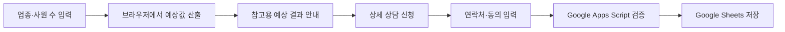

# 간단 견적 리드 수집 기능 기획

## 문서 목적

이 문서는 루트 랜딩에 추가할 `간단 견적 보기` 기능의 제품 목적, 데이터 범위, 예상 견적 산출 원칙, 동의 정책, Google Sheets 연동 경계를 정의한다.

이 기능은 정밀한 환급액을 계산하는 서비스가 아니다. 업종과 사원 수에 4refund 기준액과 제한된 양의 난수를 적용해 참고용 예상금액 하나를 보여 주고, 상세 상담을 원하는 잠재 고객의 연락처를 수집하는 리드 마그넷이다. 사용자가 결과를 실제 확정 견적으로 오인하지 않도록 기능명, 결과 문구, 안내 문구에서 예상값이라는 한계를 명확하게 알린다.

메인 랜딩 교체안, 컴포넌트, 단계형 모달과 결과 Figma를 [UI 디자인 구현 기획](quick-estimate-ui-design-plan.md)의 계약으로 보정했고, 파생 mobile 규칙과 공개 문구를 반영한 화면·제출 흐름을 통합 브랜치에 구현했다. 운영 공개는 실제 Apps Script 저장 E2E와 최종 공개 승인이 끝난 뒤 별도 release PR에서 수행한다.

## 관련 문서

- [간단 견적 기능 PR 로드맵](quick-estimate-pr-roadmap.md)
- [간단 견적 리드 수집 기술 설계](quick-estimate-technical-design.md)
- [간단 견적 UI 디자인 해석 및 구현 기획](quick-estimate-ui-design-plan.md)
- [간단 견적 기준액 벤치마크](quick-estimate-benchmark.md)
- [간단 견적 Apps Script 전송 검증](quick-estimate-apps-script-spike.md)
- [랜딩 페이지 구현 기획](landing-page-implementation.md)
- [폴더 구조와 의존성](../engineering/architecture.md)
- [코드 컨벤션](../engineering/code-conventions.md)
- [품질 게이트](../engineering/quality-gates.md)
- [간단 견적 운영 runbook](../operations/quick-estimate-runbook.md)
- [간단 견적 상담 목록 설계](quick-estimate-consultation-queue.md)

## 현재 결정 상태

### 확정 사항

| 항목           | 결정                                                                                                                                                     |
| -------------- | -------------------------------------------------------------------------------------------------------------------------------------------------------- |
| 기능 목적      | 참고용 예상 견적으로 관심을 유도하고 상담 리드를 확보한다.                                                                                               |
| 견적 입력      | 업종, 사원 수                                                                                                                                            |
| 견적 결과      | 업종별 1인당 기준액과 사원 수, 1%–3% 양의 난수로 산출한 참고용 단일 금액                                                                                 |
| 연락처 수집    | 회사명, 담당자 이름, 이메일, 전화번호                                                                                                                    |
| 동의           | 개인정보 처리에 필요한 고지와 마케팅 활용 동의를 받는다.                                                                                                 |
| 저장 범위      | 연락처, 견적 입력·결과·규칙 버전, 동의 이력을 함께 저장한다.                                                                                             |
| 저장 방식      | 별도 애플리케이션 백엔드나 데이터베이스 없이 Google Sheets를 초기 리드 저장소로 사용한다.                                                                |
| 서비스 구조    | 현재 정적 배포 구조를 유지하고 Google Apps Script를 제출 중계 계층으로 검토한다.                                                                         |
| Google 계정    | 작업자 개인 계정이 아닌 [기술 설계 `QD-010`](quick-estimate-technical-design.md#설계-결정)의 인가된 이관수 계정으로 Apps Script와 Sheet를 소유·운영한다. |
| 화면 구조      | 루트 랜딩의 기존 hero를 견적 hero로 교체하고, hero 버튼이 같은 페이지의 단계형 모달을 열어 연락처와 견적·동의를 받은 뒤 결과를 표시한다.                 |
| 현재 작업 범위 | 통합 브랜치에서 스팸 방지·운영 절차·랜딩 조합과 실제 저장 E2E를 완료하며 `main`에는 아직 공개하지 않는다.                                                |

### 전달된 디자인으로 확정한 사항

- 메인 랜딩의 기존 hero를 간단 견적 hero로 교체하고 별도 route는 만들지 않는다.
- 새 hero의 `환급액 조회하기` 버튼이 같은 페이지의 단계형 모달을 연다.
- 기존 환급 사례 track은 새 hero 하단으로 이동하고 독립 section은 중복 렌더링하지 않는다.
- 첫 단계에서 연락처, 두 번째 단계에서 업종·직원 수와 동의를 입력한다.
- `조회하기` 이후 예상 결과를 표시한다.
- 약관 전문은 모달 안에서 펼치고 접는다.
- hero 교체와 실제 공개는 전체 저장 흐름과 출시 QA가 끝난 PR에서 수행한다.

### 구현에 반영한 정합성 기준

- 별도 mobile node 없이 [UI 디자인 구현 기획](quick-estimate-ui-design-plan.md)의 파생 반응형 규칙을 사용할지 승인한다.
- Figma의 `직함`을 수집하지 않고 승인된 `회사명`과 누락된 `이메일`을 첫 단계에 반영한다.
- Figma 개인정보 전문의 보유 기간 3년을 승인된 1년으로 교정한다.
- 현재 계산 규칙에 기간 근거가 없는 `3년 예상치` 문구를 참고용 예상값 안내로 교정한다.
- Figma에 없는 제출 중, 접수 실패와 재시도 상태를 기존 제출 계약에 맞춰 추가한다.

### 후속 운영 결정이 필요한 사항

- 인가된 이관수 계정의 권한 변경·복구 절차
- [상담 목록 설계](quick-estimate-consultation-queue.md)에 따른 접근 계정, 알림 수신자와 최초 연락 목표 시간

## 제품 목표와 비목표

### 목표

- 사용자가 업종과 사원 수만으로 짧은 시간 안에 참고용 예상값을 확인한다.
- 예상 결과에서 상세 상담 신청으로 자연스럽게 이어진다.
- 상담에 필요한 최소 연락처와 동의 이력을 수집한다.
- 별도 서버 운영 없이 현재 정적 사이트 구조를 유지한다.
- 초기 운영 규모에서 담당자가 Google Sheets로 리드를 조회하고 처리한다.

### 비목표

- 실제 계약 또는 환급 가능 여부를 확정하는 견적
- 급여, 보험료, 납부 내역 등 실제 기업 데이터를 반영한 정밀 계산
- 사용자 계정, 로그인, 견적 이력 조회
- 자체 데이터베이스, 관리자 페이지, CRM 구축
- 결제, 계약 체결, 서류 제출
- 디자인이 없는 상태에서의 임시 UI 구현

## 사용자에게 설명할 기능 성격

내부적으로는 잠재 고객 유입을 위한 리드 마그넷으로 관리하되 사용자 화면에서는 기만적인 표현을 사용하지 않는다.

사용 가능한 표현 예시는 다음과 같다.

- `예상 견적`
- `참고용 예상 금액`
- `입력한 업종과 사원 수를 기준으로 계산한 예상금액`
- `실제 견적은 기업 현황과 상담 결과에 따라 달라질 수 있습니다.`

다음 표현은 근거가 준비되기 전까지 사용하지 않는다.

- `정확한 환급액`
- `확정 견적`
- `반드시 받을 수 있는 금액`
- `실제 데이터 분석 완료`

## 기능 구조

기능은 화면 배치와 관계없이 두 책임으로 나눈다.



### 예상 견적 책임

- 업종과 사원 수를 입력받는다.
- 저장소나 외부 API를 호출하지 않고 브라우저에서 계산한다.
- 업종별 기준액과 사원 수에 1%–3% 양의 난수를 적용한다.
- 계산할 때 한 번 생성한 금액은 입력 변경 또는 명시적인 다시 계산 전까지 유지한다.
- 결과는 참고용 단일 금액으로 표시하고 외부 benchmark snapshot보다 최소 1만 원 높게 산출한다.
- 계산 실패와 개인정보 제출 실패를 서로 독립적으로 처리한다.

### 리드 수집 책임

- 회사명, 담당자 이름, 이메일, 전화번호를 입력받는다.
- 개인정보 처리 고지와 마케팅 활용 동의를 구분한다.
- 사용자가 제출을 실행하기 전에는 연락처를 외부로 전송하지 않는다.
- 제출 데이터를 Google Apps Script에서 다시 검증한 뒤 Google Sheets에 저장한다.
- 성공 여부를 사용자에게 명확하게 알리고 중복 제출을 방지한다.

전달된 디자인에 따라 연락처와 견적·동의를 입력한 뒤 `조회하기`에서 결과를 공개한다. 계산이 끝났지만 개인정보 저장이 실패한 경우에도 예상 결과는 유지하고, 접수 성공·실패와 재시도 상태를 결과와 별도로 표시한다.

## 입력 데이터 명세

### 견적 입력

| 필드    | 형식                 | 필수 | 검증 원칙                                       | 저장 여부 |
| ------- | -------------------- | ---- | ----------------------------------------------- | --------- |
| 업종    | 사전에 승인된 선택값 | 예   | 자유 입력보다 관리 가능한 선택 목록을 우선한다. | 저장      |
| 사원 수 | 양의 정수            | 예   | 최소 1명, 최대값은 정책 확정 후 제한한다.       | 저장      |

업종 목록과 1인당 기준액은 산출 규칙과 함께 버전으로 관리한다. 사용자가 입력한 업종과 사원 수가 연락처와 결합되어 Google Sheets에 저장되면 리드 정보의 일부로 취급하고 개인정보 처리 고지 범위에 포함할지 검토한다.

### 연락처 입력

| 필드        | 형식            | 필수 | 검증 원칙                                             |
| ----------- | --------------- | ---- | ----------------------------------------------------- |
| 회사명      | 문자열          | 예   | 앞뒤 공백 제거, 최대 길이 제한, 빈 문자열 거부        |
| 담당자 이름 | 문자열          | 예   | 앞뒤 공백 제거, 최대 길이 제한, 빈 문자열 거부        |
| 이메일      | 이메일 주소     | 예   | 브라우저 검증과 제출 계층 검증을 모두 수행            |
| 전화번호    | 전화번호 문자열 | 예   | 숫자·구분자 정규화 정책을 정하고 제출 계층에서 재검증 |

수집 목적이 정해지기 전에는 IP 주소, User-Agent, 정확한 위치, 주민등록번호, 급여 자료 같은 추가 정보를 수집하지 않는다.

## 예상 견적 산출 정책

### 산출 원칙

- 난수는 계산 실행 event에서 한 번 생성하고, 금액 계산은 난수를 인자로 받는 프런트엔드 순수 함수로 구현한다.
- 산출 기준은 [기준액 벤치마크](quick-estimate-benchmark.md)의 버전된 설정 데이터로 관리한다.
- 4refund 1인당 기준액은 확인한 외부 기준액보다 5% 높게 책정하고 1,000원 단위로 올림한다.
- 계산 시점마다 1%–3% 범위의 양의 난수를 한 번 생성한다.
- 최종 금액은 1만 원 단위로 올림하고 benchmark 표시금액보다 최소 1만 원 높게 보정한다.
- 한 번 계산한 결과, 난수, 규칙 버전은 상담 제출과 재시도에서 함께 유지한다.
- 결과가 실제보다 정밀해 보이지 않도록 1만 원 단위보다 세밀하게 표시하지 않는다.
- 계산 기준 변경 시 기존 동의 문구와 별개로 산출 규칙 버전을 갱신한다.

### 규칙 정의

업종명, 내부 코드, 참고 기준액, 4refund 기준액, 인원별 예상 결과는 [기준액 벤치마크](quick-estimate-benchmark.md)를 단일 기준으로 삼는다. 외부 사이트를 런타임에 호출하거나 외부 업종명과 코드를 그대로 복제하지 않는다.

### 결과 안내에 포함할 정보

- 한 번 계산된 예상 금액
- 입력한 업종과 사원 수 요약
- 참고용 결과라는 안내
- 실제 견적이 달라질 수 있는 이유
- 상세 상담 진입점

## 개인정보 및 마케팅 동의

이 절은 승인된 저장 계약을 정리한 것이며 최종 공개 약관 문구를 대신하지 않는다. 공개 전 개인정보 처리 담당자 또는 법률 검토를 거쳐 Google 서비스 이용에 따른 위탁·국외 이전 고지를 포함한 최종 문구를 승인한다.

### 개인정보 처리 고지

연락처 제출은 `CONSENT`를 법적 근거 코드로 사용하며 사용자가 제출 전에 다음 내용을 확인하고 필수 동의해야 한다.

- 수집·이용 목적
- 수집 항목
- 보유·이용 기간
- 동의를 거부할 권리
- 거부 시 견적 상담 접수가 제한된다는 내용

처리 목적은 간단 견적 상담 신청 접수, 예상 환급액 상담을 위한 담당자 연락과 상담 상태 관리다. 회사명, 담당자 이름, 이메일, 전화번호와 견적 맥락을 접수일로부터 1년간 보유한다. 동의 철회나 상담 종료 등으로 목적이 먼저 달성되면 지체 없이 파기하며 고지 version은 `privacy-2026-08-06-v1`로 시작한다.

개인정보 보호법 제15조의 여러 처리 근거 중 이번 상담 접수 계약은 명시적 동의를 사용한다. 처리 목적이나 근거를 바꾸려면 새 고지 version을 승인하고 기존 동의와 구분한다.

### 마케팅 활용 동의

- 견적 상담 접수에 필요한 개인정보 처리와 별도의 항목으로 구분한다.
- 마케팅 동의는 선택값으로 설계하고, 거부해도 예상 견적 확인과 상담 접수를 막지 않는다.
- 이메일과 문자 채널을 문구에 명시하고 동의한 채널만 사용한다.
- 동의 시각, 동의 문구 버전, 선택 채널을 증빙 가능하게 저장한다.
- 동의 철회와 수신 거부 방법을 운영 정책에 포함한다.
- 이메일·문자 등 전자적 전송매체로 광고성 정보를 보낼 경우 명시적인 사전 동의와 철회 상태를 확인한다.

초기 마케팅 채널은 `EMAIL`, `SMS`만 허용한다. 전화번호는 상담 연락에 사용할 수 있지만 마케팅 전화 채널로는 사용하지 않는다. 동의 정보는 동의일로부터 1년 또는 철회 시점 중 먼저 도래하는 때까지 보유하며 version은 `marketing-2026-08-06-v1`로 시작한다.

마케팅 철회는 `iwillceo@naver.com` 또는 `010-2225-0555`로 접수한다. 접수 즉시 발송 대상에서 제외하고 최대 3영업일 안에 저장 상태를 반영한다.

### 동의 UI의 디자인 제약

- 개인정보 처리와 마케팅 동의를 하나의 필수 체크박스로 합치지 않는다.
- 각 동의의 필수·선택 상태를 텍스트로 표시한다.
- 체크박스와 약관 링크에 명확한 accessible name을 제공한다.
- 미선택 오류는 해당 항목 가까이에 표시하고 focus를 이동할 수 있어야 한다.
- 미리 선택된 체크박스를 사용하지 않는다.

## Google Sheets 저장 구조

Google Sheets는 초기 운영 규모의 리드 저장소이며 일반적인 데이터베이스와 같은 제약조건, 권한 모델, 감사 로그를 제공한다고 가정하지 않는다. 운영량, 자동화, 권한, 감사 요구가 커지면 별도 저장소나 CRM 전환을 다시 검토한다.

### 최소 저장 컬럼

| 컬럼                        | 내용                                  | 상태                   |
| --------------------------- | ------------------------------------- | ---------------------- |
| `lead_id`                   | 내부 리드 식별자                      | 필수                   |
| `request_id`                | 중복 제출 방지 식별자                 | 필수                   |
| `submitted_at`              | 서버 기준 접수 일시                   | 필수                   |
| `company_name`              | 회사명                                | 필수                   |
| `contact_name`              | 담당자 이름                           | 필수                   |
| `email`                     | 이메일                                | 필수                   |
| `phone`                     | 전화번호                              | 필수                   |
| `privacy_basis`             | 확정된 개인정보 처리 근거 코드        | 법적 근거 확정 후 적용 |
| `privacy_notice_version`    | 사용자에게 표시한 고지 버전           | 필수                   |
| `privacy_agreed`            | 동의를 근거로 사용하는 경우의 확인값  | 법적 근거 확정 후 적용 |
| `privacy_accepted_at`       | 접수 시점의 서버 시각                 | 필수                   |
| `marketing_agreed`          | 마케팅 활용 동의 여부                 | 필수                   |
| `marketing_channels`        | 동의한 마케팅 채널                    | 채널 확정 후 적용      |
| `marketing_consent_version` | 마케팅 동의 문구 버전                 | 필수                   |
| `marketing_accepted_at`     | 마케팅 동의 시각, 미동의 시 비어 있음 | 필수                   |

### 견적 맥락과 운영 컬럼

| 컬럼                    | 용도                                       |
| ----------------------- | ------------------------------------------ |
| `industry_code`         | 상담 우선순위와 예상 견적 입력 복원        |
| `employee_count`        | 예상 견적 입력 복원                        |
| `estimate_amount_krw`   | 사용자에게 표시한 예상 금액 증빙           |
| `random_uplift_bps`     | 계산에 사용한 1%–3% 양의 난수              |
| `estimate_rule_version` | 산출 기준 변경 전후 구분                   |
| `benchmark_version`     | 비교에 사용한 외부 기준 snapshot 구분      |
| `source_path`           | 유입 페이지 구분이 실제로 필요할 때만 저장 |
| `lead_status`           | 신규, 연락 완료 등 상담 처리 상태 관리     |

견적 맥락 컬럼은 사용자의 입력과 표시 결과를 보존하기 위해 함께 저장한다. `leads`는 상담 담당자의 일상 업무 화면으로 사용하지 않고, 한글 중심의 사람용 화면은 [상담 목록 설계](quick-estimate-consultation-queue.md)에 따라 별도 탭으로 투영한다. 분석 목적의 쿠키 ID나 광고 식별자는 이 기능의 기본 범위에 포함하지 않는다.

## 서버리스 연동 구조

### 우선 검토 후보

```text
정적 Next.js 페이지
  -> 브라우저의 예상 견적 계산
  -> HTTPS 제출
  -> Google Apps Script Web App의 doPost
  -> 비정상 입력 거부 및 중복 확인
  -> 권한이 제한된 Google Sheets에 행 추가
```

Google Apps Script Web App은 `doPost(e)`로 HTTP POST 요청을 받을 수 있고 배포 설정에 따라 스크립트 소유자 권한으로 실행할 수 있다. 별도 애플리케이션 서버를 운영하지 않으면서 비공개 Google Sheet에 쓰기 위한 얇은 제출 중계 계층으로 사용할 수 있다.

Apps Script도 실행 코드와 배포 권한, 할당량이 있는 외부 런타임이다. 따라서 “백엔드가 전혀 없음”이 아니라 “직접 운영하는 상시 백엔드와 데이터베이스가 없음”으로 정의한다.

[실제 전송 검증](quick-estimate-apps-script-spike.md)에서 form encoded 요청은 redirect 이후에도 성공·검증 실패·저장 실패 JSON body를 읽을 수 있음을 확인했다. `application/json`은 preflight가 실패하므로 사용하지 않으며, timeout이나 네트워크 오류처럼 저장 여부를 확정할 수 없는 경우에는 접수 완료로 표시하지 않는다.

### 연동 원칙

- Google Sheet 쓰기 권한이나 OAuth 자격 증명을 브라우저 코드에 넣지 않는다.
- Apps Script 배포 URL이 공개된다는 전제로 모든 입력을 신뢰하지 않는다.
- 브라우저 검증은 사용자 피드백용으로 사용하고 Apps Script에서 길이, 형식, 허용값을 다시 검증한다.
- 셀 수식으로 실행될 수 있는 `=`, `+`, `-`, `@` 시작 문자열을 안전하게 저장한다.
- 연속 클릭, 네트워크 재시도, 동일 요청 재전송으로 중복 행이 생기지 않도록 요청 식별자와 중복 방지 정책을 둔다.
- 처리 로그에 전체 이메일과 전화번호를 남기지 않는다.
- Apps Script 배포와 Google Sheets 소유권은 [기술 설계 `QD-010`](quick-estimate-technical-design.md#설계-결정)의 인가된 이관수 Google 계정을 사용하며 작업자 개인 계정을 사용하지 않는다.
- 인가된 이관수 계정의 비밀번호, 복구 코드와 인증 token은 저장소, 브라우저 코드, 문서에 기록하지 않는다.
- Apps Script 할당량과 장애 시 제출 실패 가능성을 운영 위험으로 관리한다.

### 대안

Google Forms를 Google Sheets에 연결하는 방식은 별도 제출 코드를 줄일 수 있지만 기존 랜딩 디자인과 검증·결과 흐름을 세밀하게 맞추기 어렵다. 디자인에서 독립적인 외부 폼 이동을 허용하는 경우에만 대안으로 비교한다.

## 제출 계약

요청·응답 필드, 오류 코드, 멱등성 규칙의 단일 기준은 [기술 설계의 제출 데이터 계약](quick-estimate-technical-design.md#제출-데이터-계약)이다. Apps Script는 저장 성공 여부와 요청 식별자만 반환하고 Google Sheet 식별자, 행 번호, 내부 오류 상세를 사용자에게 노출하지 않는다.

## 검증과 오류 처리

### 입력 오류

- 업종이 승인된 목록에 없으면 계산하지 않는다.
- 사원 수가 숫자가 아니거나 허용 범위를 벗어나면 구체적인 오류를 표시한다.
- 연락처 필드가 비어 있거나 형식이 잘못되면 제출하지 않는다.
- 마케팅 미동의는 오류로 처리하지 않는다.
- 개인정보 처리의 법적 근거상 필요한 확인이 누락된 경우에만 상담 제출을 막는다.

### 네트워크와 저장 오류

- 예상 견적 계산은 네트워크 없이 동작하도록 유지한다.
- Google Sheets 저장이 실패해도 이미 계산된 예상 결과를 숨기지 않는다.
- 제출 버튼을 무한 로딩 상태로 두지 않고 실패와 재시도 방법을 안내한다.
- 재시도 시 같은 `requestId`를 재사용해 중복 저장 가능성을 낮춘다.
- 장애 시 전화 또는 이메일 상담 링크를 대체 경로로 제공할지는 디자인 단계에서 결정한다.

### 스팸과 남용

- 화면에 보이지 않는 허니팟은 비어 있어야 하고 dialog를 연 뒤 제출까지 3초 이상, 2시간 이하여야 한다.
- Apps Script는 유효한 신규 요청을 전체 10건/분, 100건/일, 같은 정규화 이메일+전화번호 3건/시간으로 제한한다.
- 연락처별 제한 key에는 SHA-256만 사용하고 이메일·전화번호 원문을 Cache, Properties와 실패 로그에 저장하지 않는다.
- 같은 `requestId`의 6시간 이내 재시도는 제한을 다시 차감하지 않는다.
- 제한 초과는 `RATE_LIMITED`로 구분하며 현재 CAPTCHA와 별도 검증 secret은 사용하지 않는다.
- 원문 입력을 그대로 수식이나 HTML로 해석하지 않는다.

## 접근 권한과 운영

- Google Sheet는 승인된 이관수 소유 계정 한 명에게만 공유한다.
- 링크를 아는 모든 사용자가 열람할 수 있는 공개 공유를 사용하지 않는다.
- 계정에 다중 인증을 적용하고 담당자 변경 시 접근 권한을 회수한다.
- `leads` 원본과 [한글 상담 목록](quick-estimate-consultation-queue.md)의 책임을 분리하고 상담 담당자는 사람용 화면에서만 배정·상태·연락 일정을 운영한다.
- 상담 담당자 계정에 직접 접근 권한을 주기 전 개인별 계정, 편집 범위와 권한 회수 절차를 별도로 승인한다.
- 이관수 계정 관리자가 매월 보유 기간을 확인하고 파기 사유 확인 후 최대 5영업일 안에 대상 데이터를 삭제한다.
- 별도 export와 backup을 만들지 않으며 `lead_id`, 파기일, 파기 사유만 개인정보 없이 파기대장에 기록한다.
- Google Sheets 변경 이력 때문에 행 삭제만으로 복구 불가능한 파기를 단정하지 않는다. 공개 전 파일 교체·영구 삭제 절차를 실제 계정에서 검증한다.
- 마케팅 동의 철회가 접수되면 Sheets의 현재 상태와 실제 발송 대상에서 모두 제외한다.
- Google 서비스 이용이 개인정보 처리위탁 또는 국외 이전 고지 대상인지 개인정보 처리방침과 함께 검토한다.
- 장애 대응 담당자 이관수가 영업일마다 Apps Script 실패·할당량과 마지막 정상 접수를 확인하고, 인지 후 1영업일 안에 대응을 시작한다.
- 배포, 실제 저장 E2E, 접수 중단과 복구는 [운영 runbook](../operations/quick-estimate-runbook.md)을 따른다.

## 디자인 전달 시 필요한 산출물

전달된 Figma에서 다음 상태를 확인했으며 누락 상태와 계약 차이는 [UI 디자인 구현 기획](quick-estimate-ui-design-plan.md)에 기록한다.

- 최초 진입 상태
- 업종 선택 상태
- 사원 수 입력 상태
- 입력 오류 상태
- 계산 진행 또는 즉시 계산 상태
- 예상 결과 상태
- 연락처 입력 상태
- 개인정보 고지와 마케팅 동의 상태
- 제출 중 상태
- 제출 성공 상태
- 제출 실패와 재시도 상태
- 모바일과 데스크톱 상태
- keyboard focus와 약관 상세 보기 상태

기본·입력 완료·결과와 component variant를 구현했고, Figma에 없던 제출 중·접수 실패·재시도와 별도 mobile node가 없는 조건은 승인된 접근성 상태와 파생 반응형 규칙으로 보완했다.

## 코드 배치 원칙

사용자 행동과 비즈니스 규칙은 독립 feature가 소유한다.

```text
src/features/quick-estimate/
├── components/    # 기능 전용 폼, 결과, 동의 UI
├── constants/     # 업종 목록, 산출 규칙, 동의 버전
├── lib/           # 순수 예상 견적 계산
├── schemas/       # 브라우저 및 제출 데이터 검증 계약
├── types/         # 기능 전용 타입
└── index.ts       # 랜딩 페이지에 공개할 진입점
```

- 실제로 필요해진 디렉터리만 만든다.
- `src/app`은 페이지 조합을 위해 feature UI 경로를 참조할 수 있고, Apps Script build가 사용하는 root `index.ts`에는 브라우저 UI export를 섞지 않는다.
- 입력 UI가 비슷하다는 이유만으로 기존 랜딩 컴포넌트나 `shared`에 선제적으로 합치지 않는다.
- Apps Script 소스를 저장소에서 버전 관리할 경우 위치와 검사 정책을 `architecture.md`에 먼저 정의한다.
- Next.js 코드를 작성하기 전에 설치된 버전의 관련 문서를 확인한다.

## 단계별 구현 착수 조건

전체 작업을 디자인 완료까지 한꺼번에 보류하지 않는다. [PR 로드맵](quick-estimate-pr-roadmap.md)에 따라 디자인과 독립적인 검증과 계산·저장 계약을 먼저 진행하고, 각 단계에 필요한 승인만 진입 조건으로 사용한다.

### 디자인 전에 가능한 작업

- [x] `QD-010` 승인 계정의 테스트용 Sheet를 이용한 Apps Script 요청·응답 교차 출처 검증
- [x] 업종 목록과 사원 수 최대값 승인 후 계산 core 구현
- [x] 기준액, 난수 범위, 표시금액 상한 승인 후 전 범위 자동 검증
- [x] 개인정보 처리 목적, 법적 근거와 1년 보유 기간 확정
- [x] 이메일·문자 마케팅 선택 동의, 1년 보유와 철회 계약 확정
- [x] `QD-010` 승인 계정 단독 접근, 24개 컬럼, 운영 상태와 초기 제출량 확정

### 디자인 이후 작업

- [x] 데스크톱 페이지·컴포넌트·단계형 모달·결과 Figma 전달
- [x] 결과 공개 시점과 전체 사용자 흐름 문서화
- [x] 별도 mobile Figma를 대신할 파생 반응형 규칙 승인
- [x] 승인된 수집 항목·1년 보유 계약을 반영한 사용자 문구 최종 승인
- [x] 입력, 결과, 연락처, 동의와 오류 상태 UI 구현
- [x] 계산·제출 연동과 local keyboard·mobile E2E 검증

### 공개 전 필수 조건

- [x] Apps Script 배포·스팸 방지·장애 대응 정책 확정
- [x] 개인정보 처리방침과 마케팅 활용 문구의 공개 승인
- [x] 운영 계정 최소 권한, 백업, 보유 기간과 파기 절차 확인
- [x] 최신 benchmark 재확인과 4refund 금액 정책 유효성 검증
- [x] 전체 품질 게이트와 실제 배포 환경 E2E 통과

## 구현 완료 기준

- 계산 결과가 승인된 1%–3% 난수 범위 안에 있다.
- 한 번 표시한 결과는 제출과 재시도 중 바뀌지 않는다.
- 같은 조건의 새 계산은 난수에 따라 달라질 수 있다.
- 최종 금액이 적용한 benchmark snapshot보다 최소 1만 원 높다.
- 결과가 참고용 예상값임을 사용자가 제출 전에 알 수 있다.
- 마케팅 활용에 동의하지 않아도 예상 견적과 상담 신청을 이용할 수 있다.
- 브라우저와 Apps Script 양쪽에서 입력을 검증한다.
- 승인된 데이터만 Google Sheets에 한 번 저장된다.
- 동의 여부, 동의 문구 버전, 필요한 동의 시각을 추적할 수 있다.
- 자격 증명과 Google Sheet 쓰기 권한이 브라우저에 노출되지 않는다.
- 키보드와 모바일 환경에서 전체 흐름을 완료할 수 있다.
- 저장 실패 시 데이터가 접수된 것처럼 안내하지 않는다.
- `npm run check`가 통과한다.

## 참고 자료

- [개인정보 보호법 제15조 개인정보의 수집·이용](https://www.law.go.kr/lsLinkCommonInfo.do?chrClsCd=010202&lsJoLnkSeq=1029335387)
- [개인정보보호위원회 개인정보 수집·이용 시 동의 여부 및 방법 안내](https://m.pipc.go.kr/np/cop/bbs/selectBoardArticle.do?bbsId=BS074&mCode=C020010000&nttId=10566)
- [정보통신망법 제50조 영리목적의 광고성 정보 전송 제한](https://www.law.go.kr/LSW/lsLawLinkInfo.do?chrClsCd=010202&lsJoLnkSeq=1000463042)
- [Google Apps Script Web Apps](https://developers.google.com/apps-script/guides/web)
- [Google Apps Script 할당량](https://developers.google.com/apps-script/guides/services/quotas)
