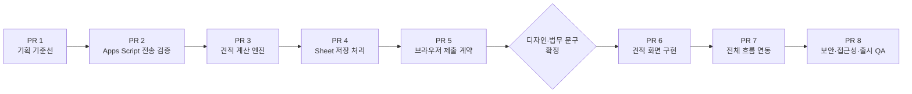
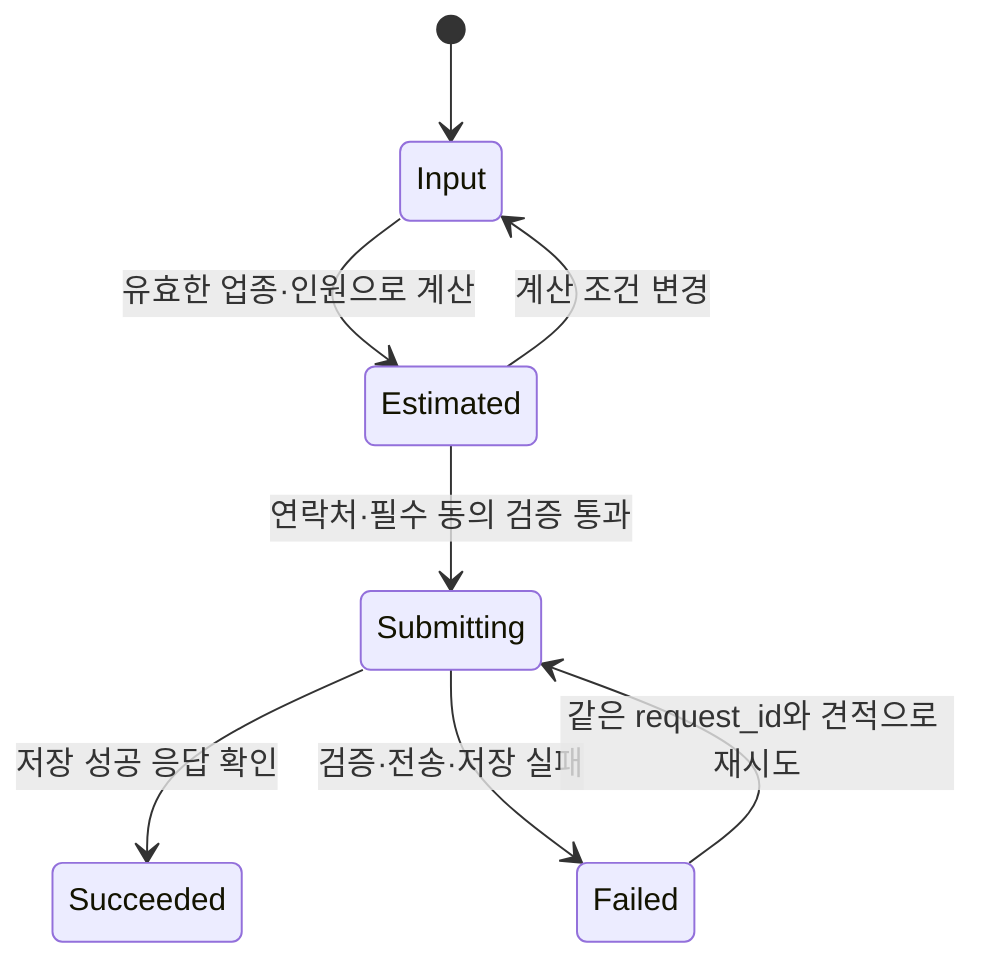

# 간단 견적 기능 PR 로드맵

## 문서 목적

이 문서는 [간단 견적 리드 수집 기능 기획](quick-estimate-lead-collection.md), [기술 설계](quick-estimate-technical-design.md), [UI 디자인 구현 기획](quick-estimate-ui-design-plan.md), [기준액 벤치마크](quick-estimate-benchmark.md)를 실제 변경으로 옮길 때 사용할 PR 단위 실행 계획이다.

여기서 `PR 1`부터 `PR 8`은 작업 순서를 나타내는 계획용 식별자다. 실제 GitHub PR 번호나 생성 여부를 뜻하지 않는다. 한 PR이 merge된 뒤 `main`을 최신 상태로 갱신하고 다음 PR을 시작하며, 별도 합의 없이 병렬 PR이나 stacked PR로 진행하지 않는다.

## 핵심 분할 원칙

- 디자인이 없어도 검증할 수 있는 정책, 계산, 전송, 저장 계약을 먼저 다룬다.
- 디자인이 확정되기 전에는 React 컴포넌트, 레이아웃, 스타일, 에셋을 만들지 않는다.
- 계산 로직은 UI와 분리된 순수 함수로 구현하고 난수는 실행 경계에서 한 번만 생성한다.
- Google Apps Script는 실제 브라우저에서 성공과 실패 응답을 구분할 수 있다는 기술 검증을 통과한 뒤에만 저장 수단으로 채택한다.
- 기술 검증에는 가짜 데이터만 사용하며 회사명, 담당자 이름, 이메일, 전화번호 등 실제 개인정보를 넣지 않는다.
- 개인정보 수집·이용과 마케팅 활용 동의는 별도 계약과 별도 검증 대상으로 유지한다.
- 미완성 기능이 운영 랜딩에 노출되지 않도록 실제 공개 연결은 마지막 PR에서 수행한다.
- 각 PR은 하나의 주된 검토 목적과 독립적인 완료 조건을 가진다.
- PR 설명과 checklist에는 실제 diff와 실행한 검사만 기록한다.
- 현재 저장소의 문서 우선 원칙과 `app → features → shared` 의존성 방향을 유지한다.

## 전체 순서



| PR   | 검토 목적                    | 주요 결과물                                            | 디자인 필요 | 선행 조건                         |
| ---- | ---------------------------- | ------------------------------------------------------ | ----------- | --------------------------------- |
| PR 1 | 제품·기술 기준선 확정        | 기획, 벤치마크, 기술 설계, PR 로드맵                   | 아니요      | 없음                              |
| PR 2 | 정적 사이트 전송 가능성 검증 | Apps Script 교차 출처·응답 spike와 채택 여부           | 아니요      | `QD-010` 승인 계정과 테스트 Sheet |
| PR 3 | 금액 계산 규칙 구현          | 업종별 기준액, 1%–3% 난수, 계산 함수와 단위 테스트     | 아니요      | 금액 정책과 입력 범위 승인        |
| PR 4 | 서버리스 저장 경계 구현      | Apps Script 검증·중복 방지·Sheet 저장과 운영 문서      | 아니요      | PR 2, PR 3, 개인정보 정책 승인    |
| PR 5 | 브라우저 제출 계약 구현      | 제출 schema, transport client, 제출 상태와 단위 테스트 | 아니요      | PR 4 배포 계약 확정               |
| PR 6 | 디자인을 semantic UI로 번역  | 입력·결과·연락처·동의 화면과 반응형 기반               | 예          | 최종 디자인과 사용자 문구 승인    |
| PR 7 | 사용자 흐름 완성             | 계산·동의·저장 연동, 로딩·성공·실패·재시도             | 예          | PR 6                              |
| PR 8 | 공개 가능 상태 검증          | 스팸 방지, 접근성, E2E, 운영 점검, 랜딩 공개 연결      | 예          | PR 7, 운영 계정과 공개 승인       |

PR 1부터 PR 5까지는 화면 디자인과 독립적으로 진행할 수 있다. 다만 PR 2부터는 표에 적힌 정책·계정 승인이 별도로 필요하다. 디자인이 없다는 이유로 기술 검증을 막지 않으며, 승인이 필요한 값을 개발자가 임의로 확정하지도 않는다.

## 공통 PR 규칙

### Branch와 commit

- branch는 해당 PR의 목적 하나만 표현한다.
- commit은 Conventional Commits 형식과 한국어 제목을 사용한다.
- 커밋은 PR 작업을 모두 끝낸 뒤 한 번에 만들지 않는다. 하나의 책임 범위가 완결되고 해당 범위의 검증을 통과할 때마다 작업 중간에 작성한다.
- 한 커밋은 독립적으로 review하고 되돌릴 수 있는 하나의 책임만 가진다. 문서, 계산 core, transport, 저장 처리처럼 변경 이유가 다른 책임을 한 커밋에 섞지 않는다.
- 단순 시간 경과나 미완성 상태를 저장하는 WIP 커밋은 만들지 않는다. 각 커밋은 해당 책임에 필요한 구현·문서·테스트를 함께 포함한다.
- 각 PR의 Metadata에 적힌 commit은 대표적인 제목 예시이며 PR당 커밋 하나를 강제하지 않는다. 실제 책임 분리에 따라 여러 커밋으로 나누고 출하 시 그 이력을 유지한다.
- 한 PR에 다음 PR용 미사용 컴포넌트나 추측성 abstraction을 미리 넣지 않는다.
- 실제 변경 범위가 계획보다 커지면 해당 PR에 억지로 포함하지 않고 로드맵을 먼저 갱신한다.
- 의존성 추가, 배포 설정 변경, 새 최상위 폴더 도입은 필요한 PR에서 이유와 검증 범위를 함께 기록한다.

### 공통 품질 게이트

모든 PR에서 아래 검사를 실행한다.

```bash
git diff --check
npm run check
```

추가 검사는 각 PR에 정의한다. 실행하지 않은 검사는 PR 본문에서 통과했다고 표시하지 않는다.

### 개인정보와 secret

- 저장소, fixture, screenshot, 로그에 실제 개인정보를 넣지 않는다.
- Apps Script 배포 URL을 공개 설정으로 취급할지 여부는 기술 검증 결과와 스팸 방지 정책으로 결정한다.
- Sheet ID, 운영 계정, CAPTCHA secret과 접근 권한은 소스 코드에 하드코딩하지 않는다.
- Apps Script와 Sheet는 작업자 개인 계정이 아닌 [기술 설계 `QD-010`](quick-estimate-technical-design.md#설계-결정)의 승인 계정으로 소유·배포한다.
- 테스트에는 `example.com`, 예약된 전화번호 형식 등 명백한 가짜 데이터만 사용한다.
- 개인정보가 저장된 행을 코드 롤백이나 테스트 정리 과정에서 임의 삭제하지 않는다.

### 계산 정책 공통 계약

- 외부 계산기를 런타임에 호출하지 않는다.
- 기준은 `incruit-2026-08-05` snapshot에서 파생한 4refund 전용 업종별 1인 기준액이다.
- 계산마다 100–300bp, 즉 1%–3%의 양의 난수를 한 번 적용한다.
- 사원 수는 1명부터 6,000명까지의 정수만 허용한다.
- 표시금액은 100억 원까지 허용하며 초과 결과를 상한값으로 잘라 표시하지 않는다.
- 동일 계산 실행에서는 화면 표시, 제출, 재시도 중 금액과 난수가 바뀌지 않는다.
- 최종 금액은 적용한 benchmark snapshot보다 최소 1만 원 높아야 한다.
- 결과는 실제 확정 견적이 아니라 참고용 예상값임을 사용자에게 알린다.
- 출시 전 benchmark를 다시 확인해 가격 보장 기준이 여전히 유효한지 검증한다.

## PR 1. 간단 견적 기획 및 기술 기준선 문서화

### Metadata

| 항목        | 값                                                |
| ----------- | ------------------------------------------------- |
| 권장 branch | `docs/quick-estimate-plan`                        |
| 권장 제목   | `간단 견적 기능 기획 및 기술 설계`                |
| 권장 commit | `docs(estimate): 간단 견적 기획과 기술 설계 추가` |
| 선행 PR     | 없음                                              |

### 목적

코드를 작성하기 전에 리드 마그넷의 한계, 수집 항목, 별도 동의, 자체 금액 기준, 난수 정책, Google Sheets 저장 경계와 후속 PR 순서를 review 가능한 기준선으로 확정한다.

### 포함 변경

- `docs/planning/quick-estimate-lead-collection.md`
- `docs/planning/quick-estimate-benchmark.md`
- `docs/planning/quick-estimate-technical-design.md`
- `docs/planning/quick-estimate-pr-roadmap.md`
- `docs/planning/landing-page-implementation.md`의 후속 기능 문서 링크
- 문서 사이의 상호 링크와 단계별 착수 조건

### 제외 변경

- `src` 변경
- React 컴포넌트와 CSS
- Apps Script와 Google Sheet 생성
- 운영 계정·배포 설정 변경
- 실제 개인정보 수집

### Reviewer 확인점

- 실제 환급액이나 확정 견적으로 오인시키지 않는 제품 경계가 명확한가
- 외부 서비스와 동일한 업종명·금액표·문구·UI를 복제하지 않는가
- 자체 기준액이 snapshot보다 높고 난수가 항상 양의 범위인가
- 개인정보 수집·이용과 마케팅 활용 동의가 분리되어 있는가
- 디자인 전후 PR 경계와 각 승인 주체가 명확한가
- Google Apps Script가 검증 전 확정 기술로 표현되지 않았는가

### 검수

- 모든 상대 Markdown 링크 확인
- 금액 표와 계산 예시의 version 일치 확인
- `git diff --check`
- `npm run check`

### 완료 조건

- 문서 변경만 포함한다.
- 미확정 정책과 결정 주체를 숨기지 않는다.
- PR 2 이후의 착수 조건과 중단 조건을 확인할 수 있다.

## PR 2. Google Apps Script 전송 방식 검증

### Metadata

| 항목        | 값                                           |
| ----------- | -------------------------------------------- |
| 권장 branch | `test/quick-estimate-transport-spike`        |
| 권장 제목   | `간단 견적 Apps Script 전송 방식 검증`       |
| 권장 commit | `test(estimate): Apps Script 전송 경로 검증` |
| 선행 PR     | PR 1                                         |

### 진입 조건

- `QD-010` 승인 계정에 테스트용 Sheet와 Apps Script를 생성할 권한이 확인되었다.
- 테스트 데이터가 실제 개인정보를 포함하지 않는다.
- 테스트 배포와 종료 후 접근 권한 회수 담당자가 정해져 있다.

### 목적

현재 정적 배포 환경의 브라우저가 Google Apps Script Web App에 요청하고, 저장 성공과 검증 실패 및 서버 실패를 서로 구분해 읽을 수 있는지 증명한다. 이 PR의 결과로 Apps Script 채택 여부를 확정한다.

실행 결과와 채택 근거는 [간단 견적 Apps Script 전송 검증](quick-estimate-apps-script-spike.md)에 기록한다.

### 포함 변경

- 테스트용 Web App 요청·응답 검증
- `POST` 요청, redirect, CORS, content type 동작 기록
- 성공, 4xx 성격의 검증 실패, 5xx 성격의 처리 실패 구분 여부 기록
- 실제 배포 도메인과 로컬 개발 origin에서의 동작 비교
- 요청 timeout과 재시도 가능성 확인
- spike 결과 문서와 채택 또는 기각 결정
- 테스트 배포 종료·권한 회수 절차

### 예상 변경 영역

```text
docs/planning/
└── quick-estimate-apps-script-spike.md
```

임시 검증 코드가 필요하면 PR 본문에 위치와 제거 여부를 기록한다. 아직 승인되지 않은 `integrations/` 최상위 폴더를 영구 구조로 먼저 만들지 않는다.

### 제외 변경

- 운영 Sheet
- 실제 연락처
- 영구 저장 schema 전체 구현
- 랜딩 페이지 UI
- Apps Script 채택을 전제로 한 브라우저 client

### 판정 기준

`채택`은 브라우저가 다음 세 상태를 신뢰할 수 있게 구분할 때만 가능하다.

1. Sheet 저장이 끝난 성공
2. 요청이 거절된 검증 실패
3. 저장 여부를 확정할 수 없는 전송·서버 실패

성공 여부를 읽을 수 없는 `no-cors` 전송, 불투명 응답, redirect 의존 방식은 기각한다. 기각되면 PR 4와 PR 5를 시작하지 않고 Google Forms 또는 별도 serverless 중계 등 대안을 기술 설계에 반영한다.

### 검수

- 브라우저 Network 기록 또는 자동화된 재현 로그 확인
- 성공·실패 fixture에 실제 개인정보가 없는지 확인
- 배포 종료 후 테스트 URL 접근 상태 확인
- `git diff --check`
- `npm run check`

### 완료 조건

- Apps Script 채택 여부와 근거가 문서에 남는다.
- 실패 경로를 성공으로 오인하지 않는 계약이 확인된다.
- 임시 배포와 테스트 데이터의 정리 책임이 기록된다.

## PR 3. 간단 견적 계산 엔진 구현

### Metadata

| 항목        | 값                                                  |
| ----------- | --------------------------------------------------- |
| 권장 branch | `feat/quick-estimate-calculation`                   |
| 권장 제목   | `간단 견적 금액 계산 규칙 구현`                     |
| 권장 commit | `feat(estimate): 업종별 예상 환급액 계산 로직 추가` |
| 선행 PR     | PR 1                                                |

PR 2와 코드 의존성은 없지만 순차 PR 원칙에 따라 PR 2가 merge된 뒤 시작한다.

### 진입 조건

- 업종 목록과 내부 code가 승인되어 있다.
- 사원 수 최소·최대값이 승인되어 있다.
- 기준액, 1%–3% 난수, 표시 단위와 상한이 승인되어 있다.
- benchmark snapshot version이 문서와 일치한다.

### 목적

화면과 외부 저장소에 의존하지 않는 결정론적 계산 core를 구현한다. 난수 생성과 계산을 분리해 동일 입력과 동일 난수로 결과를 재현할 수 있게 한다.

### 포함 변경

- 14개 내부 업종 code와 1인 기준액
- `estimate-rule-2026-08-05`와 `incruit-2026-08-05` version 상수
- 100–300bp 난수 생성 함수
- 업종, 사원 수, 난수를 입력받는 순수 계산 함수
- 1만 원 단위 올림과 benchmark 최소 1만 원 초과 보장
- 사원 수 1–6,000명과 표시금액 100억 원 상한 검증
- 지원하지 않는 업종, 범위 밖 인원, 범위 밖 난수 거절
- 결과에 금액, 난수, 규칙·benchmark version 포함
- 함수·상수와 비자명한 제약의 TSDoc
- 계산 단위 테스트

### 예상 변경 영역

```text
src/features/quick-estimate/
├── constants/
│   └── estimate-rule-set.ts
├── lib/
│   ├── calculate-estimate.ts
│   └── generate-random-uplift.ts
├── types/
│   └── estimate.ts
└── index.ts

tests 또는 기존 테스트 배치 규칙에 맞는 계산 테스트
```

실제 테스트 위치와 공개 API는 구현 시 저장소의 기존 패턴을 따른다. 사용하지 않는 `components`, `hooks`, `api` 폴더는 만들지 않는다.

### 제외 변경

- 브라우저 폼과 결과 UI
- Google Apps Script 요청
- 개인정보 schema
- `Math.random()`을 계산 함수 내부에서 직접 호출하는 구현
- 외부 참고 사이트 런타임 호출

### 필수 테스트

- 모든 업종의 1명, 10명, 50명, 100명 경계 예시
- 모든 업종과 승인된 전체 인원 범위에서 snapshot보다 최소 1만 원 높은지 확인
- 난수 100bp와 300bp 경계
- 같은 입력과 같은 난수에서 같은 결과
- 같은 입력과 다른 난수에서 허용 범위 내 결과
- 잘못된 업종, 0명, 최대 초과, 소수·문자열 입력 거절

### 완료 조건

- 계산 core가 DOM, React, `fetch`, Google API에 의존하지 않는다.
- 테스트가 무작위 확률에 의존하지 않고 난수 값을 주입한다.
- 승인된 전 범위에서 benchmark 초과 보장을 자동 검증한다.

## PR 4. Apps Script 리드 저장 처리 구현

### Metadata

| 항목        | 값                                                |
| ----------- | ------------------------------------------------- |
| 권장 branch | `feat/quick-estimate-storage`                     |
| 권장 제목   | `간단 견적 Google Sheets 저장 연동 구현`          |
| 권장 commit | `feat(estimate): Apps Script 리드 저장 처리 추가` |
| 선행 PR     | PR 2, PR 3                                        |

### 진입 조건

- PR 2에서 Apps Script가 채택되었다.
- 개인정보 처리 목적, 법적 근거, 보유 기간과 파기 절차가 승인되었다.
- 마케팅 채널, 선택 동의 문구와 철회 절차가 승인되었다.
- 운영 Sheet는 `QD-010` 승인 계정이 소유하며 접근 담당자가 확정되었다.
- 저장 컬럼, 운영 상태값과 예상 제출량이 확정되었다.

위 진입 조건은 `privacy-2026-08-06-v1`, `marketing-2026-08-06-v1`, 이관수 계정 단독 접근과 일 100건·분당 10건의 초기 제출량 계약으로 충족했다.

### 목적

브라우저를 신뢰하지 않는 저장 경계를 구현한다. Apps Script가 요청을 재검증하고 계산 결과를 재현한 뒤, 중복 제출과 spreadsheet formula injection을 방어하며 한 행을 원자적으로 저장하게 한다.

### 포함 변경

- Apps Script source와 배포 manifest
- 요청 schema와 허용 필드 검증
- 업종·인원·난수·version 기반 금액 재계산
- 개인정보 수집·이용 필수 동의 검증
- 마케팅 동의값과 문구 version 저장
- `lead_id` 기반 멱등성 처리
- `LockService` 기반 동시 쓰기 보호
- `=`, `+`, `-`, `@`로 시작하는 사용자 입력의 formula 실행 방지
- 서버 기준 접수 시각과 운영 상태 `NEW` 저장
- 성공, 검증 실패, 중복, 처리 실패 응답 계약
- Sheet 컬럼 codebook, 배포·권한·백업·파기 운영 문서
- 자동 검사가 새 최상위 구조를 인식하도록 architecture 문서와 검사 규칙 갱신

### 후보 변경 영역

```text
integrations/google-apps-script/quick-estimate/
├── Code.gs
├── appsscript.json
└── README.md

docs/engineering/
└── architecture.md

docs/planning/
└── quick-estimate-technical-design.md
```

후보 구조는 구현 전 architecture 문서와 검사 코드를 함께 확인한다. Apps Script와 프런트엔드가 규칙 파일을 수동 복사해 서로 다른 원본을 갖게 하지 않는다.

### 제외 변경

- React 컴포넌트
- 운영 랜딩 공개 연결
- 관리자 화면
- 실제 개인정보 fixture
- 코드 롤백 시 기존 Sheet 행 삭제

### 필수 테스트

- 정상 저장과 정확한 컬럼 순서
- 필수 동의 누락 거절
- 마케팅 미동의 정상 저장과 동의 시 version·시각 저장
- 변조된 금액, 업종, 인원, 난수, version 거절
- 같은 `request_id` 재전송 시 중복 행 방지
- formula-like 입력이 수식으로 실행되지 않음
- 잠금 충돌, quota, Sheet 쓰기 실패 응답

### 완료 조건

- 브라우저가 보낸 계산 금액을 그대로 신뢰하지 않는다.
- 승인된 한 요청이 한 행으로만 저장된다.
- secret과 Sheet 쓰기 권한이 브라우저 bundle에 포함되지 않는다.
- 운영자가 컬럼 의미, 접근 권한과 파기 책임을 문서에서 확인할 수 있다.

## PR 5. 브라우저 제출 계약과 상태 구현

### Metadata

| 항목        | 값                                                      |
| ----------- | ------------------------------------------------------- |
| 권장 branch | `feat/quick-estimate-submission`                        |
| 권장 제목   | `간단 견적 상담 제출 계약 구현`                         |
| 권장 commit | `feat(estimate): 상담 리드 제출 계약과 클라이언트 추가` |
| 선행 PR     | PR 4                                                    |

### 목적

아직 화면을 만들지 않고 브라우저 측 데이터 계약, 제출 transport와 상태 전이를 구현한다. 디자인이 모달, 단일 화면, 다단계 폼 중 어느 방식을 선택해도 같은 제출 계약을 사용할 수 있게 한다.

### 포함 변경

- 회사명, 담당자 이름, 이메일, 전화번호 validation schema
- 업종, 사원 수, 견적 금액, 난수, 규칙 version을 포함한 request schema
- 개인정보 동의와 마케팅 선택 동의의 별도 필드
- `idle → submitting → succeeded | failed` 상태 전이
- 제출 시작 시 `request_id` 생성과 재시도 시 동일 ID 유지
- timeout, 네트워크 실패, 검증 실패, 서버 실패와 판독 불가 응답의 구분
- 성공 응답을 확인한 경우에만 접수 완료 상태 전환
- 외부 endpoint를 호출하는 얇은 client adapter
- transport와 상태 전이 단위 테스트

### 예상 변경 영역

```text
src/features/quick-estimate/
├── api/
│   └── submit-estimate-lead.ts
├── lib/
│   └── submission-state.ts
├── schemas/
│   └── lead-submission.ts
├── types/
│   └── lead-submission.ts
└── index.ts
```

### 제외 변경

- 입력 컴포넌트와 화면 copy
- endpoint URL 하드코딩
- 실패한 요청을 성공으로 간주하는 fallback
- 자동 무한 재시도
- 운영 랜딩 노출

### 필수 테스트

- 유효·무효 회사명, 이름, 이메일, 전화번호
- 필수 개인정보 동의 누락
- 마케팅 미동의 요청 허용
- 제출 중 중복 실행 차단
- 실패 후 같은 `request_id`, 계산 금액과 난수를 유지한 재시도
- 성공, 검증 실패, timeout, 불투명 응답의 상태 전이

### 완료 조건

- UI 없이 제출 계약과 상태를 검증할 수 있다.
- 마케팅 미동의가 상담 요청 실패 원인이 되지 않는다.
- 오류 응답이나 읽을 수 없는 응답을 성공으로 표시하지 않는다.

## PR 6. 간단 견적 화면 구현

### Metadata

| 항목        | 값                                           |
| ----------- | -------------------------------------------- |
| 권장 branch | `feat/quick-estimate-ui`                     |
| 권장 제목   | `간단 견적 입력 및 결과 화면 구현`           |
| 권장 commit | `feat(estimate): 간단 견적 사용자 화면 구현` |
| 선행 PR     | PR 5                                         |

### 진입 조건

- 데스크톱 Figma와 [파생 mobile 반응형 규칙](quick-estimate-ui-design-plan.md#반응형-기준)이 승인되었다.
- 메인 랜딩 hero의 CTA 위치와 `/quick-estimate` route가 승인되었다.
- 연락처 → 견적·동의 → 결과의 단계형 modal 흐름이 승인되었다.
- Figma의 `직함`, 누락 이메일과 3년 보유 문구를 [승인 계약에 맞게 보정](quick-estimate-ui-design-plan.md#figma와-승인-계약의-정합성)했다.
- 디자인 node와 에셋 원본에 접근할 수 있다.

### 목적

확정된 디자인을 semantic HTML과 feature 전용 컴포넌트로 번역한다. 이 PR에서는 시각 구조와 모든 상태를 구현하되 운영 endpoint와 랜딩 공개 연결은 하지 않는다.

### 포함 변경

- 업종과 사원 수 입력 UI
- 참고용 예상값 결과 UI
- 회사명, 담당자 이름, 이메일, 전화번호 입력 UI
- 개인정보 필수 동의와 마케팅 선택 동의 UI
- `/quick-estimate` route와 `noindex` metadata
- 기존 사이트 header·연락 CTA·footer 조합
- 봉투·결과지·동전 합성 이미지와 reduced motion 대응
- 기본, 입력 오류, 계산 완료, 제출 중, 성공, 실패 상태의 시각 표현
- desktop·mobile 반응형 레이아웃
- label, description, error 연결과 focus-visible
- feature 내부 전용 에셋과 스타일
- 디자인 기준 screenshot 또는 렌더링 비교 자료

### 예상 변경 영역

```text
src/features/quick-estimate/
├── components/
├── constants/
├── styles 또는 기존 스타일 배치 규칙
└── index.ts

public/assets/quick-estimate/
└── 디자인에서 실제 사용하는 에셋
```

실제 component 이름과 폴더는 디자인의 정보 구조를 확인한 뒤 정한다. 화면이 비슷해 보인다는 이유만으로 기존 `landing-page` 내부 컴포넌트나 `shared`로 합치지 않는다.

### 공개 차단 원칙

- 이 PR만 merge된 상태에서 운영 사용자가 미완성 제출 흐름에 진입할 수 없어야 한다.
- 공개 차단 방식은 디자인과 현재 배포 구조를 확인해 PR 설명에 기록한다.
- 다음 PR을 위해 임의의 가짜 성공 응답이나 운영 endpoint 대체 코드를 넣지 않는다.

### 제외 변경

- 운영 Apps Script 호출
- 실제 Sheet 저장
- 메인 랜딩 CTA 연결과 검색 index 허용
- analytics·광고 script
- 디자인에 없는 단계, 모달, tooltip 발명
- 전역 form component 추출

### 필수 검수

- 디자인 기준 desktop·mobile 시각 비교
- 모든 label과 error의 접근 가능한 연결
- keyboard만으로 입력과 동의 요소 이동
- 200% 확대와 긴 한국어·이메일·전화번호 overflow
- 마케팅 선택 동의가 필수처럼 표현되지 않는지 확인

### 완료 조건

- 디자인에 정의된 모든 상태를 실제 DOM으로 검수할 수 있다.
- 예상값 한계와 동의 목적이 제출 전에 읽힌다.
- 운영 랜딩에는 미완성 기능이 노출되지 않는다.

## PR 7. 계산·동의·저장 전체 흐름 연동

### Metadata

| 항목        | 값                                                |
| ----------- | ------------------------------------------------- |
| 권장 branch | `feat/quick-estimate-flow`                        |
| 권장 제목   | `간단 견적 계산 및 상담 제출 흐름 구현`           |
| 권장 commit | `feat(estimate): 견적 계산과 상담 제출 흐름 연결` |
| 선행 PR     | PR 6                                              |

### 목적

PR 3의 계산 엔진, PR 5의 제출 계약과 PR 6의 UI를 연결해 사용자가 입력부터 저장 결과 확인까지 한 흐름으로 완료하게 한다. 아직 최종 공개는 하지 않는다.

### 포함 변경

- 업종·사원 수 검증 후 난수 한 번 생성과 예상값 계산
- 화면에 표시한 금액·난수·version을 제출과 재시도에서 유지
- 연락처와 필수·선택 동의 validation 연결
- 제출 중 이중 클릭과 중복 요청 차단
- Apps Script endpoint 설정 연결
- 성공 확인 후 완료 UI 전환
- 실패 시 입력과 계산 결과를 유지한 재시도
- 오류 종류별 사용자 안내와 focus 이동
- 흐름 단위 component/integration 테스트

### 상태 흐름



### 제외 변경

- 운영 공개 전환
- 실제 사업 지표 분석
- 관리자 조회 UI
- 실패 시 새로운 난수 자동 생성
- 동의 checkbox의 사전 선택

### 필수 테스트

- 계산부터 성공 접수까지 정상 흐름
- 계산 조건 변경 시 새 계산과 새 난수 생성
- 연락처만 수정하거나 재시도할 때 기존 계산 유지
- 필수 동의 누락 시 제출되지 않음
- 마케팅 미동의 상태로 정상 접수
- 빠른 중복 click에서 한 요청만 전송
- timeout·서버 실패 후 입력과 결과 유지
- 화면 금액과 Sheet 저장 금액 일치

### 완료 조건

- 사용자가 전체 흐름을 완료할 수 있다.
- 성공 응답 전에는 접수 완료로 표시하지 않는다.
- 동일 제출 재시도가 중복 행을 만들지 않는다.
- 운영 공개 전환 없이 staging 또는 검증 환경에서 E2E를 수행할 수 있다.

## PR 8. 보안·접근성·출시 QA 및 랜딩 공개

### Metadata

| 항목        | 값                                                |
| ----------- | ------------------------------------------------- |
| 권장 branch | `feat/quick-estimate-release`                     |
| 권장 제목   | `간단 견적 기능 출시 검증 및 공개`                |
| 권장 commit | `feat(estimate): 간단 견적 공개와 최종 검증 적용` |
| 선행 PR     | PR 7                                              |

### 진입 조건

- 개인정보 처리방침과 마케팅 동의 문구의 최종 공개 승인이 있다.
- `QD-010` 승인 계정의 Sheet 접근자와 장애 대응 담당자가 정해져 있다.
- 스팸 방지 방식과 secret 보관 위치가 정해져 있다.
- 외부 benchmark를 다시 확인하고 내부 기준이 여전히 더 높은지 검증했다.
- 운영 배포에서 사용할 Apps Script version이 고정되어 있다.

### 목적

보안, 스팸, 접근성, 반응형, 실제 저장과 운영 절차를 최종 검증하고 기존 랜딩에서 간단 견적 진입점을 공개한다.

### 포함 변경

- 승인된 스팸 방지 방식 적용
- rate·quota 초과와 장애 안내
- 키보드, focus, screen reader용 상태 알림 보완
- desktop·mobile 시각 회귀 검수
- 실제 배포 환경의 전체 E2E
- benchmark refresh 결과와 규칙 version 갱신 여부 기록
- Sheet 열 보호, 최소 권한, 백업·파기·접근자 점검
- 기존 랜딩 페이지의 최종 진입 CTA 연결
- 공개 중단과 롤백 절차 확인
- 필요한 운영 체크리스트와 모니터링 기준

### 필수 E2E

- desktop과 mobile의 정상 접수
- 마케팅 동의·미동의 각각 한 건의 테스트용 접수
- 잘못된 이메일·전화번호와 필수 동의 누락
- 중복 click과 네트워크 재시도
- Apps Script 검증 실패와 Sheet 쓰기 실패
- keyboard-only 전체 흐름
- 200% 확대, reduced motion, 자동 접근성 검사
- 운영 Sheet의 컬럼, 시각, 동의 version과 UI 표시값 일치

운영 E2E에서도 사전에 승인한 테스트 식별자를 사용하고 실제 고객 개인정보를 사용하지 않는다. 테스트 행 삭제가 필요하면 운영자가 승인한 절차와 증빙을 따른다.

### 롤백

- 장애 시 랜딩 진입점만 비활성화해 기존 정적 랜딩을 유지한다.
- Apps Script 배포를 중단하거나 접근 권한을 회수해 신규 제출을 막는다.
- 프런트엔드 코드 롤백이 이미 저장된 Sheet 행을 삭제하지 않는다.
- 데이터 오류는 대상 행, 사유, 승인자를 남긴 파기 절차로 처리한다.

### 완료 조건

- 승인된 공개 문구와 실제 데이터 처리 방식이 일치한다.
- 전체 품질 게이트와 E2E 결과가 PR 본문에 실제 실행 내역으로 기록된다.
- 장애 시 신규 제출을 중단하는 방법과 담당자가 확인된다.
- 기존 랜딩의 다른 section과 연락 동작에 회귀가 없다.

## 단계별 중단 조건

| 시점 | 중단 조건                                               | 다음 조치                                            |
| ---- | ------------------------------------------------------- | ---------------------------------------------------- |
| PR 2 | 성공·실패 응답을 브라우저가 구분할 수 없음              | Apps Script 기각, 기술 설계에 대체 중계 방식 반영    |
| PR 3 | 승인된 범위에서 외부 snapshot 초과 보장을 만족하지 못함 | 기준액·반올림·상한 정책 재승인                       |
| PR 4 | 개인정보 법적 근거나 보유·파기 책임이 미확정            | 실제 저장 구현과 운영 Sheet 생성을 보류              |
| PR 5 | endpoint 응답 계약이 불안정하거나 불투명함              | UI 구현 전에 transport 계약 수정                     |
| PR 6 | desktop 또는 mobile 디자인과 동의 문구가 미확정         | 프런트엔드 구현을 시작하지 않고 PR 1–5 산출물만 유지 |
| PR 7 | 재시도 시 중복 저장 또는 금액 변경 발생                 | 공개 차단을 유지하고 멱등성·상태 계약 수정           |
| PR 8 | 운영 계정·스팸·접근권한·파기 절차 중 하나라도 미확정    | 랜딩 진입점을 공개하지 않음                          |

## 완료 추적

| 계획 ID | 상태      | 실제 PR                                                        | merge 확인 | 비고                            |
| ------- | --------- | -------------------------------------------------------------- | ---------- | ------------------------------- |
| PR 1    | 병합됨    | [#22](https://github.com/leekwansootv-creator/4refund/pull/22) | 확인       | 기획·기술 기준선 반영           |
| PR 2    | 병합됨    | [#23](https://github.com/leekwansootv-creator/4refund/pull/23) | 확인       | Apps Script 전송 방식 검증 반영 |
| PR 3    | 병합됨    | [#24](https://github.com/leekwansootv-creator/4refund/pull/24) | 확인       | 금액 계산 엔진 반영             |
| PR 4    | 병합됨    | [#25](https://github.com/leekwansootv-creator/4refund/pull/25) | 확인       | Apps Script 저장 처리 반영      |
| PR 5    | 병합됨    | [#26](https://github.com/leekwansootv-creator/4refund/pull/26) | 확인       | 브라우저 제출 계약 반영         |
| PR 6    | 진입 준비 | 미생성                                                         | 미확인     | Figma 정합성과 반응형 규칙 검토 |
| PR 7    | 대기      | 미생성                                                         | 미확인     | PR 6 필요                       |
| PR 8    | 대기      | 미생성                                                         | 미확인     | 운영·법무 공개 승인 필요        |

상태는 실제 작업을 시작하거나 GitHub 상태를 확인했을 때만 갱신한다. 사용자가 PR 단위 작업 시작을 승인한 뒤에는 책임 범위가 끝날 때마다 commit하고, 사용자 수동 조치가 필요하지 않으면 PR 전체 검증 후 push와 Draft PR 생성까지 수행한다. 수동 조치가 필요하면 필요한 계정·화면·절차·완료 증빙을 안내하고 해당 입력을 기다린다.
