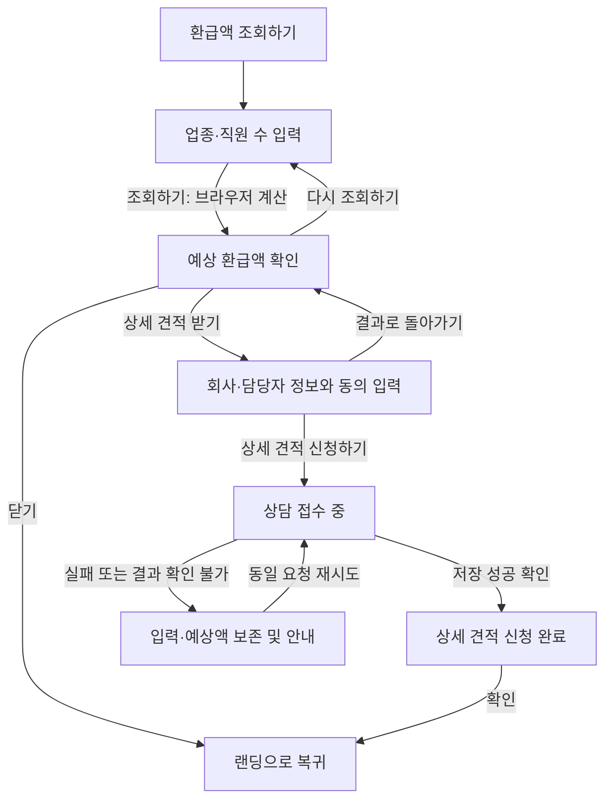

# 간편 환급액 선조회 및 상세 견적 신청 플로우 기획

## 문서 상태와 적용 범위

- 작성일: 2026-09-04
- 상태: 구현 기준선. 2026-09-04 사용자 실행 요청과 아래 화면 결정에 따라 순차 구현한다.
- 이번 작업: RF-PR1~5의 구현·검증·순차 병합. 실제 완료 상태는 실행 계획의 기록을 따른다.
- 구현·배포 상태: 이 문서의 변경 흐름은 아직 구현하거나 배포하지 않았다.

사용자가 확인한 요구는 **업종·직원 수 입력 → 간편 예상 환급액 확인 → 상세 견적을 원하는 경우 회사·담당자 정보 입력**이다. 현재 코드를 기준으로 상세 견적은 담당자 상담을 통한 후속 안내를 의미한다. 회사·연락처를 입력하면 더 정밀한 금액이 자동 산출되는 기능은 이번 범위에 포함하지 않는다.

기존 문서는 연락처를 먼저 받는 구현 기준과 과거 출시 계획을 담고 있다. 이 문서는 그중 화면 순서, 동의 배치, 제출 시점과 결과 후속 동작의 변경안을 정의한다. 기획 검토 후 구현할 때 해당 항목은 이 문서에 맞춰 기존 문서 본문도 갱신한다. 계산 규칙, 최종 제출 데이터, 저장·운영 계약은 별도 변경이 명시되지 않는 한 기존 문서를 따른다.

관련 문서:

- [기존 리드 수집 기획](quick-estimate-lead-collection.md)
- [기존 UI 디자인 및 흐름](quick-estimate-ui-design-plan.md)
- [계산·제출·저장 기술 설계](quick-estimate-technical-design.md)
- [기존 PR 로드맵](quick-estimate-pr-roadmap.md)
- [이번 플로우 변경의 PR 실행 계획](quick-estimate-result-first-pr-roadmap.md)
- [업종 분류 v2](quick-estimate-industry-v2.md)
- [상담 목록 설계](quick-estimate-consultation-queue.md)
- [품질 게이트](../engineering/quality-gates.md)

## 배경과 목표

현재는 사용자가 예상액을 보기 전에 회사명·담당자 이름·이메일·전화번호를 모두 입력해야 한다. 이후 업종·직원 수와 동의를 입력하고 `조회하기`를 누르면 예상액 계산과 상담 접수가 함께 실행된다.

변경 목표는 연락처 입력 전에 간편 조회의 결과를 제공하고, 상세 견적을 원하는 사용자가 직접 상담 신청을 선택하게 하는 것이다. 입력 부담 감소와 신청 의사의 명확화를 기대하지만 전환율 상승이나 신청 건수 증가를 검증된 효과로 간주하지 않는다.

| 구분             | 현재 코드                          | 변경안                                   |
| ---------------- | ---------------------------------- | ---------------------------------------- |
| 최초 입력        | 회사명·담당자 이름·이메일·전화번호 | 업종·직원 수                             |
| 동의 시점        | 업종·직원 수 입력 화면             | 상세 견적 신청 정보 입력 화면            |
| 조회 실행        | 계산과 상담 제출을 함께 시작       | 브라우저에서 계산하고 결과만 표시        |
| 결과의 주요 행동 | 다시 조회하기 / 상담하기           | 상세 견적 받기 / 다시 조회하기           |
| 상담하기 동작    | 모달을 닫고 하단 `#contact`로 이동 | 같은 모달에서 신청 정보 입력으로 이동    |
| 리드 저장 시점   | 조회 버튼 실행 이후                | 정보·동의를 검증하고 신청 버튼 실행 이후 |
| 조회만 한 사용자 | 제출까지 이어지는 구조             | 상담 리드를 생성하지 않음                |

## 요구사항과 기획 제안의 구분

| 구분                      | 내용                                                                  |
| ------------------------- | --------------------------------------------------------------------- |
| 사용자 확인 요구          | 업종·직원 수를 먼저 입력하고 예상액을 확인한다.                       |
| 사용자 확인 요구          | 상세 견적을 원하는 경우에 회사·담당자 정보를 입력한다.                |
| 요구를 충족하는 처리 기준 | 간편 조회와 상세 견적 상담 제출을 분리한다.                           |
| 요구를 충족하는 처리 기준 | 간편 조회에는 연락처와 상담 접수 동의를 요구하지 않는다.              |
| 기획 제안                 | 기존 네 개 연락처 필드와 동의 정책을 신청 단계로 옮긴다.              |
| 기획 제안                 | 같은 모달 안에서 조회 조건, 결과, 신청 정보, 접수 완료를 구분한다.    |
| 기획 제안                 | 결과 화면에서 `상세 견적 받기`를 주요 버튼으로 강조한다.              |
| 기획 제안                 | 접수 기능이 준비되지 않은 환경에서도 간편 계산은 이용할 수 있게 한다. |

## 사용자 흐름

간편 조회의 완료와 상담 접수의 완료는 서로 다른 상태다. 결과만 본 사용자에게 `상담 신청이 접수되었습니다`를 표시하지 않는다. 신청 정보 화면에 진입하거나 필드를 입력하는 것만으로도 전송하지 않는다.

## 화면별 상세 기획

### 1. 업종·직원 수 입력

- 진입: 기존 랜딩의 `환급액 조회하기` 버튼으로 같은 페이지의 모달을 연다.
- 제목 제안: `예상 환급액 조회`
- 설명 제안: `업종과 직원 수만으로 예상 환급액을 확인해 보세요.`
- 입력: 기존 KSIC 대분류 21개와 직원 수 1~6,000명 정수 검증을 사용한다.
- 업종 목록의 `용역·파견·시설관리업` 첫 노출과 나머지 표시 순서는 유지한다.
- 개인정보·마케팅 동의는 이 화면에 표시하지 않는다.
- 업종과 직원 수가 유효하면 `조회하기`를 활성화한다.
- 검증 실패 시 해당 필드에 이유를 표시하고 임의의 금액을 반환하지 않는다.
- 클릭 시 난수를 한 번 생성하고 기존 계산 함수로 예상액을 산출한다. 외부 계산 API나 상담 제출 API를 호출하지 않는다.

### 2. 예상 환급액 결과

- 제목 제안: `조회 결과`
- 표시: 선택 업종, 직원 수, 원화 예상 환급액.
- 기존의 참고용 예상값 안내를 유지하며 실제 환급액이나 확정 견적으로 표현하지 않는다.
- 신청 유도 문구 제안: `더 자세한 견적을 원하시나요? 회사와 담당자 정보를 남겨주시면 상담을 통해 안내해 드립니다.`
- 주요 버튼: `상세 견적 받기` → 신청 정보 화면.
- 보조 버튼: `다시 조회하기` → 기존 조건이 채워진 입력 화면.
- 닫기: 상담 신청 없이 랜딩으로 복귀.
- 상담 제출 중·성공·실패 안내는 이 최초 조회 결과에 노출하지 않는다.

`상세 견적 받기`는 신청 정보 입력의 시작이다. 이 버튼 자체가 신청을 제출하거나 하단 문의 영역으로 이동하지 않는다. 랜딩의 기존 전화·이메일 문의 영역은 계속 사용할 수 있다.

### 3. 상세 견적 신청 정보

- 제목 제안: `상세 견적 신청`
- 설명 제안: `상세 견적 상담을 위해 회사와 담당자 정보를 입력해 주세요.`
- 상단에 앞서 확인한 업종·직원 수·예상액을 간결하게 표시한다.
- 현재 수집하는 회사명·담당자 이름·이메일·전화번호를 모두 필수로 유지한다.
- 기존 길이·형식 검증을 재사용한다. 사업자등록번호·직함·주소 등은 추가하지 않는다.
- 개인정보 수집·이용 동의는 필수, 마케팅 활용 동의는 선택으로 배치한다. 기본값은 모두 미동의다.
- 동의 전문은 기존처럼 같은 모달 안에서 펼치고 접는다.
- 필수 정보와 동의가 유효하면 `상세 견적 신청하기`를 활성화한다. 마케팅 미동의는 신청을 막지 않는다.
- `결과로 돌아가기`를 제공하며 전송 전에는 입력 중인 정보와 현재 예상액을 모달 세션 안에서 보존한다.
- 신청 버튼을 눌렀을 때 최종 검증, 요청 식별자 생성, 전송을 수행한다.

### 4. 접수 진행과 완료

| 상태      | 화면과 행동                                                                               |
| --------- | ----------------------------------------------------------------------------------------- |
| 접수 중   | `상세 견적 신청을 접수하고 있습니다.` 표시. 중복 제출·입력 수정·이전 이동·모달 닫기 차단. |
| 접수 완료 | 서버의 저장 성공 응답을 확인한 뒤 `상세 견적 신청이 접수되었습니다.` 표시.                |
| 완료 후   | `남겨주신 연락처로 상담을 안내해 드립니다.`와 `확인` 버튼 표시.                           |
| 접수 실패 | 신청 정보와 예상액을 유지하고 오류별 복구 행동 제공.                                      |

완료 화면은 더 정확한 금액이 계산됐다는 의미를 갖지 않는다. 응답 시간, 환급 가능 여부, 확정 금액 또는 담당자 배정 완료를 보장하는 문구는 사용하지 않는다. 성공한 요청은 같은 모달에서 다시 제출할 수 없게 한다.

## 상태 유지와 예외 처리

### 결과와 입력의 수명

- 결과에서 신청 정보로 이동하거나 다시 결과로 돌아올 때 금액·난수·규칙 버전을 유지한다.
- `다시 조회하기`로 조건을 편집하는 동안 기존 결과는 제출 대상으로 사용하지 않는다. 유효한 조건으로 `조회하기`를 실행해야 새 결과가 확정된다.
- 새 조회 실행은 기존 정책대로 새 난수를 생성할 수 있다. 동일 조건을 다시 조회해도 금액이 달라질 수 있으며 이번 변경에서 산식 정책은 바꾸지 않는다.
- 새 조회 결과로 신청할 때는 화면에 표시한 최신 결과를 사용한다. 기존 실패 요청의 재시도와 새 조회를 섞지 않는다.
- 제출 전 뒤로 이동할 때 연락처·동의를 보존하되, 모달을 닫고 다시 열면 기존 구현처럼 전체 값을 초기화한다.
- 새로고침·페이지 이탈 후 복원이나 견적 이력 기능은 제공하지 않는다. Web Storage에 연락처·동의·견적을 추가 저장하지 않는다.

### 실패와 재시도

| 상황                              | 처리 기준                                                                                                  |
| --------------------------------- | ---------------------------------------------------------------------------------------------------------- |
| 계산 입력 오류 또는 미지원 규칙   | 결과 단계로 진행하지 않고 입력 또는 재조회 안내. 0원이나 기본 업종 금액으로 대체하지 않음.                 |
| 필수 정보·동의 누락               | 제출 전에 해당 항목 수정 안내. 예상액 유지.                                                                |
| 입력·동의 검증 거절               | 해당 정보 확인 안내. 수정 제출이 필요한 경우 새 요청으로 처리하며 기존 예상액 보존.                        |
| 계산 규칙 거절                    | 재조회가 필요함을 안내. 사용자가 새 결과를 확인하기 전에 자동 재계산·제출하지 않음.                        |
| 저장 실패                         | 실패 안내와 기존 요청 재시도 제공.                                                                         |
| 네트워크·시간 초과·응답 판독 불가 | 저장 여부를 단정하지 않고 `접수 결과를 확인하지 못했습니다`로 안내.                                        |
| 요청 제한                         | 잠시 후 재시도 안내. 접수 성공으로 표시하지 않음.                                                          |
| 장시간 열린 폼                    | 기존 최대 체류 시간 검증을 유지하고 새 흐름 시작을 안내. 오래된 요청의 시간을 임의로 바꿔 재전송하지 않음. |

전송 재시도는 최초 `requestId`, 연락처, 동의, 금액, 난수가 포함된 동일 payload를 사용한다. 서버에서 이미 저장한 요청을 재시도하면 기존 중복 처리 계약에 따라 완료할 수 있어야 한다.

기존 코드에는 실패 후 연락처를 수정하면 새 요청 식별자로 제출하는 동작이 있다. 저장 여부가 불명확한 요청에서 이 행동을 그대로 제공하면 중복 접수 가능성이 있으므로, 변경안에서는 먼저 동일 요청 재시도를 안내한다. 미확인 상태에서 새 신청을 시작하거나 모달을 닫을 때는 이전 접수 여부가 확인되지 않았음을 알린다. 모달을 닫은 뒤 요청 복원이나 별도 접수 조회 기능은 이번 범위에 없으며, 재방문한 새 신청까지 중복 방지를 보장하지 않는다.

### 접수 환경과 계산의 분리

현재는 endpoint가 비어 있으면 랜딩의 조회 버튼 전체가 비활성화된다. 변경안은 간편 조회를 허용하고, 접수 환경이 없는 경우 결과 화면에서 상세 견적 신청을 이용할 수 없다는 안내와 기존 문의 영역으로 이동하는 행동을 제공한다. 이 상태에서는 신청 정보 입력으로 유도하지 않는다.

endpoint가 설정됐어도 런타임 장애는 실제 제출 때 확인될 수 있다. 결과 표시 전에 사전 접수 요청을 보내지 않고 제출 오류로 처리한다.

이 사용자 화면의 분리는 운영 배포 검증 완화를 뜻하지 않는다. `.github/workflows/quality.yml`의 endpoint 필수·형식 검사와 정상 접수가 가능한 상태에서 배포하는 기준은 유지한다.

## 데이터·동의·운영 영향

| 시점                  | 처리 및 저장                                                  |
| --------------------- | ------------------------------------------------------------- |
| 업종·직원 수 입력     | 브라우저 메모리에서 관리                                      |
| 예상액 계산·결과 확인 | 브라우저 메모리에 결과 보존. 상담 리드 저장·알림 없음         |
| 신청 정보 입력        | 브라우저 메모리에서 연락처·동의 관리. 자동 전송 없음          |
| 신청 버튼 실행        | 연락처·동의·예상액 맥락을 기존 Apps Script 계약으로 전송      |
| 저장 성공             | 기존 `leads`, `상담 목록` 동기화와 신규 상담 알림 처리 재사용 |

- 최종 제출 필드와 `sourcePath: "/"`를 유지한다. 금액·난수·규칙·benchmark 버전은 최초 결과와 동일하게 전송한다.
- Apps Script의 입력 검증, 금액 재계산, 중복 방지, rate limit, 시트 수식 방지를 유지한다.
- 개인정보 수집 항목·목적·보유 기간과 마케팅 선택권은 기존 고지 계약을 유지하며 동의 화면의 위치를 옮긴다.
- 동의 전문과 의미가 동일한 위치 변경만으로 동의 버전을 임의 갱신하지 않는다. 고지 내용까지 바꾸면 별도 변경으로 다루고 서버의 허용 버전과 이전 제출 호환성도 함께 확인한다.
- 허니팟과 기존 모달 진입 기준 체류 시간 검증을 보존한다. 3초 미만·2시간 초과 제한을 피하기 위한 임의의 시간 보정은 하지 않는다.
- 조회만 한 사용자는 상담 목록과 알림에 포함되지 않는다. 기존 리드 건수를 전체 조회 건수로 해석할 수 없다.
- 새 분석 이벤트·익명 조회 저장소·추적 식별자는 이번 범위에 추가하지 않는다. 조회 대비 신청 전환율 측정은 별도 기획이 필요하다.

최종 제출 계약을 유지하는 것을 전제로 시트 컬럼 추가, 기존 행 변경, Apps Script 재배포는 예상하지 않는다. 다만 공유 타입·상수 변경이 생성 artifact에 영향을 주는지는 구현 diff와 `check:apps-script`에서 확인해야 한다. 별도 CMS의 현재 구현과 배포 상태는 이번 문서 작성에서 조사하지 않았으며, CMS 호환성이 검증됐다고 간주하지 않는다.

## 구현 범위와 코드 연결

아래는 현재 파일을 기준으로 한 후속 구현 범위다. 이번 문서 작성에서 코드를 변경했다는 뜻이 아니다.

| 현재 파일                                                                 | 후속 변경 또는 재사용                                                     |
| ------------------------------------------------------------------------- | ------------------------------------------------------------------------- |
| `src/features/quick-estimate/components/quick-estimate-flow.client.tsx`   | 최초 화면 변경, 계산과 제출 분리, 결과→신청→완료 전이, 재시도·가용성 처리 |
| `src/features/quick-estimate/components/estimate-step.tsx`                | 업종·직원 수 전용 입력, 동의 없는 조회 검증                               |
| `src/features/quick-estimate/components/estimate-result-step.tsx`         | 상세 견적 버튼, 접수 전 결과 표현                                         |
| `src/features/quick-estimate/components/contact-step.tsx`                 | 연락처·동의·견적 요약·최종 제출·이전 이동                                 |
| `src/features/quick-estimate/components/consent-disclosure.tsx`           | 기존 동의 전문 펼침 컴포넌트 재사용                                       |
| `src/features/quick-estimate/components/quick-estimate-dialog.tsx` 및 CSS | 단계별 제목·포커스, 늘어난 폼의 모바일 높이와 스크롤 검토                 |
| `src/features/quick-estimate/types/quick-estimate-ui.ts`                  | 조회 입력과 연락처·동의 입력의 책임 분리                                  |
| `src/features/quick-estimate/lib/calculate-estimate.ts` 및 계산 규칙      | 기존 산식·업종·범위 재사용                                                |
| `src/features/quick-estimate/lib/submission-state.ts` 및 API·제출 스키마  | 기존 제출·검증·재시도 계약 재사용, 필요한 상태 연결만 조정                |
| `src/app/page.tsx`                                                        | 필요한 경우에만 feature 조합 계약 조정                                    |
| feature의 컴포넌트 테스트와 `e2e/`                                        | 변경된 순서와 제출 시점, 접근성·실패 경로 검증                            |

완료 화면을 별도 컴포넌트로 분리할지는 구현 시 UI 책임을 기준으로 결정한다. `src/app -> src/features -> src/shared` 구조와 정적 export를 유지한다. 새로운 계산 API, Next.js 서버 런타임, 로그인, 파일 업로드, 결제, CRM 변경은 포함하지 않는다.

## 디자인과 접근성

### RF-PR1 화면 결정 (2026-09-04)

사용자가 일반적인 구현·디자인 결정을 위임한 범위에서 기존 모달 CSS와 컴포넌트 구조를 검토해 다음을 구현 기준으로 선택했다. 이는 기존 Figma의 새 흐름 승인이나 새 Figma 검수 결과가 아니다.

- 기존 480px 모달, 모바일 좌우 여백, 고정 헤더와 내부 스크롤을 유지한다. 긴 신청 폼도 동일한 모달 안에서 스크롤한다.
- 제목은 `예상 환급액 조회`, `조회 결과`, `상세 견적 신청`, `상세 견적 신청 완료`로 구분한다. 화면별 상세 기획의 설명 제안을 구현 문구로 채택한다.
- 결과는 조건 요약 → 예상액 카드 → 참고용 안내 → 상담 설명 → 파란 `상세 견적 받기` → 보조 `다시 조회하기` 순서로 배치한다. 행동 우선순위를 색상과 배치로 구분한다.
- 신청은 상담 설명 → 기존 예상액과 조건 요약 → 연락처 네 필드 → 기존 동의 전문 → `상세 견적 신청하기` → `결과로 돌아가기` 순서다. 정확한 금액 자동 산출을 약속하지 않는다.
- 접수 중에는 수정 가능한 폼 대신 진행 안내를 표시하고, 성공 응답 뒤에는 별도 완료 요약과 `확인`만 제공한다.
- 저장 여부 불명확 시 동일 요청 재시도를 우선 제공한다. 닫기에는 접수 여부 미확인 경고와 명시적 닫기 선택을 제공하고, 무경고 새 신청은 허용하지 않는다.
- endpoint 미설정 시 결과와 참고 안내는 유지하고, 신청 입력 대신 접수 준비 안내와 기존 문의 영역 이동을 제공한다.
- 문구·배치의 구현 전 미확정 항목은 없다. 실제 모바일·키보드·확대·오류 화면 검증은 RF-PR3~4에서 수행한다.

- 기존 모달·입력·버튼 스타일을 기반으로 새 화면 순서와 신청 정보 화면의 배치를 검토한다.
- 기존 Figma의 연락처 우선 화면은 변경 후 화면의 최종 디자인으로 간주하지 않는다. 코드 구현 전에 새 배치와 문구를 확인한다.
- 결과에서는 예상액 다음에 상세 견적 신청 행동이 읽히도록 배치한다.
- 신청 정보 화면은 연락처 네 필드와 동의 전문으로 길어지므로 모바일에서 내부 스크롤과 제출 버튼 도달을 확인한다.
- 입력 단계는 첫 입력, 결과·완료 단계는 결과 요약, 제출 오류는 오류 안내로 포커스를 이동한다.
- 키보드 포커스 가두기·닫은 뒤 조회 버튼으로 복귀·제출 중 닫기 차단을 유지한다.
- 동의 전문 확장, 필드 오류 연결, 접수 상태 알림, 200% 확대와 reduced motion을 검증한다.

## 검증 및 완료 기준

다음 항목은 후속 구현의 수용 기준이며 아직 검증 완료로 표시하지 않는다.

- [ ] 처음 진입하면 업종·직원 수만 입력하며 회사·연락처·동의 없이 결과를 확인한다.
- [ ] 조회·재조회·신청 화면 진입·필드 입력만으로 제출 API를 호출하지 않는다.
- [ ] 결과만 확인하고 닫으면 상담 행과 알림을 생성하지 않는다.
- [ ] 결과의 주요 버튼이 같은 모달의 신청 정보 화면을 연다.
- [ ] 연락처 네 항목과 필수 동의 검증을 통과해야 신청할 수 있다.
- [ ] 마케팅 미동의 신청이 정상 처리된다.
- [ ] 화면 전환·연락처 수정·제출·동일 요청 재시도에서 기존 예상액과 난수가 유지된다.
- [ ] 새 조회 결과를 확정한 뒤 신청하면 새 조건과 해당 화면의 금액만 전송한다.
- [ ] 연속 클릭은 한 요청만 전송하고 제출 중 이전 이동·닫기·수정을 차단한다.
- [ ] 저장 성공 응답을 확인한 경우에만 완료를 표시하고 같은 요청을 재제출하지 않는다.
- [ ] 실패·시간 초과·판독 불가·요청 제한·규칙 거절별 안내와 복구 동작을 확인한다.
- [ ] 저장 결과가 불명확한 재시도는 동일 payload를 사용하며 무단으로 새 요청을 만들지 않는다.
- [ ] 모달 재진입 초기화와 뒤로 이동 시 값 보존이 정의한 기준과 일치한다.
- [ ] endpoint가 없는 환경에서도 계산은 가능하고 신청 불가 안내를 제공한다.
- [ ] endpoint가 있는 환경의 정상 신청과 기존 운영 배포 검사를 유지한다.
- [ ] 모바일·키보드·확대·접근성 검사를 통과한다.
- [ ] 최종 제출 schema와 Apps Script artifact 호환성을 확인한다.
- [ ] 일반 E2E에 요청을 가로채는 흐름 검증을 추가하고 실제 서버 쓰기 없이 조회/신청 경계를 확인한다.
- [ ] 승인된 테스트 환경의 운영 연동 E2E에서 변경 순서와 한 건 저장·중복 방지를 확인한다.
- [ ] `npm run check`와 `git diff --check`를 통과한다.

일반 E2E와 실제 Apps Script 저장 E2E를 구분한다. 운영 연동 테스트가 건너뛰어진 전체 검사 결과를 실제 저장 검증으로 기록하지 않는다.

## 후속 작업 순서와 전환

별도 **`milestone/quick-estimate-result-first` 브랜치를 생성해 통합하는 것을 필수로 한다.** 구현 PR은 모두 milestone을 대상으로 순차 병합하고, 완성된 누적 변경만 마지막 릴리스 PR에서 `main`으로 반영한다. 구체적인 브랜치·PR 범위·검증·병합 조건은 [PR 실행 계획](quick-estimate-result-first-pr-roadmap.md)을 따른다.

1. RF-PR1: 기획과 실행 계획을 정리하고 새 화면 문구·배치를 검토한다.
2. RF-PR2: 현재 동작을 유지하면서 조회 입력과 동의 책임을 분리한다.
3. RF-PR3: 계산·제출 분리, 동의 이동, 결과·신청·완료와 실패 복구 흐름을 회귀 테스트와 함께 구현한다.
4. RF-PR4: 브라우저·접근성·실제 저장 검증과 운영 안내를 보강한다.
5. RF-PR5: 최종 검증과 공개 결정을 확인한 뒤 milestone에서 main으로 릴리스한다.

실행 상태는 전용 PR 실행 계획에 기록한다. 기존 PR 로드맵의 과거 브랜치명을 이번 작업의 새 브랜치로 재사용하지 않는다.

최종 payload와 서버 계약이 같다면 프런트엔드 전환을 위한 선행 시트 migration은 없다. 고지·공유 계약을 추가 변경하게 되면 서버의 이전·신규 요청 호환을 먼저 확보하고 프런트엔드를 전환한다. 구현 후 되돌릴 때는 해당 UI 변경을 되돌려 재배포하며 기존 상담 행을 삭제하거나 재작성하지 않는다. 롤백하면 연락처 우선·조회와 동시 접수 흐름으로 돌아간다는 제품 영향도 함께 확인한다.
