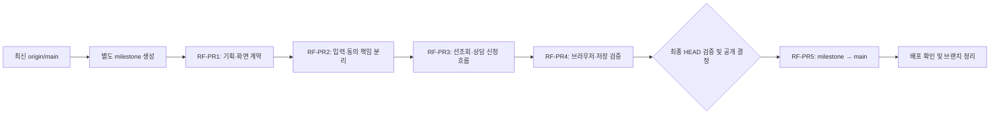

# 간편 환급액 선조회 플로우 PR 실행 계획

## 목적과 현재 상태

[선조회 및 상세 견적 신청 기획](quick-estimate-result-first-flow.md)을 독립적으로 검토할 수 있는 PR로 나누고, 별도 milestone 브랜치에서 통합한 뒤 완성된 흐름을 `main`에 반영하는 실행 계획이다.

- 작성일: 2026-09-04
- 상태: RF-PR1 진행. 최신 `origin/main`의 `59531812614af079740cf662dd2fc8c8a45b241a`에서 전용 milestone과 RF-PR1 브랜치를 생성했다. PR·검사·병합은 아래 실행 기록에 확인 후 기록한다.
- `RF-PR1`~`RF-PR5`는 이 문서의 계획 식별자이며 실제 GitHub PR 번호가 아니다.
- 현재 작성된 기획 문서와 기존 문서의 참조 안내는 `RF-PR1`에 포함할 대상이다. 문서가 작성됐다는 사실이 PR 생성·검토·병합 완료를 뜻하지 않는다.
- 이 문서는 이번 플로우 변경의 실행 순서를 소유한다. [기존 PR 로드맵](quick-estimate-pr-roadmap.md)의 과거 브랜치·PR 순서는 새 작업에 적용하지 않는다.

## 별도 milestone 브랜치 필수

이번 작업은 **`milestone/quick-estimate-result-first`를 새로 만들어 통합한다.** 기능 구현 PR을 `main`으로 직접 보내지 않는다. 현재 배포 workflow가 `main` push에서 배포를 수행하므로, 단계별 변경이 운영 화면에 노출되지 않게 통합 경계를 둔다.

| 용도           | 브랜치                                     | 생성 기준                         | PR 대상           |
| -------------- | ------------------------------------------ | --------------------------------- | ----------------- |
| 운영 기준      | `main`                                     | 기존 브랜치                       | 해당 없음         |
| 이번 기능 통합 | `milestone/quick-estimate-result-first`    | 실행 시 확인한 최신 `origin/main` | 마지막에만 `main` |
| RF-PR1         | `docs/quick-estimate-result-first-plan`    | milestone                         | milestone         |
| RF-PR2         | `refactor/quick-estimate-input-state`      | RF-PR1 병합 후 milestone          | milestone         |
| RF-PR3         | `feat/quick-estimate-result-first-flow`    | RF-PR2 병합 후 milestone          | milestone         |
| RF-PR4         | `test/quick-estimate-result-first-release` | RF-PR3 병합 후 milestone          | milestone         |
| RF-PR5         | milestone 브랜치 자체                      | RF-PR4 병합 후 누적 변경          | `main`            |

표의 `milestone`은 모두 `milestone/quick-estimate-result-first`를 가리킨다. 작업 브랜치 이름도 실행 계획이며 이미 존재하는 브랜치를 확인했다는 뜻이 아니다.

### 브랜치 준비 절차

1. 실행 시 현재 브랜치, 미커밋 변경, 원격 상태를 확인한다. 현재 작성 중인 문서와 사용자 작업을 보존한다.
2. 원격 `main`을 갱신해 기준 commit을 확인하고 그 지점에서 milestone 브랜치를 생성한다.
3. 원격 milestone 브랜치를 생성해 구현 PR의 base로 사용할 수 있게 한다.
4. milestone에서 RF-PR1 작업 브랜치를 만들고 이번 기획·로드맵 문서 변경만 옮긴다.
5. 같은 이름의 브랜치가 있으면 기존 목적과 commit을 확인한다. 강제 초기화하거나 과거 업종 v2 milestone을 재사용하지 않는다.

아래 명령은 브랜치 준비 절차다. 실행 기록의 기준 commit에서 기존 기획 문서 변경을 보존하며 수행했다.

```bash
git fetch origin
git switch -c milestone/quick-estimate-result-first origin/main
git push -u origin milestone/quick-estimate-result-first
git switch -c docs/quick-estimate-result-first-plan
```

미커밋 변경 때문에 전환이 안전하지 않으면 별도 worktree를 사용한다. 변경을 잃는 `reset --hard`, 강제 checkout이나 사용자 변경의 임의 stash·삭제는 사용하지 않는다.

### PR 진행 원칙

- 각 작업 PR을 milestone에 병합한 것을 확인한 뒤, 갱신된 milestone에서 다음 작업 브랜치를 만든다.
- 미병합 작업 브랜치를 다음 PR의 base로 사용하는 stacked PR이나 병렬 구현으로 진행하지 않는다.
- milestone에 기능이 연결되어도 운영 공개로 간주하지 않는다. 운영 공개 경계는 RF-PR5의 `main` 병합이다.
- 각 PR은 그 단계의 기능과 회귀 테스트를 함께 포함하고 `npm run check`를 통과한다. 오류를 남겨 다음 PR에서 고치는 방식으로 분할하지 않는다.
- `main`의 별도 변경을 milestone에 통합해야 하면 충돌을 해결하고 최신 milestone HEAD를 다시 검증한다.
- 최종 병합·배포·정리는 각각 실제 완료 증거를 확인한다. 계획만으로 자동 완료 처리하지 않는다.

## 전체 PR 순서



| 계획   | PR 제목 제안                                     | 핵심 검토 목적                           | 선행 조건                                   | 병합 직후 상태                 |
| ------ | ------------------------------------------------ | ---------------------------------------- | ------------------------------------------- | ------------------------------ |
| RF-PR1 | 간편 환급액 선조회 플로우 기획 및 실행 계획 정리 | 제품·화면·데이터 경계 확정               | milestone 준비                              | 문서 기준선 확정, 현재 UI 유지 |
| RF-PR2 | 간편 견적 입력 상태와 동의 책임 분리             | 새 순서에 필요한 기존 코드 책임 정리     | RF-PR1 병합                                 | 기존 연락처 우선 동작 유지     |
| RF-PR3 | 간편 환급액 선조회 및 상세 견적 신청 구현        | 새로운 사용자 흐름을 완결된 단위로 전환  | RF-PR2 병합, 화면 배치·문구 확인            | milestone에서 새 흐름 동작     |
| RF-PR4 | 선조회 플로우 브라우저 및 상담 저장 검증 보강    | 실제 브라우저·저장 경계의 출시 증거 확보 | RF-PR3 병합                                 | 공개 가능한 통합 상태          |
| RF-PR5 | 간편 환급액 선조회 플로우 적용                   | 검증된 누적 diff를 운영에 반영           | RF-PR4 병합, 최신 HEAD 검증, 최종 공개 결정 | main 반영 후 배포 확인 필요    |

## RF-PR1. 기획과 화면 계약

### 범위

- 선조회 기획과 이 PR 실행 계획을 문서 기준선으로 정리한다.
- 기존 리드 수집·UI·기술 문서의 연락처 우선 흐름과 후속 변경안의 관계를 명시한다.
- 결과·신청 정보·완료 화면의 문구, 버튼 우선순위, 이전 이동, 접수 불가 안내를 검토한다.
- 현재 디자인을 바탕으로 새 화면 배치를 확인하고 결과를 UI 기획에 남긴다. 기존 연락처 우선 Figma를 새 배치 승인으로 취급하지 않는다.
- 구현 후 적용할 계약과 현재 코드의 동작을 구분한다.

### 대상 문서

```text
docs/planning/
├── quick-estimate-result-first-flow.md
├── quick-estimate-result-first-pr-roadmap.md
├── quick-estimate-lead-collection.md
├── quick-estimate-ui-design-plan.md
├── quick-estimate-technical-design.md
└── quick-estimate-pr-roadmap.md
```

### 완료 조건

- 조회만으로 리드를 만들지 않는 기준과 실제 제출 버튼·시점이 명확하다.
- 기존 네 연락처 필드, 필수 개인정보 동의, 선택 마케팅 동의를 유지하는 범위가 명확하다.
- 상세 견적은 상담 신청이라는 의미와 기존 계산식 유지가 문서에 반영된다.
- 화면 배치·문구에 남은 검토 항목은 담당자가 확인할 수 있게 기록한다. 미확정 항목을 승인 완료로 표시하지 않는다.
- 문서 링크, 포맷, `git diff --check`, `npm run check`를 확인한다.

이 PR은 런타임·계산 규칙·운영 자산을 변경하지 않는다. 화면 배치 검토가 남아 있으면 RF-PR2의 구조 정리는 진행할 수 있지만, RF-PR3의 UI 구현 진입 전에 해결한다.

## RF-PR2. 입력 상태와 동의 책임 분리

### 범위

- 현재 `QuickEstimateFormValues`에 함께 있는 업종·직원 수와 동의 값을 책임별로 분리한다.
- 동의 전문·입력 조합을 신청 화면으로 이동할 수 있도록 feature 내부에서 분리한다. 기존 `ConsentDisclosure`를 재사용한다.
- 현재 단계 컴포넌트와 flow의 props를 갱신하되, 이 PR에서는 연락처 → 조회 조건·동의 → 결과·접수 순서를 유지한다.
- 견적 결과, 편집 중 입력, 제출 payload의 소유 경계를 명확히 한다. 단계 변경으로 결과를 재계산하거나 제출하지 않도록 기존 호출 경계를 보존한다.
- 분리한 책임에 맞게 컴포넌트 테스트를 조정하고 현재 동작의 회귀를 확인한다.

### 주요 대상

`types/quick-estimate-ui.ts`, `components/estimate-step.tsx`, `components/quick-estimate-flow.client.tsx`, 관련 동의 UI와 컴포넌트 테스트가 중심이다. 새 파일은 필요한 책임에 한해 `src/features/quick-estimate` 안에 배치한다.

### 완료 조건

- 기존 사용자 흐름과 조회·접수 횟수가 변하지 않는다.
- 동의 전문·버전·필수 여부와 payload 필드가 변하지 않는다.
- 마케팅 미동의 접수와 기존 재시도·중복 클릭 방지가 유지된다.
- 산식·계산 규칙·서버 검증·시트 schema를 변경하지 않는다.
- `npm run check`와 `git diff --check` 통과.

이 PR의 목적은 실제 기존 입력 책임을 분리하는 것이다. 아직 사용하지 않는 새 상태 관리 계층, 범용 폼 프레임워크 또는 미리 만든 완료 화면을 추가하지 않는다.

## RF-PR3. 선조회와 상세 견적 신청 흐름 구현

### 범위

- 최초 단계를 업종·직원 수 입력으로 변경한다.
- 조회 시 브라우저 계산과 결과 표시만 수행하고 접수 요청은 발생시키지 않는다.
- 결과의 주요 버튼을 `상세 견적 받기`로 변경해 같은 모달의 신청 정보로 연결한다.
- 연락처·동의를 신청 단계에 배치하고 최종 신청 버튼에서만 payload를 만들고 전송한다.
- 신청 중·완료·실패 화면, 결과로 돌아가기, 재조회와 재진입 초기화를 연결한다.
- 처음 표시한 금액·난수·규칙 버전을 신청과 재시도에서 보존한다.
- 중복 클릭·전송 중 수정/닫기 차단, 저장 결과 불명 상태의 동일 요청 재시도, 규칙 거절 시 재조회 등 기획의 실패 경로를 함께 구현한다.
- endpoint 없는 환경의 계산과 신청 불가 안내를 분리한다. 운영 배포의 endpoint 검사는 유지한다.
- 단계별 제목·포커스·모바일 스크롤과 동의 전문 펼침을 구현한다.
- 이 변경으로 영향을 받는 기존 컴포넌트·일반 E2E·live E2E의 단계 순서와 기대값을 함께 수정한다.
- 기존 기획·UI·기술 문서 본문을 새 구현과 정렬하되 운영 공개 전임을 유지한다.

### 주요 대상

flow, 조회·결과·신청 단계, dialog·CSS, 필요 시 완료 UI와 오류 분기, 관련 컴포넌트 테스트가 중심이다. 제출 상태·API·schema는 기존 계약을 재사용하며 변경이 필요하면 해당 diff와 이유를 명시한다.

### 이 PR에서 반드시 검증할 동작

- 조건 입력·조회·재조회·신청 화면 진입·필드 입력까지 제출 호출 0회.
- 필수 검증을 통과한 신청 버튼 실행 시 제출 1회.
- 제출 payload의 금액이 직전에 표시한 예상액과 일치.
- 마케팅 미동의 허용, 동의 누락 차단, 전송 전 뒤로 이동의 값 보존.
- 성공 확인 전 완료 문구 없음, 성공 후 같은 요청 재제출 없음.
- 시간 초과·네트워크·응답 판독 불가 재시도에서 동일 requestId와 payload 유지.
- 저장 실패·요청 제한·입력/동의/규칙 거절의 안내와 복구 경로 확인.
- endpoint가 없을 때도 조회 가능, 신청 입력은 차단하고 기존 문의 경로 제공.
- `npm run check`와 `git diff --check` 통과.

정상 흐름만 구현하고 실패·동의·중복 방지를 RF-PR4로 미루지 않는다. 이 PR을 병합한 milestone은 새 흐름 전체를 실행할 수 있어야 한다. 조회 순서만 바꾸고 기존 자동 접수를 남기는 중간 상태는 병합하지 않는다.

## RF-PR4. 브라우저와 실제 저장 경계 검증

### 범위

- 일반 Playwright에서 접수 요청을 가로채는 테스트로 조회와 신청 경계를 검증한다. 실제 외부 저장은 발생시키지 않는다.
- 데스크톱·모바일에서 전체 흐름, 동의 전문 확장, 긴 폼 스크롤, 오류 복구를 확인한다.
- 키보드, 모달 포커스, 200% 확대, reduced motion, axe 검사를 새 화면에 적용한다.
- 승인된 테스트 endpoint·Sheet에서 실제 전송, 한 건 저장, 동일 요청 중복 방지, 상담 목록 동기화와 알림 처리 결과를 확인한다.
- 저장된 업종·직원 수·예상액·규칙 버전·동의 정보가 화면 및 payload와 일치하는지 확인한다.
- 운영 안내에 조회자 전체가 아니라 상세 견적 신청자만 상담 목록에 남는다는 의미를 반영한다.
- 이 단계에서 발견한 결함은 해당 책임의 코드와 회귀 테스트를 함께 수정한다. 결함 규모가 크면 별도 수정 PR을 milestone 대상으로 추가하고 재검증한다.

### 완료 조건

- 일반 E2E는 실서버 쓰기 없이 반복 실행할 수 있다.
- 실제 저장 검증은 사용한 환경과 실행 결과를 기록한다. 연락처 등 개인정보를 증빙 문서·스크린샷·로그에 남기지 않는다.
- 가짜 데이터만 사용하고 운영 데이터와 구분한다. 테스트 데이터 정리는 승인된 기존 운영 절차를 따른다.
- live 테스트 5건 등이 skip된 `npm run check` 결과를 실제 저장 성공으로 대신하지 않는다.
- 외부 환경이 없으면 코드와 일반 검증은 완료하되, 실제 저장은 미검증으로 기록하고 RF-PR5의 공개 조건을 충족했다고 보지 않는다.
- `check:apps-script`를 포함한 `npm run check`와 `git diff --check` 통과.

RF-PR4는 RF-PR3에서 빠진 필수 테스트를 뒤늦게 작성하는 단계가 아니다. 구성 요소 검증을 실제 브라우저·저장 결과로 대조하고 공개 근거를 확보하는 단계다.

## RF-PR5. milestone에서 main으로 릴리스

### PR 형태

- head: `milestone/quick-estimate-result-first`
- base: `main`
- 제목 제안: `간편 환급액 선조회 플로우 적용`
- 내용: RF-PR1~4의 누적 diff, 최종 사용자 흐름, 검증 결과, 운영 영향과 롤백.
- 새로운 기능 개발을 릴리스 PR에 섞지 않는다. 검토 중 수정이 필요하면 milestone 대상 수정 PR을 병합하고 릴리스 HEAD를 다시 확인한다.

### main 병합 전 조건

- [ ] RF-PR1~4와 필요한 수정 PR의 milestone 병합 확인.
- [ ] 최종 milestone HEAD와 비교 대상 main의 commit 확인.
- [ ] 최신 누적 diff의 범위·충돌·문서 정합성 확인.
- [ ] 최종 HEAD의 `npm run check`와 `git diff --check` 통과.
- [ ] 최종 변경을 포함하는 실제 저장 검증 증거 확보. 검증 후 코드가 바뀌면 영향받는 검증 갱신.
- [ ] 미해결 리뷰·필수 검사 상태 확인.
- [ ] 계산·고지·제출 계약과 생성 artifact의 호환성 확인.
- [ ] 테스트 데이터 정리 상태와 운영 담당자에게 전달할 변경 의미 기록.
- [ ] 최종 공개 결정 확인.

각 PR을 생성할 때 실제 저장소에 존재하는 라벨과 현재 작업자 정보를 확인해 담당자·라벨을 설정하고, 생성 후 제목·담당자·라벨을 검증한다. 계정이나 라벨을 이 계획에서 임의로 지정하지 않는다.

### 병합 후 조건

1. GitHub에서 실제 `MERGED`와 merge commit을 확인한다.
2. 해당 commit의 품질 검사와 GitHub Pages 배포 성공을 확인한다. PR 병합만으로 배포 완료를 보고하지 않는다.
3. 공개 화면에서 새 순서와 간편 조회 동작을 확인한다. 공개 사이트에 임의 상담 신청을 만들지 않는다.
4. 병합된 작업 브랜치와 worktree만 확인 후 정리한다. milestone은 최종 main 병합과 필요한 작업 보존을 확인한 뒤 정리한다.

## 배포 호환성과 롤백

- 기존 산식, 고지 전문·버전, 최종 payload와 시트 컬럼을 유지하는 한 프런트엔드 전환을 위한 선행 migration은 계획하지 않는다.
- Apps Script 재배포를 기본 단계로 추가하지 않는다. 공유 타입·상수·artifact가 실제로 달라지는 경우 diff를 검토해 별도 호환 PR과 배포 선후관계를 계획에 추가한다.
- 서버 허용 버전이나 schema를 변경해야 하면 이전·신규 요청을 모두 처리할 수 있는 서버 변경을 먼저 배포한 뒤 프런트엔드를 공개한다.
- milestone 단계의 문제는 main 공개 전에 수정한다. 이미 main에 반영된 문제는 이번 릴리스 변경을 revert하고 다시 배포한다.
- 롤백 시 기존 상담 행을 삭제·변환하지 않는다. 화면이 연락처 우선·조회와 동시 접수 흐름으로 돌아가는 영향은 운영 담당자에게 명시한다.

## 실행 기록

계획과 실제 상태를 구분하기 위한 기록 표다. 실행한 뒤 확인된 값만 채운다.

| 계획   | 실제 PR | 검증 commit | 상태         |
| ------ | ------- | ----------- | ------------ |
| RF-PR1 | 미생성  | 미기록      | 문서 작성 중 |
| RF-PR2 | 미생성  | 미기록      | 미착수       |
| RF-PR3 | 미생성  | 미기록      | 미착수       |
| RF-PR4 | 미생성  | 미기록      | 미착수       |
| RF-PR5 | 미생성  | 미기록      | 미착수       |
