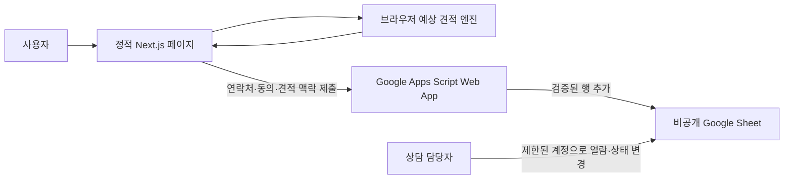
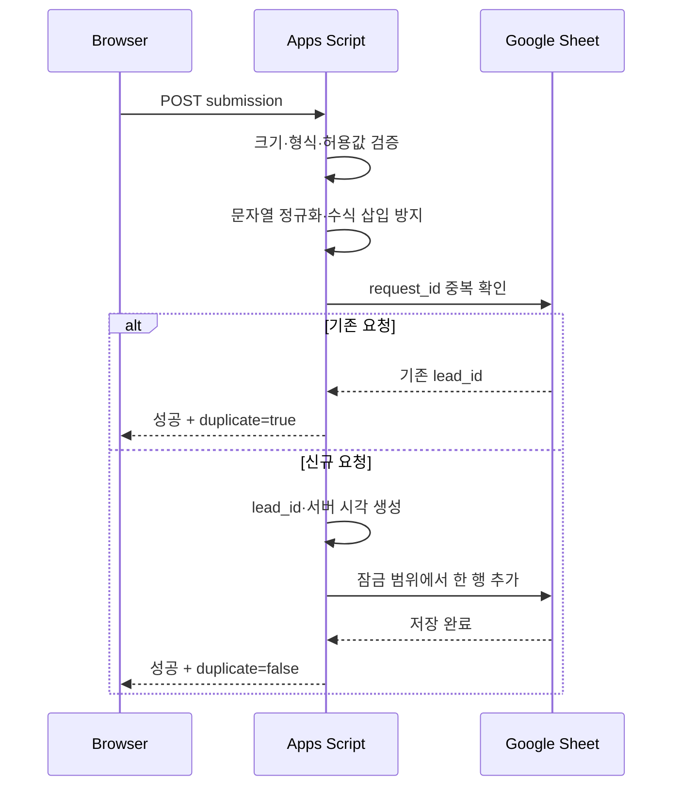

# 간단 견적 리드 수집 기술 설계

## 문서 목적

이 문서는 [간단 견적 리드 수집 기능 기획](quick-estimate-lead-collection.md)을 구현 가능한 기술 계약으로 구체화한다. 디자인이 확정되기 전에 결정할 수 있는 예상 견적 엔진, 데이터 계약, Google Sheets schema, Google Apps Script 처리 순서, 보안·오류·테스트 경계를 정의한다. 업종별 금액과 외부 참고값은 [간단 견적 기준액 벤치마크](quick-estimate-benchmark.md)를 따르며 실제 변경 순서는 [간단 견적 기능 PR 로드맵](quick-estimate-pr-roadmap.md)을 따른다. Apps Script 전송 방식의 실제 관측 결과는 [전송 검증 문서](quick-estimate-apps-script-spike.md)를 기준으로 삼는다.

현재 저장소에는 React 컴포넌트, 스타일과 브라우저 client를 구현하지 않는다. 기술 검증용 Apps Script와 비공개 Google Sheet는 인가 계정에 생성했으며 공개 테스트 배포는 검증 후 보관 처리했다. 사원 수는 1명부터 6,000명까지, 표시금액은 100억 원까지로 승인했다. 개인정보 처리는 동의를 근거로 접수일로부터 1년간 보유하며, 마케팅은 이메일·문자 선택 동의로 분리하는 계약을 승인했다.

## 설계 결정

| ID       | 결정                                                                                                  | 상태 | 근거                                                                                                    |
| -------- | ----------------------------------------------------------------------------------------------------- | ---- | ------------------------------------------------------------------------------------------------------- |
| `QD-001` | 4refund 1인당 기준액은 2026-08-05 인크루트 관측값보다 5% 높게 책정하고 1,000원 단위로 올림한다.       | 채택 | 참고값을 그대로 복제하지 않으면서 모든 업종의 자체 기준을 소폭 높인다.                                  |
| `QD-002` | 계산마다 1%–3% 양의 난수를 적용하고 최종 단일 금액을 1만 원 단위로 올림한다.                          | 채택 | 같은 조건에서도 제한된 변동을 주되 과도한 정밀도를 피한다.                                              |
| `QD-003` | 난수 생성은 계산 실행 event에서 한 번 수행하고 금액 계산은 난수를 인자로 받는 순수 함수로 구현한다.   | 채택 | 결과를 재현·검증하면서 정적 배포와 외부 서비스 장애 분리를 유지한다.                                    |
| `QD-004` | 연락처를 제출할 때 업종, 사원 수, 표시금액, 난수, 규칙·benchmark version도 함께 저장한다.             | 채택 | 상담 담당자가 문의 맥락과 사용자에게 표시된 결과를 재현할 수 있어야 한다.                               |
| `QD-005` | IP 주소, User-Agent, 광고 식별자는 기본 수집 대상에서 제외한다.                                       | 채택 | 상담 접수에 필요하지 않은 식별 정보 수집을 피한다.                                                      |
| `QD-006` | 개인정보 처리와 마케팅 활용 동의는 별도 계약과 컬럼으로 관리한다.                                     | 채택 | 목적과 필수 여부, 철회 상태가 다르다.                                                                   |
| `QD-007` | Apps Script Web App에 form encoded 단순 요청을 보내고 redirect 이후 JSON body로 성공·실패를 판정한다. | 채택 | [실제 검증](quick-estimate-apps-script-spike.md)에서 저장·검증·서버 실패와 재시도 중복 방지를 구분했다. |
| `QD-008` | 화면 순서와 결과 공개 시점은 디자인 결정으로 남기고 계산 상태와 제출 상태는 독립적으로 관리한다.      | 채택 | UI 구성이 바뀌어도 계산과 저장 계약을 유지한다.                                                         |
| `QD-009` | 외부 계산기는 런타임에 호출하지 않고 날짜가 붙은 내부 benchmark snapshot만 사용한다.                  | 채택 | 외부 장애·변경·정책에 제품 계산이 직접 의존하지 않게 한다.                                              |
| `QD-010` | Apps Script 배포와 Google Sheet 소유에는 사전에 인가된 이관수 Google 계정을 사용한다.                 | 채택 | 작업자 개인 계정에 운영 자산과 권한을 귀속시키지 않는다.                                                |
| `QD-011` | 상담 신청 개인정보는 명시적 동의를 근거로 수집하고 접수일로부터 1년간 보유한다.                       | 채택 | 상담 접수·연락·상태 관리에 필요한 최소 항목만 제한된 기간 동안 처리한다.                                |
| `QD-012` | 마케팅은 이메일·문자 채널의 선택 동의로 분리하고 동의일로부터 1년 또는 철회 시까지 보유한다.          | 채택 | 상담 필수 처리와 광고성 정보 전송의 선택권 및 철회 상태를 분리한다.                                     |
| `QD-013` | 운영 Sheet는 이관수 계정만 접근하고 일 100건, 분당 10건 이하의 초기 제출량을 기준으로 운영한다.       | 채택 | 초기 규모에서 선형 중복 조회와 단일 잠금이 감당할 수 있는 명시적 검증 기준을 둔다.                      |

## 시스템 경계



### 브라우저가 소유하는 책임

- 업종과 사원 수 입력 상태
- 예상 견적 규칙 조회와 결과 표시
- 사용자 피드백을 위한 1차 입력 검증
- 연락처와 동의 상태 입력
- 요청 식별자 생성
- 제출 중, 성공, 실패 상태

브라우저의 검증과 계산 결과는 신뢰 경계 밖에 있다. Apps Script는 요청 전체가 조작될 수 있다는 전제로 다시 검증한다.

### Apps Script가 소유하는 책임

- 요청 크기, 형식, 필수값, 허용값 검증
- 문자열 정규화와 Sheet 수식 삽입 방지
- 중복 요청 확인
- 서버 기준 접수 시각과 리드 식별자 생성
- Google Sheet 행 추가
- 내부 정보가 없는 성공 또는 실패 응답

### Google Sheet가 소유하는 책임

- 초기 리드 원본 보관
- 상담 처리 상태 관리
- 제한된 담당자 접근
- 보유 기간에 따른 파기 대상 확인

Google Sheet는 견적 계산 원본이나 애플리케이션 설정 저장소로 사용하지 않는다. 견적 규칙의 단일 원본은 저장소에서 버전 관리한다.

## 상태 설계

화면 단계 하나로 모든 상태를 합치지 않고 견적 상태와 제출 상태를 독립적으로 둔다.

### 견적 상태

```text
empty
  -> invalid
  -> calculated
  -> unsupported
```

| 상태          | 의미                                                                        |
| ------------- | --------------------------------------------------------------------------- |
| `empty`       | 업종 또는 사원 수가 입력되지 않았다.                                        |
| `invalid`     | 값의 형식이나 허용 범위가 잘못되었다.                                       |
| `calculated`  | 승인된 기준액과 난수로 예상금액을 계산했다.                                 |
| `unsupported` | 값은 유효하지만 대응하는 규칙이 없다. 임의 fallback 금액을 표시하지 않는다. |

### 제출 상태

```text
idle
  -> submitting
  -> succeeded
  -> failed
```

| 상태         | 의미                                                                   |
| ------------ | ---------------------------------------------------------------------- |
| `idle`       | 연락처를 아직 제출하지 않았다.                                         |
| `submitting` | 한 요청이 진행 중이며 추가 제출을 막는다.                              |
| `succeeded`  | Apps Script가 저장 성공을 확인했다.                                    |
| `failed`     | 검증, 네트워크 또는 저장 오류가 발생했다. 입력과 계산 결과를 보존한다. |

브라우저 검증 실패는 수정 가능한 초안과 오류 목록을 보존한다. 전송을 시작한 뒤의 실패는 최초 `requestId`, 계산 금액과 난수가 포함된 payload 전체를 보존하며, 재시도는 새 식별자를 만들지 않고 같은 payload만 다시 전송한다. 진행 중에는 추가 제출과 초기화를 모두 차단한다.

디자인은 두 상태를 한 화면, 모달, 여러 단계 중 어떤 방식으로 보여 줄지 결정한다. 기술 구현은 UI 단계 번호에 의존하지 않는다.

## 예상 견적 엔진

### 입력 계약

```typescript
type EstimateInput = {
  industryCode: string;
  employeeCount: number;
};

type EstimateCalculationInput = EstimateInput & {
  randomUpliftBps: number;
};
```

- `industryCode`는 사용자에게 보이는 한국어 문구가 아니라 변경에 안정적인 코드다.
- `employeeCount`는 정수이며 규칙에 정의된 최소·최대 범위 안에 있어야 한다.
- `randomUpliftBps`는 계산 실행 event에서 생성해 순수 계산 함수에 전달한다.
- 업종 label 변경은 코드나 과거 데이터의 의미를 바꾸지 않는다.

### 규칙 계약

```typescript
type EstimateRuleSet = {
  version: string;
  benchmarkVersion: string;
  currency: "KRW";
  displayUnit: number;
  maxDisplayAmount: number;
  randomUpliftBps: {
    min: number;
    max: number;
  };
  employeeCount: {
    min: number;
    max: number;
  };
  industries: Array<{
    code: string;
    label: string;
    benchmarkRatePerEmployee: number;
    baseRatePerEmployee: number;
  }>;
};
```

실제 구현에서는 프로젝트 규칙에 맞는 schema로 외부 설정을 검증하고, 공개 타입을 중복 선언하지 않는다. 위 코드는 설계 계약을 설명하기 위한 예시다.

### 규칙 불변조건

- `version`은 배포된 규칙 집합마다 고유하다.
- `benchmarkVersion`은 기준액을 확인한 출처 snapshot을 식별한다.
- `displayUnit`은 0보다 큰 정수다.
- `employeeCount`는 1명부터 6,000명까지의 정수다.
- `maxDisplayAmount`는 100억 원이며 초과 결과를 상한값으로 잘라 반환하지 않는다.
- 난수 범위는 100bp부터 300bp이며 항상 양수다.
- 업종마다 참고 1인당 기준액과 4refund 1인당 기준액이 하나씩 존재한다.
- 4refund 기준액은 참고 기준액의 105%를 1,000원 단위로 올림한 값이다.
- 최종 표시금액은 `displayUnit` 기준으로 올림한다.
- 최종 표시금액은 동일 조건의 benchmark 표시금액보다 최소 1만 원 높다.
- 승인되지 않은 업종에는 임의의 기본 금액을 사용하지 않는다.
- 이전 규칙 버전은 이미 저장된 리드를 해석할 수 있도록 Git 이력에서 확인 가능해야 한다.

### 계산 순서

1. 업종 코드가 현재 규칙에 있는지 확인한다.
2. 사원 수가 정수이고 전체 허용 범위 안인지 확인한다.
3. cryptographically secure random source에서 100bp부터 300bp 사이의 정수를 하나 생성한다.
4. 참고 기준액과 사원 수로 benchmark 표시금액을 계산하고 1만 원 단위 반올림한다.
5. 4refund 기준액과 사원 수에 난수를 적용하고 1만 원 단위 올림한다.
6. 후보 금액과 `benchmark 표시금액 + 10,000원` 중 큰 값을 최종 예상금액으로 사용한다.
7. 최종 금액이 100억 원을 넘으면 상한값으로 자르지 않고 `amount_limit_exceeded`로 거절한다.
8. 최종 금액, 난수, 규칙·benchmark version을 결과로 반환한다.
9. 대응 업종이 없으면 `unsupported`를 반환하고 금액을 만들지 않는다.

### 결과 계약

```typescript
type EstimateResult =
  | {
      status: "calculated";
      industryCode: string;
      employeeCount: number;
      amount: number;
      currency: "KRW";
      randomUpliftBps: number;
      ruleVersion: string;
      benchmarkVersion: string;
    }
  | {
      status: "invalid";
      reason:
        | "employee_count_not_integer"
        | "employee_count_out_of_range"
        | "random_uplift_not_integer"
        | "random_uplift_out_of_range"
        | "amount_limit_exceeded";
    }
  | {
      status: "unsupported";
      reason: "unsupported_industry";
    };
```

`reason`은 내부 오류 원문이 아니라 UI가 승인된 문구를 선택할 수 있는 안정적인 코드로 구현한다.

## 제출 데이터 계약

### 요청

```json
{
  "requestId": "0fca3874-40bc-4ea9-a7ad-742a062736ea",
  "estimate": {
    "industryCode": "approved-industry-code",
    "employeeCount": 10,
    "amount": 0,
    "currency": "KRW",
    "randomUpliftBps": 200,
    "ruleVersion": "estimate-rule-2026-08-05",
    "benchmarkVersion": "incruit-2026-08-05"
  },
  "lead": {
    "companyName": "회사명",
    "contactName": "담당자 이름",
    "email": "name@example.com",
    "phone": "01000000000"
  },
  "privacy": {
    "basis": "CONSENT",
    "noticeVersion": "privacy-2026-08-06-v1",
    "agreed": true
  },
  "marketing": {
    "agreed": false,
    "channels": [],
    "consentVersion": "marketing-2026-08-06-v1"
  },
  "sourcePath": "/"
}
```

- `requestId`는 브라우저에서 생성하는 UUID이며 같은 제출의 재시도에서 유지한다.
- 예상 금액은 사용자가 실제로 본 결과를 기록하기 위해 전달한다.
- Apps Script는 업종, 사원 수, 난수, 규칙·benchmark version으로 예상 금액을 재계산해 요청값과 일치하는지 검증한다.
- `privacy.basis`는 `CONSENT`, `noticeVersion`은 `privacy-2026-08-06-v1`, `agreed`는 `true`여야 한다.
- `marketing.agreed`가 `false`이면 `channels`는 빈 배열이어야 한다.
- `marketing.agreed`가 `true`이면 `EMAIL`, `SMS` 중 하나 이상의 채널이 있어야 한다. 전화번호는 상담 연락에만 사용하고 마케팅 전화 채널로 사용하지 않는다.
- 클라이언트가 보낸 접수 시각은 저장하지 않는다.
- wire body는 `application/x-www-form-urlencoded;charset=UTF-8`이며 위 JSON 전체를 `payload` form field의 문자열로 전달한다.
- Apps Script는 `e.parameter.payload`를 JSON parse한 뒤 schema를 검증한다. flat form field를 운영 계약으로 사용하지 않는다.

### 성공 응답

```json
{
  "ok": true,
  "leadId": "lead-generated-by-endpoint",
  "duplicate": false
}
```

같은 `requestId`가 재전송되면 새 행을 만들지 않고 기존 `leadId`와 `duplicate: true`를 반환한다.

### 실패 응답

```json
{
  "ok": false,
  "code": "INVALID_INPUT"
}
```

| 오류 코드             | HTTP 의미                       | 사용자 처리                            |
| --------------------- | ------------------------------- | -------------------------------------- |
| `INVALID_INPUT`       | 입력 계약 위반                  | 해당 입력을 수정하도록 안내            |
| `INVALID_CONSENT`     | 필수 확인 누락 또는 계약 불일치 | 동의 항목을 다시 확인하도록 안내       |
| `UNSUPPORTED_RULE`    | 지원하지 않는 견적 규칙 버전    | 결과를 유지하고 상담 대체 경로 안내    |
| `STORAGE_UNAVAILABLE` | Google Sheets 저장 실패         | 접수되지 않았음을 명시하고 재시도 안내 |
| `INTERNAL_ERROR`      | 공개할 수 없는 내부 오류        | 일반 오류 문구와 대체 연락처 제공      |

Apps Script `ContentService`에서는 도메인 실패도 HTTP `200`으로 반환될 수 있으므로 브라우저는 status만으로 성공 처리하지 않는다. form encoded 요청의 redirect 이후 JSON body를 읽고 `ok`와 결과 코드를 함께 판정한다. `application/json`은 preflight가 실패하므로 사용하지 않으며, body를 읽을 수 없는 전송 방식은 성공 응답 계약을 만족하지 못한 것으로 판단한다.

### 브라우저 전송 판정

- endpoint URL은 호출자가 주입하며 소스 코드에 운영 URL을 하드코딩하지 않는다.
- `URLSearchParams`의 `payload` field에 JSON을 담고 credential 없이 redirect를 따라간다.
- 기본 timeout은 Apps Script cold start를 고려한 15초이며 호출자가 명시적으로 조정할 수 있다.
- `INVALID_INPUT`, `INVALID_CONSENT`, `UNSUPPORTED_RULE`은 검증 실패로 분류한다.
- `STORAGE_UNAVAILABLE`, `INTERNAL_ERROR`은 서버 실패로 분류한다.
- timeout, fetch 예외와 판독 불가 응답은 저장 여부를 확정하지 않으며 성공으로 표시하지 않는다.
- 응답의 필드 집합, `leadId` UUID와 `duplicate`를 확인한 경우에만 성공으로 전환한다.
- 자동 재시도는 하지 않는다. 사용자가 재시도하면 최초 payload를 그대로 사용한다.

## 정규화와 검증

| 필드        | 브라우저 검증      | Apps Script 검증·정규화                         |
| ----------- | ------------------ | ----------------------------------------------- |
| 업종 코드   | 현재 선택지에 포함 | 허용 목록과 규칙·benchmark version 확인         |
| 사원 수     | 정수와 범위        | 정수와 현재 정책 상한 확인                      |
| 난수        | 100bp–300bp        | 정수와 허용 범위 확인                           |
| 예상 금액   | 계산 결과          | 같은 규칙과 난수로 재계산해 값 일치 확인        |
| 회사명      | 필수, 길이         | trim, 길이, 제어문자, 수식 시작 문자 처리       |
| 담당자 이름 | 필수, 길이         | trim, 길이, 제어문자, 수식 시작 문자 처리       |
| 이메일      | 입력 형식          | trim, 소문자 정규화 범위 확정, 길이와 기본 형식 |
| 전화번호    | 입력 형식          | 구분자 제거, 허용 길이, Sheet 텍스트 저장       |
| 동의 버전   | 현재 화면 상수     | 허용된 버전인지 확인                            |
| 마케팅 채널 | 선택값             | 동의 여부와 채널 조합 검증                      |
| source path | 현재 경로          | 허용 경로 목록 또는 길이 제한                   |

이메일 주소의 local-part는 대소문자가 의미를 가질 수 있으므로 전체를 무조건 소문자로 바꾸지 않는다. 비교용 정규화가 필요하면 원본 저장값과 분리한다.

## Google Sheets schema

### 문서와 시트 구성

```text
간단 견적 리드 저장소
├── leads       # 제출 원본과 상담 상태
└── codebook    # 컬럼 설명, 상태값, 동의 버전 기록
```

- `leads`의 첫 행은 고정 header이며 담당자가 변경하지 못하도록 보호한다.
- `codebook`은 운영자가 현재 컬럼 의미와 허용 상태를 확인하는 문서용 시트다.
- Apps Script가 쓰는 원본 컬럼과 담당자가 수정하는 운영 컬럼을 시각적·권한상 분리한다.
- 모든 시각은 UTC ISO 8601 문자열로 저장하고 Sheet 표시 형식에서 한국 시간으로 보여 줄 수 있다.
- 초기 운영 접근자는 `QD-010` 소유 계정 한 명으로 제한하고 공개 링크 공유와 별도 export·backup을 금지한다.
- 일 100건, 분당 10건을 초기 용량 계약으로 사용하며 이 범위를 넘기기 전에 중복 조회와 잠금 시간을 다시 측정한다.

### leads 컬럼

| 순서 | 컬럼                        | 생성 주체          | 수정 | 내용                             |
| ---- | --------------------------- | ------------------ | ---- | -------------------------------- |
| 1    | `lead_id`                   | Apps Script        | 금지 | 내부 리드 식별자                 |
| 2    | `request_id`                | 브라우저           | 금지 | 중복 제출 방지 식별자            |
| 3    | `submitted_at`              | Apps Script        | 금지 | 서버 기준 접수 시각              |
| 4    | `industry_code`             | 브라우저           | 금지 | 견적 업종 코드                   |
| 5    | `employee_count`            | 브라우저           | 금지 | 견적 사원 수                     |
| 6    | `estimate_amount_krw`       | 브라우저           | 금지 | 표시한 최종 예상 금액            |
| 7    | `random_uplift_bps`         | 브라우저           | 금지 | 계산에 사용한 100bp–300bp 난수   |
| 8    | `estimate_rule_version`     | 브라우저           | 금지 | 적용한 규칙 버전                 |
| 9    | `benchmark_version`         | 브라우저           | 금지 | 적용한 외부 기준 snapshot        |
| 10   | `company_name`              | 브라우저           | 금지 | 회사명                           |
| 11   | `contact_name`              | 브라우저           | 금지 | 담당자 이름                      |
| 12   | `email`                     | 브라우저           | 금지 | 이메일                           |
| 13   | `phone`                     | 브라우저           | 금지 | 정규화한 전화번호 문자열         |
| 14   | `privacy_basis`             | 브라우저           | 금지 | 확정된 개인정보 처리 근거 코드   |
| 15   | `privacy_notice_version`    | 브라우저           | 금지 | 사용자에게 표시한 고지 버전      |
| 16   | `privacy_agreed`            | 브라우저           | 금지 | 동의를 근거로 사용할 때의 확인값 |
| 17   | `privacy_accepted_at`       | Apps Script        | 금지 | 접수 시점의 서버 시각            |
| 18   | `marketing_agreed`          | 브라우저           | 금지 | 마케팅 활용 동의 여부            |
| 19   | `marketing_channels`        | 브라우저           | 금지 | 승인된 채널 코드 목록            |
| 20   | `marketing_consent_version` | 브라우저           | 금지 | 사용자에게 표시한 동의 버전      |
| 21   | `marketing_accepted_at`     | Apps Script        | 금지 | 동의한 경우의 서버 시각          |
| 22   | `source_path`               | 브라우저           | 금지 | 승인된 유입 경로                 |
| 23   | `lead_status`               | Apps Script·담당자 | 허용 | 초기값 `NEW`, 운영 상태          |
| 24   | `handled_at`                | 담당자             | 허용 | 최초 처리 시각                   |

Sheet에 메모 자유 입력 컬럼을 기본 제공하지 않는다. 상담 중 추가 개인정보를 무분별하게 적는 경로가 될 수 있기 때문이다. 운영상 메모가 필요하면 목적, 접근권한, 보유 기간을 별도로 정의한다.

### 운영 상태

| 상태         | 의미                                       |
| ------------ | ------------------------------------------ |
| `NEW`        | 아직 확인하지 않은 신규 리드               |
| `CONTACTING` | 담당자가 연락을 시도 중인 리드             |
| `COMPLETED`  | 상담 또는 후속 처리가 완료된 리드          |
| `CLOSED`     | 중복, 오입력, 요청 철회 등으로 종료된 리드 |

상태 변경 이력 자체가 필요해지면 같은 셀을 덮어쓰는 Sheets 구조를 확장하지 않고 별도 CRM 또는 감사 로그 저장소 도입을 검토한다.

## Apps Script 처리 흐름



### 처리 순서

1. POST body 존재 여부와 최대 크기를 확인한다.
2. JSON 파싱 실패를 `INVALID_INPUT`으로 처리한다.
3. 예상 견적, 연락처, 개인정보, 마케팅 계약을 각각 검증한다.
4. 허용되지 않은 필드를 저장하지 않는다.
5. 문자열을 trim하고 제어문자와 Sheet 수식 시작 문자를 처리한다.
6. 동시 요청 잠금을 획득한다.
7. `request_id`가 이미 있으면 기존 성공 결과를 반환한다.
8. 서버 시각, `lead_id`, 초기 상태를 추가해 한 행을 저장한다.
9. 잠금을 해제하고 최소한의 성공 응답을 반환한다.
10. 실패 로그에는 `request_id`, 오류 코드, 실행 시각만 남기고 연락처 원문을 기록하지 않는다.

동시성 잠금과 중복 조회 방식은 예상 제출량으로 성능을 검증한다. 선형 조회가 운영량을 감당하지 못하면 Apps Script 최적화보다 관리형 데이터 저장소 전환을 우선 검토한다.

## 전송 방식 기술 검증

[2026-08-05 실제 검증](quick-estimate-apps-script-spike.md)에서 form encoded 단순 요청의 redirect 이후 JSON body를 브라우저가 읽을 수 있음을 확인해 Apps Script를 제출 중계 후보로 채택했다. `application/json`, `no-cors`와 응답을 읽지 않는 전송은 채택하지 않는다.

### 검증 목적

Google Apps Script가 저장 성공과 실패를 정적 사이트의 브라우저에 구분해서 전달할 수 있는지 확인한다.

### 검증 환경

- 운영과 분리한 테스트용 Google Sheet
- 가짜 회사명, 이름, 이메일, 전화번호
- 실제 GitHub Pages와 동일한 정적 origin 또는 production build
- Apps Script의 실제 배포 URL

### 통과 조건

- 브라우저가 성공 body를 읽고 `succeeded`로 전환할 수 있다.
- 검증 실패 body와 오류 코드를 읽을 수 있다.
- 저장 실패를 성공으로 오인하지 않는다.
- redirect 이후에도 응답 계약이 유지된다.
- 자격 증명과 Sheet 식별자가 브라우저 bundle에 포함되지 않는다.
- 한 요청의 재시도가 하나의 행만 만든다.

위 조건은 가짜 데이터와 임시 배포에서 모두 확인했다. timeout과 네트워크 단절은 저장 여부 불명 상태로 분류하고, 동일 `requestId`로 재시도해 중복 행을 만들지 않는 계약을 유지한다.

### 실패 시 대안 순서

1. Google Forms와 연결된 Sheet를 사용하고 사용자 흐름 제약을 디자인에 반영한다.
2. 성공 응답을 보장하는 관리형 서버리스 함수가 Google Sheet 쓰기만 중계하도록 한다.
3. 위 대안도 운영 요구를 만족하지 못하면 Sheets 저장 방식을 재검토한다.

응답을 읽을 수 없는 `no-cors` fire-and-forget 제출은 접수 성공을 증명할 수 없으므로 채택하지 않는다.

## 보안과 개인정보

| 위험               | 통제                                                               |
| ------------------ | ------------------------------------------------------------------ |
| 공개 endpoint 스팸 | 허니팟·제출 시간·CAPTCHA 후보 비교, 요청 크기 제한, 반복 제출 정책 |
| 브라우저 검증 우회 | Apps Script에서 schema와 허용값 재검증                             |
| Sheet 수식 삽입    | 위험 시작 문자를 일반 문자열로 escape하고 컬럼을 텍스트로 취급     |
| 중복 행            | `request_id` 멱등성, 동시성 잠금, 제출 버튼 중복 실행 방지         |
| 개인정보 로그 노출 | 연락처 원문 로깅 금지, 오류 코드 중심 로그                         |
| Sheet 공유 노출    | 공개 링크 금지, 최소 담당자 권한, 다중 인증, 퇴사자 권한 회수      |
| 규칙 조작          | 업종·인원·난수·version으로 Apps Script가 예상금액 재계산           |
| 동의 증빙 부족     | 고지·동의 버전과 서버 접수 시각 저장                               |
| 데이터 장기 보관   | 승인된 보유 기간과 정기 파기 절차                                  |

CAPTCHA를 채택하면 검증용 secret은 Apps Script의 비공개 설정에서만 읽는다. 사이트의 공개 환경 변수나 저장소에 넣지 않는다.

## 관측과 운영

- Apps Script 실행 성공·실패 횟수를 정기적으로 확인한다.
- `STORAGE_UNAVAILABLE`과 할당량 오류를 구분해 기록한다.
- 신규 리드가 예상 기간 동안 한 건도 들어오지 않으면 제출 경로 장애 여부를 확인한다.
- 운영 담당자는 `lead_status`만 수정하고 원본 제출 컬럼은 수정하지 않는다.
- 마케팅 철회 요청이 오면 `marketing_agreed` 원본을 덮어쓰기보다 철회 상태를 기록할 별도 정책을 마련한다. 철회 요구가 실제로 발생하기 전까지 임의 컬럼을 추가하지 않는다.
- 보유 기간 만료 데이터의 추출·파기 책임자와 실행 주기를 공개 전에 정한다.

## 코드 구조

각 [PR 로드맵](quick-estimate-pr-roadmap.md)의 진입 조건이 충족된 뒤 해당 단계에 필요한 폴더만 만든다. 현재 계산, schema, transport와 상태 코드만 존재하며 `components`는 디자인 확정 후 생성한다.

```text
src/features/quick-estimate/
├── api/
│   └── submit-estimate-lead.ts       # form encoded 전송과 응답 판정
├── constants/
│   ├── estimate-rule-set.ts          # 승인된 업종·기준액·난수 정책
│   └── lead-submission-contract.ts   # 고지·동의와 payload 크기 계약
├── lib/
│   ├── calculate-estimate.ts         # 난수를 인자로 받는 순수 견적 계산
│   ├── generate-random-uplift.ts     # 브라우저 보안 난수 생성 경계
│   ├── generate-submission-request-id.ts # 제출 UUID 생성 경계
│   └── submission-state.ts           # 제출 상태와 멱등 재시도 전이
├── schemas/
│   └── lead-submission.ts            # 연락처·동의·견적 제출 검증
├── types/
│   ├── estimate.ts                   # 계산 결과 계약
│   └── lead-submission.ts            # wire·응답·전송 결과 계약
└── index.ts                          # feature 공개 진입점
```

Apps Script를 저장소에서 관리하기로 결정하면 다음 후보 구조를 사용하되, 실제 폴더를 만들기 전에 `docs/engineering/architecture.md`와 자동 검사 범위를 함께 갱신한다.

```text
integrations/google-apps-script/quick-estimate/
├── appsscript.json
├── Code.gs
└── README.md
```

브라우저와 Apps Script가 같은 규칙 계약을 공유해야 할 때 파일 복사로 동기화하지 않는다. 저장소의 규칙 원본에서 배포 artifact를 생성하거나 두 구현의 규칙 일치 테스트를 추가한다.

## 테스트 설계

### 예상 견적 단위 테스트

- 모든 업종이 참고 기준액과 4refund 기준액을 가진다.
- 4refund 기준액이 참고 기준액의 105%를 1,000원 단위로 올림한 값인지 확인한다.
- 0, 음수, 소수, 상한 초과 사원 수를 거부한다.
- 알 수 없는 업종을 `unsupported`로 처리한다.
- 생성한 난수가 100bp부터 300bp 사이의 정수인지 확인한다.
- 최종 금액이 benchmark 표시금액보다 최소 1만 원 높은지 확인한다.
- 난수 경곗값 100bp와 300bp에서 계산과 1만 원 올림이 정확한지 확인한다.
- 한 번 계산한 결과가 제출과 재시도에서 바뀌지 않는지 확인한다.
- 같은 입력을 새로 계산하면 난수에 따라 다른 결과를 가질 수 있는지 확인한다.

### 제출 계약 테스트

- 연락처 필수값과 최대 길이를 검증한다.
- 마케팅 미동의를 정상 요청으로 허용한다.
- 미동의 상태의 마케팅 채널을 거부한다.
- 진행 중 중복 제출과 초기화를 차단한다.
- 실패 재시도에서 같은 `request_id`, 계산 금액과 난수를 유지한다.
- timeout, network와 판독 불가 응답을 성공으로 표시하지 않는다.
- 알 수 없는 동의 버전과 견적 규칙 버전을 거부한다.
- 알 수 없는 benchmark version과 허용 범위 밖의 난수를 거부한다.
- 요청 예상금액이 서버 재계산값과 다르면 거부한다.
- IP 주소와 User-Agent 같은 허용되지 않은 필드를 저장하지 않는다.
- 수식 시작 문자열을 일반 텍스트로 저장한다.

### Apps Script 통합 테스트

- 유효한 요청이 한 행으로 저장된다.
- 같은 `request_id` 재시도가 새 행을 만들지 않는다.
- 동시 중복 요청도 한 행만 만든다.
- 저장 실패가 `STORAGE_UNAVAILABLE`로 전달된다.
- 로그에 이메일과 전화번호 원문이 없다.
- 성공·검증 실패·저장 실패 응답을 실제 정적 origin에서 읽을 수 있다.

### 디자인 이후 E2E 테스트

- 업종과 사원 수 입력부터 예상 결과까지 완료한다.
- 연락처와 필수 확인을 입력해 제출한다.
- 마케팅 미동의 상태로 제출할 수 있다.
- 제출 중 중복 실행이 차단된다.
- 실패 후 입력과 예상 결과를 유지한 채 재시도한다.
- keyboard와 모바일 환경에서 전체 흐름을 완료한다.
- 자동 접근성 검사와 실제 focus 이동을 검증한다.

## 구현 순서

1. 완료: 현재 기획, benchmark, 기술 설계와 [PR 로드맵](quick-estimate-pr-roadmap.md)을 문서 기준선으로 확정한다.
2. 완료: `QD-010` 승인 계정의 테스트용 Sheet와 가짜 데이터로 [Apps Script 전송 방식](quick-estimate-apps-script-spike.md)을 검증하고 제출 중계 후보로 채택한다.
3. 완료: 승인된 업종·기준액·난수 정책과 사원 수 범위로 계산 core와 단위 테스트를 구현한다.
4. 완료: 승인된 개인정보·마케팅 계약과 `QD-010` 계정의 접근·운영 범위로 저장 처리를 구현한다.
5. 완료: 확정된 endpoint 계약을 기준으로 브라우저 제출 schema, transport와 상태 전이를 구현한다.
6. 디자인과 사용자 문구 확정 후 컴포넌트와 접근성 상태를 구현한다.
7. 계산, 동의, 제출과 저장을 연결하고 정적 배포 환경에서 전체 흐름을 검증한다.
8. 스팸 방지, 운영 권한, benchmark 갱신과 출시 QA를 마친다.
9. `npm run check`를 통과한 뒤 랜딩 진입점을 공개한다.

5단계까지는 화면 디자인 없이 진행할 수 있다. 각 코드 작업은 해당 단계의 금액, 개인정보, 운영 계정 또는 전송 계약이 승인된 뒤 시작하며, 아직 필요하지 않은 화면 폴더를 미리 만들지 않는다.

## 롤백과 복구

- 프런트엔드 연결 전 기술 검증은 운영 랜딩에 영향을 주지 않는다.
- 기능 공개 후 장애가 발생하면 랜딩의 진입점만 비활성화하고 기존 정적 콘텐츠를 유지한다.
- Apps Script 배포를 폐기하거나 접근 권한을 회수해 신규 제출을 중단할 수 있다.
- 코드 롤백이 기존 Sheet 행을 자동 삭제해서는 안 된다.
- 잘못 저장된 개인정보 삭제는 승인된 파기 절차와 삭제 대상 증빙을 거쳐 수행한다.
- schema migration이 필요한 규모가 되면 Google Sheets를 계속 확장하지 않고 관리형 저장소 전환을 검토한다.

## 미확정 결정

| 항목                                  | 결정 주체        | 구현 영향                      |
| ------------------------------------- | ---------------- | ------------------------------ |
| benchmark 갱신 주기                   | 사업·운영 담당자 | 외부 기준보다 높다는 보장 범위 |
| 결과를 연락처 제출 전후 언제 공개할지 | 제품·디자인      | 화면 흐름과 전환 측정          |
| 스팸 방지 방식                        | 운영·개발        | 사용자 마찰과 비밀값 관리      |
| 승인 계정의 복구 절차                 | 운영 담당자      | 운영 연속성                    |
