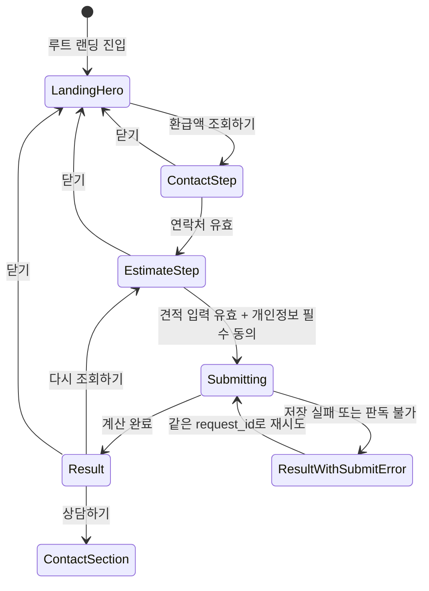
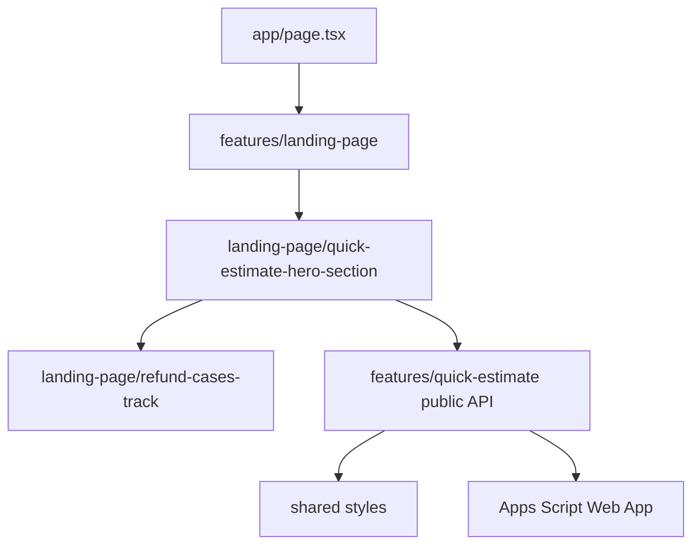

# 간단 견적 UI 디자인 해석 및 구현 기획

> 2026-09-04 후속 기획: [간편 환급액 선조회 및 상세 견적 신청 플로우](quick-estimate-result-first-flow.md)를 검토한다. 이 문서의 Figma와 연락처 우선 단계는 변경 전 기준이며, 새 화면 순서·동의 배치·완료 화면은 아직 구현하지 않았다.

새 배치·문구는 후속 기획의 `RF-PR1 화면 결정 (2026-09-04)`을 구현 기준으로 삼는다. 기존 모달의 폭·헤더·내부 스크롤을 재사용하고 결과 → 연락처·동의 → 접수 상태로 책임을 나눈다. 결정 근거는 사용자 요구와 현재 컴포넌트 구조이며, 기존 Figma가 새 흐름을 승인했다는 의미가 아니다.

## 문서 목적

이 문서는 2026-08-07 최종 전달된 Figma를 기준으로 루트 랜딩의 기존 hero를 간단 견적 hero로 교체하고, 같은 페이지의 단계형 모달과 결과 화면을 현재 계산·제출·Google Sheets 계약에 연결하는 구현 기준을 정의한다.

이번 문서의 범위는 디자인 해석과 후속 PR 설계까지다. React 컴포넌트, 스타일, 에셋, 라우트와 운영 endpoint는 변경하지 않는다.

## 관련 문서

- [간단 견적 리드 수집 기능 기획](quick-estimate-lead-collection.md)
- [간단 견적 리드 수집 기술 설계](quick-estimate-technical-design.md)
- [간단 견적 기능 PR 로드맵](quick-estimate-pr-roadmap.md)
- [간단 견적 기준액 벤치마크](quick-estimate-benchmark.md)
- [랜딩 페이지 구현 기획](landing-page-implementation.md)
- [폴더 구조와 의존성](../engineering/architecture.md)
- [코드 컨벤션](../engineering/code-conventions.md)

## Figma 기준선

| 구분             | Figma node                                                                                                                                                 | 확인한 내용                                                               |
| ---------------- | ---------------------------------------------------------------------------------------------------------------------------------------------------------- | ------------------------------------------------------------------------- |
| 메인 랜딩        | [`290:387`](https://www.figma.com/design/ijPZL5WxrjvxbHjBp0DoQa/4%EB%8C%80%EB%B3%B4%ED%97%98-%ED%99%98%EA%B8%89%EC%84%BC%ED%84%B0?node-id=290-387&m=dev)   | 기존 hero를 대체하는 견적 hero, 조회 CTA, 환급 사례 track, 나머지 section |
| 폐기된 별도 안   | [`313:1030`](https://www.figma.com/design/ijPZL5WxrjvxbHjBp0DoQa/4%EB%8C%80%EB%B3%B4%ED%97%98-%ED%99%98%EA%B8%89%EC%84%BC%ED%84%B0?node-id=313-1030&m=dev) | 별도 route 안은 구현 기준에서 제외하고 합성 이미지 참고로만 사용          |
| 컴포넌트 모음    | [`319:1700`](https://www.figma.com/design/ijPZL5WxrjvxbHjBp0DoQa/4%EB%8C%80%EB%B3%B4%ED%97%98-%ED%99%98%EA%B8%89%EC%84%BC%ED%84%B0?node-id=319-1700&m=dev) | 조회 CTA, 입력, 버튼, 드롭다운, 동의 checkbox의 상태 variant              |
| hero 이미지 원본 | [`368:550`](https://www.figma.com/design/ijPZL5WxrjvxbHjBp0DoQa/4%EB%8C%80%EB%B3%B4%ED%97%98-%ED%99%98%EA%B8%89%EC%84%BC%ED%84%B0?node-id=368-550&m=dev)   | 봉투 뒤·앞·그림자, 결과지, 세 개 동전 레이어                              |
| 담당자 입력 기본 | [`324:499`](https://www.figma.com/design/ijPZL5WxrjvxbHjBp0DoQa/4%EB%8C%80%EB%B3%B4%ED%97%98-%ED%99%98%EA%B8%89%EC%84%BC%ED%84%B0?node-id=324-499&m=dev)   | 첫 단계 빈 입력과 비활성 `다음` 버튼                                      |
| 담당자 입력 완료 | [`349:632`](https://www.figma.com/design/ijPZL5WxrjvxbHjBp0DoQa/4%EB%8C%80%EB%B3%B4%ED%97%98-%ED%99%98%EA%B8%89%EC%84%BC%ED%84%B0?node-id=349-632&m=dev)   | 첫 단계 유효 입력과 활성 `다음` 버튼                                      |
| 견적·동의 입력   | [`333:570`](https://www.figma.com/design/ijPZL5WxrjvxbHjBp0DoQa/4%EB%8C%80%EB%B3%B4%ED%97%98-%ED%99%98%EA%B8%89%EC%84%BC%ED%84%B0?node-id=333-570&m=dev)   | 두 번째 단계 업종, 직원 수, 두 동의와 `조회하기` 버튼                     |
| 결과             | [`349:580`](https://www.figma.com/design/ijPZL5WxrjvxbHjBp0DoQa/4%EB%8C%80%EB%B3%B4%ED%97%98-%ED%99%98%EA%B8%89%EC%84%BC%ED%84%B0?node-id=349-580&m=dev)   | 예상 환급액, 한계 안내, 다시 조회하기와 상담하기                          |

전달된 마지막 결과 링크는 `333:570`으로 두 번째 입력 화면과 같았다. Figma 파일에서 별도 결과 frame `349:580`을 확인했으므로 결과 상태는 이 node를 기준으로 삼는다.

`290:387`이 현재 페이지 기준선이다. 기존에 검토한 `313:1030` 별도 페이지와 `/quick-estimate` route 계획은 폐기한다.

## 화면 디자인 해석

### 메인 hero 교체

루트 `/`의 현재 어두운 배경 hero와 전화·이메일 action row를 제거하고 `290:387`의 흰색 간단 견적 hero로 교체한다. 별도 페이지 이동은 만들지 않는다.

1. 기존 사이트 header
2. `기업의 4대보험 환급을 함께합니다.` 제목
3. `국내 다양한 업종의 기업과 함께 4대보험 경정청구를 진행하며, 숨은 환급금을 찾아드리고 있습니다.` 설명
4. 봉투·결과지·동전 합성 이미지와 이미지 안의 `우리 회사 예상 환급액은?` 문구
5. 같은 hero 안의 `환급액 조회하기` 버튼
6. hero 하단을 가로로 순환하는 기존 환급 사례
7. 기존 소개·혜택·전문가·절차·연락·footer section

데스크톱 Figma에서 새 hero는 흰색 배경, 약 946px 높이, 상하 100px 여백과 1280px 콘텐츠 폭을 사용한다. 제목은 48px bold, 설명은 20px, 합성 이미지 본체는 약 442px, 조회 버튼은 약 295×54px의 파란 pill 형태다. 기존 `--color-brand-primary: #0074ca`, `--color-brand-navy: #10294c`, 콘텐츠 폭 token을 그대로 사용한다.

CTA는 `<button>`이며 같은 페이지 위에 단계형 dialog를 연다. 페이지 navigation과 새 route는 발생하지 않고 제출의 `sourcePath`도 `/`를 유지한다.

### 환급 사례 통합

`290:387`은 환급 사례 card track을 새 hero 하단에 포함하고, 그 다음에 바로 기존 소개 section을 배치한다. 따라서 현재 `LandingPage`에서 독립적으로 렌더링하는 `RefundCasesSection`을 그대로 남기지 않는다.

- 기존 사례 데이터와 mobile 자동 순환·touch 안전 동작은 보존한다.
- `RefundCasesSection`에서 track 책임을 분리해 새 hero 내부에서 조합한다.
- 같은 사례를 hero와 기존 위치에 중복 렌더링하지 않는다.
- hero 교체와 독립 사례 section 제거는 전체 흐름이 준비된 통합 PR에서 원자적으로 적용하고, 완성된 통합 branch만 별도 release PR로 `main`에 공개한다.

### hero 이미지와 모션

hero 이미지는 하나의 평면 screenshot으로 합치지 않고 다음 레이어를 의미 기반 에셋으로 저장한다.

| 레이어         | Figma node            | 구현 원칙                                 |
| -------------- | --------------------- | ----------------------------------------- |
| 봉투 뒤        | `319:1670` 계열       | 장식 이미지, 고정 크기 container          |
| 결과지         | `371:1722`            | 봉투 안에서 세로 이동, crop 유지          |
| 봉투 앞 그림자 | `319:1672` 계열       | 결과지 위, 봉투 앞면 아래 순서            |
| 봉투 앞        | `319:1671` 계열       | 최상단 봉투 레이어                        |
| 동전           | `371:1727`–`371:1729` | 같은 source image의 서로 다른 crop과 위치 |
| 사례 track     | `371:1730`            | card 묶음을 가로로 무한 순환              |

`290:387`에서 확인한 Figma motion은 약 28.021초 반복 timeline이다.

- 결과지는 시작 후 약 3초 동안 `translateY(50px)`에서 원위치로 올라온 뒤 나머지 주기 동안 정지한다.
- 위·아래 동전은 `-15px ↔ 15px`, 왼쪽 동전은 약 `-9.2px ↔ 9.2px` 범위를 초반에 반복한 뒤 정지한다.
- 환급 사례 track은 `translateX(0)`에서 약 `-1900.8px`까지 28.021초 동안 선형 이동하고 반복한다.
- 별도 `motion/react` 의존성을 추가하지 않고 CSS keyframes로 구현한다.
- `prefers-reduced-motion: reduce`에서는 결과지와 동전을 최종 정적 위치에 두고 사례 track 자동 이동을 중지한다.

### 단계형 모달

모달은 어두운 반투명 backdrop 위 중앙 card 구조다. Figma 기준 card 폭은 480px, 내부 여백은 32px, 기본 control 폭은 416px, control 높이는 47px 또는 51px이다.

Figma는 첫 단계 radius를 24px, 두 번째와 결과 단계를 16px로 표현한다. 같은 dialog가 단계 전환 때 외곽 geometry까지 튀지 않도록 구현에서는 16px radius로 통일한다. 추가 필드와 긴 약관 때문에 높이는 고정하지 않고 viewport 안에서 `max-height`와 내부 scroll을 사용한다.

## 확정 사용자 흐름



### 1단계: 상담 연락처

첫 단계는 외부 전송 없이 메모리에서 다음 네 필드를 수집한다.

| 화면 label  | 데이터 계약        | 필수 | 입력 조건                            |
| ----------- | ------------------ | ---- | ------------------------------------ |
| 회사명      | `lead.companyName` | 예   | trim 후 1–100자                      |
| 담당자 이름 | `lead.contactName` | 예   | trim 후 1–50자                       |
| 이메일      | `lead.email`       | 예   | 기본 이메일 형식, 최대 254자         |
| 전화번호    | `lead.phone`       | 예   | 구분자 허용, 정규화 후 숫자 9–11자리 |

모든 필드가 유효할 때만 `다음` 버튼이 활성화된다. field를 벗어났거나 다음 진행을 시도한 뒤 오류를 연결된 설명으로 표시한다. `다음`은 단계만 변경하며 개인정보를 Apps Script, analytics, log 또는 Web Storage로 전송하지 않는다.

### 2단계: 견적 조건과 동의

- 업종은 KSIC 대분류 코드 21개 중 하나를 선택한다. `N`의 화면명 `용역·파견·시설관리업`을 첫 번째에 고정하고 나머지는 승인된 한글 순서를 따른다.
- 직원 수는 1–6,000명의 정수만 허용한다.
- 개인정보 수집·이용 동의는 필수다.
- 마케팅 활용 동의는 선택이며 미동의가 버튼 활성화나 예상 결과 확인을 막지 않는다.
- 두 동의의 `[보기]`는 같은 화면 안에서 전문을 펼치고 `[접기]`로 되돌린다.
- `조회하기`는 업종, 직원 수와 개인정보 필수 동의가 유효할 때만 활성화한다.

업종은 fixed option 목록이므로 기본 구현은 semantic `<select>`를 사용한다. 닫힌 control은 Figma와 일치시키고, 운영체제별 option panel 차이는 접근성과 keyboard 동작을 우선해 허용한다. 별도 combobox dependency는 추가하지 않는다.

### 조회와 제출

`조회하기` 한 번의 사용자 event에서 다음 순서를 지킨다.

1. 모든 입력과 동의 조합을 검증한다.
2. 보안 난수 100–300bp를 한 번 생성한다.
3. 현재 계산 core로 예상 금액을 계산한다.
4. 제출 `requestId`를 한 번 생성한다.
5. 화면에 표시할 결과와 제출 payload를 고정한다.
6. Apps Script에 제출하고 접수 상태를 별도로 갱신한다.

계산 상태와 저장 상태는 독립적으로 유지한다. 계산이 완료되면 예상 결과는 표시하되, 저장 실패나 판독 불가 응답을 접수 성공으로 표시하지 않는다. 실패 상태에서는 결과와 입력을 유지하고 같은 `requestId`, 금액과 난수로 재시도한다.

### 결과 단계

- 결과 card는 `예상 환급액` label과 1만 원 단위 금액을 표시한다.
- Figma의 `3년 예상치` 표현은 현재 계산 규칙에 기간 변수가 없어 그대로 사용하지 않는다. 금액 바로 아래에는 `본 결과는 참고용 예상값이며, 실제 환급액과 다를 수 있습니다. 정확한 금액은 전문가와 상담하세요.`를 표시한다.
- 접수 성공, 제출 중, 접수 실패·재시도 안내는 결과와 별도의 `aria-live` 영역에 표시한다.
- `다시 조회하기`는 연락처를 유지한 채 두 번째 단계로 돌아간다. 새 조회를 시작할 때 새 난수와 새 `requestId`를 만든다.
- `상담하기`는 중복 제출하지 않고 dialog를 닫은 뒤 같은 페이지의 연락 CTA `#contact`로 이동하고 heading에 focus를 전달한다.
- dialog를 완전히 닫으면 메모리에 보관한 연락처, 동의, 견적과 재시도 payload를 모두 초기화한다.

## Figma와 승인 계약의 정합성

Figma는 시각 기준이지만 수집 항목, 보유 기간과 동의 계약은 승인된 제품·개인정보 문서를 우선한다.

| Figma 표현                                | 계약과의 차이                                                | 구현 결정                                                                    |
| ----------------------------------------- | ------------------------------------------------------------ | ---------------------------------------------------------------------------- |
| 첫 단계 `이름`                            | 의미가 모호함                                                | `담당자 이름`으로 명확히 표시                                                |
| 첫 단계 `직함`                            | 승인 수집 항목과 Sheet schema에 없음                         | 수집하지 않고 `회사명` field로 대체                                          |
| 이메일 field 없음                         | 필수 제출 계약에 `email` 존재                                | 첫 단계에 이메일 field 추가                                                  |
| 개인정보 전문에 이름·연락처·이메일만 표시 | 회사명과 견적 맥락이 빠짐                                    | 승인된 전체 수집 항목과 목적을 표시                                          |
| 개인정보 보유 기간 `3년`                  | 승인된 `privacy-2026-08-06-v1`은 접수일부터 1년              | 공개 문구를 1년으로 교정                                                     |
| 결과 안내 `3년 예상치`                    | 현재 계산 규칙과 benchmark에 3년 기간 근거가 없음            | `참고용 예상값`으로 교정하고 3년 표현은 별도 금액 정책 승인 전 사용하지 않음 |
| 마케팅 checkbox 하나                      | wire 계약은 `EMAIL`, `SMS` 채널 증빙 필요                    | 문구에 이메일·문자를 모두 명시하고 동의 시 두 채널, 미동의 시 빈 배열 저장   |
| 마케팅 선택 동의                          | 일부 화면에서 모든 내용을 채워야 활성화되는 것으로 해석 가능 | 선택 동의는 항상 button 활성 조건에서 제외                                   |
| `sourcePath: "/"`                         | 최종 화면도 루트 `/`에서 동작                                | 기존 wire·Apps Script 계약을 변경하지 않고 그대로 유지                       |
| 결과 링크가 입력 화면과 동일              | 결과 frame을 식별할 수 없음                                  | 실제 결과 node `349:580`을 기준으로 사용                                     |
| 연락 card `010-2225-0005`                 | 현재 랜딩 상담 번호는 `010-2225-0555`                        | 랜딩 연락처 상수와 기존 site shell 재사용                                    |

`직함`을 추가 수집하거나 Figma의 3년 보유 문구를 그대로 사용하는 변경은 별도 정책·schema 승인 없이는 하지 않는다.

## 컴포넌트 상태 해석

| 대상          | Figma 상태                                  | 구현 상태                                          |
| ------------- | ------------------------------------------- | -------------------------------------------------- |
| hero 조회 CTA | hover on/off                                | 기본, hover, focus-visible, active                 |
| text input    | 기본, hover, focus, 입력 완료, 오류, 비활성 | native input 상태와 `aria-invalid`, 오류 설명 연결 |
| action button | 기본, hover, 비활성                         | `disabled` 속성, 제출 중 label과 busy 상태 추가    |
| 업종 dropdown | 기본, hover, 열림, 선택 완료, 비활성        | native select의 기본·focus·invalid·disabled 상태   |
| 동의 checkbox | 선택/미선택 × 접힘/펼침                     | native checkbox와 disclosure button을 독립 제어    |
| dialog        | 연락처 기본/완료, 견적 입력, 결과           | 단계별 heading과 동일 dialog shell 유지            |

Figma에 없는 제출 중, 저장 실패, 재시도, mobile overflow 상태는 기존 제출 계약과 접근성 요구를 바탕으로 추가한다. 이를 가짜 성공이나 새로운 제품 단계로 취급하지 않고 같은 화면의 상태 variant로 구현한다.

## 라우팅과 아키텍처

### 라우트

신규 route를 추가하지 않는다. `src/app/page.tsx`와 루트 `/`를 유지하고, 통합 QA PR에서 `LandingPage`의 section 조합만 교체한다. 완성된 `integration/quick-estimate`를 `main`으로 병합하는 release PR 전에는 운영 배포하지 않는다. 별도 metadata, redirect, navigation과 `noindex` 정책도 추가하지 않는다.

### 예상 파일 구조

```text
src/
├── features/
│   ├── landing-page/
│   │   ├── components/
│   │   │   ├── landing-page.tsx             # 통합 QA PR에서 hero와 section 순서 교체
│   │   │   ├── quick-estimate-hero-section.tsx # 새 hero layout과 사례 track 조합
│   │   │   ├── refund-cases-track.tsx       # 기존 사례 자동 순환 책임 분리
│   │   │   └── hero-section.tsx             # 공개 전까지 유지할 기존 hero
│   │   └── index.ts                         # app 조합용 공개 export
│   └── quick-estimate/
│       ├── components/
│       │   ├── quick-estimate-flow.client.tsx # trigger와 dialog의 브라우저 상태 경계
│       │   ├── quick-estimate-dialog.tsx    # focus, 닫기와 단계 shell
│       │   ├── contact-step.tsx             # 회사·담당자·이메일·전화번호
│       │   ├── estimate-step.tsx            # 업종·직원 수·동의
│       │   ├── estimate-result-step.tsx     # 결과·접수 상태·후속 action
│       │   ├── consent-disclosure.tsx       # checkbox와 약관 펼침
│       │   └── quick-estimate.module.css    # 합성 이미지, 모션, 반응형
│       ├── constants/
│       │   └── quick-estimate-assets.ts     # feature 에셋 경로
│       ├── types/
│       │   └── quick-estimate-flow.ts       # 화면 단계 discriminated union
│       └── index.ts                         # app·landing에 필요한 공개 계약
└── shared/
    └── styles/
        └── theme.css                        # 반복 근거가 있는 token만 추가

public/assets/quick-estimate/
├── envelope-back.png
├── estimate-paper.png
├── envelope-front-shadow.png
├── envelope-front.png
├── coin-top.png
├── coin-left.png
└── coin-bottom.png
```

실제 파일은 해당 PR에서 필요해질 때만 만든다. Figma가 같은 component set에 배치했다는 이유로 입력, 버튼과 checkbox를 곧바로 `shared`로 승격하지 않는다. 먼저 `quick-estimate` feature가 소유하고 실제로 같은 의미와 변경 이유를 가진 두 번째 사용처가 생길 때만 공용화를 검토한다.

### 의존성 흐름



새 hero의 랜딩 전용 배치와 사례 track은 `landing-page`가 소유한다. form·dialog·계산·제출 흐름은 `quick-estimate`가 소유하고 public `index.ts`로만 노출한다. `quick-estimate`가 `landing-page` 내부를 import하지 않으며, `landing-page`에서 `quick-estimate` public API로만 의존한다.

## 상태 관리 경계

- 페이지 shell, hero의 정적 문구·이미지와 사례 track은 가능한 한 Server Component로 유지한다.
- dialog open, 입력값, 단계, 계산 결과와 제출 상태만 가장 작은 Client Component가 소유한다.
- 전역 store, Context와 Web Storage를 도입하지 않는다.
- 화면 단계는 `closed | contact | estimate | result` discriminated union으로 표현한다.
- 제출 상태는 기존 `idle | submitting | succeeded | failed` 계약을 그대로 사용한다.
- 현재 입력으로 계산 가능한 button 활성 여부와 오류 유무는 별도 state로 복제하지 않고 schema 결과에서 파생한다.
- 재시도 payload는 dialog가 열린 동안만 메모리에 보관한다.

## 스타일과 반응형

### 디자인 token 적용

| 용도           | 값                      | 적용                                 |
| -------------- | ----------------------- | ------------------------------------ |
| primary        | `#0074ca`               | 기존 global brand token 재사용       |
| navy heading   | `#10294c`               | 기존 global brand token 재사용       |
| focus          | `#3d6eed`               | quick-estimate component local token |
| result amount  | `#2166ed`               | 결과 영역 local token                |
| invalid        | `#e53333`               | field local invalid 상태             |
| result surface | `#f2f7ff`               | 결과 card local surface              |
| backdrop       | `rgba(19, 21, 31, 0.4)` | dialog backdrop                      |

폼은 Noto Sans KR, hero 설명과 CTA는 현재 Pretendard fallback stack을 사용한다. 새 font 또는 icon package는 추가하지 않는다. Figma의 소수점 생성값은 시각 차이가 없는 정수 token으로 정규화한다.

### 반응형 기준

별도 mobile Figma node는 전달되지 않았다. 새로운 bottom sheet나 단계를 발명하지 않고 데스크톱 정보 순서를 유지하는 다음 파생 규칙을 사용한다.

| viewport    | 구현 원칙                                                                           |
| ----------- | ----------------------------------------------------------------------------------- |
| 1280px 이상 | 1280px content container, 48px heading, 약 442px hero illustration, 사례 track 노출 |
| 769–1279px  | heading과 illustration을 `clamp()`로 축소하고 사례 card가 viewport를 넘겨 순환      |
| 768px 이하  | 기존 compact header, 20px page padding, hero 이미지 최대 viewport 폭, CTA 전폭      |
| dialog      | `width: min(480px, calc(100vw - 40px))`, viewport 높이 안에서 body scroll           |
| 375px       | 335px usable width에서 label, 이메일, 약관과 금액이 root overflow를 만들지 않음     |

mobile 구현은 이 파생 규칙의 screenshot을 PR에 첨부해 승인받는다. 별도 mobile Figma가 전달되면 그 node가 이 규칙보다 우선한다.

## 접근성 계약

- hero의 modal trigger는 `<button>`을 사용하며 route 이동 link로 구현하지 않는다.
- dialog는 접근 가능한 이름, modal semantics, Escape 닫기, focus 진입·순환·복귀와 background scroll 잠금을 제공한다.
- 닫기 icon에는 `간단 견적 닫기`라는 접근 가능한 이름을 제공한다.
- 모든 input은 visible label과 연결하고 오류는 `aria-describedby`, invalid 상태는 `aria-invalid`로 연결한다.
- 개인정보와 마케팅 checkbox는 각각 독립된 native input이다.
- 약관 `[보기]`는 `aria-expanded`와 대상 `aria-controls`를 제공한다.
- 제출 중 button은 비활성화하고 상태 영역을 `aria-live="polite"`로 알린다.
- 접수 실패에 focus를 강제로 빼앗지 않고 오류 요약에 programmatic focus를 제공한다.
- 결과 금액은 문맥과 함께 읽히게 하고 시각적 색상만으로 성공을 구분하지 않는다.
- 200% 확대와 keyboard-only, reduced motion에서 전체 흐름을 완료할 수 있어야 한다.

## 테스트와 시각 검수 계획

### PR 6 화면 테스트

- 연락처 네 필드의 기본·focus·완료·오류 상태
- 필수값이 모두 유효할 때만 `다음` 활성화
- 업종과 직원 수, 개인정보 필수 동의에 따른 `조회하기` 활성화
- 마케팅 미동의 상태에서 `조회하기` 활성화
- 두 약관의 펼침·접힘과 keyboard 조작
- dialog 열기, Escape·닫기, focus 복귀와 background scroll 잠금
- 결과, 제출 중, 성공, 실패·재시도 상태별 DOM
- reduced motion에서 결과지·동전·사례 track animation 중지
- 새 hero 안의 사례가 한 번만 렌더링되고 기존 자동 순환·touch 동작이 보존됨

### PR 7 전체 흐름 테스트

- CTA에서 연락처, 견적, 동의, 계산과 접수까지 정상 흐름
- `다음`에서는 외부 요청이 발생하지 않고 `조회하기`에서만 제출
- 계산 event당 난수와 request ID가 한 번만 생성됨
- 저장 성공 전 접수 성공 문구를 표시하지 않음
- timeout·network·판독 불가 후 같은 payload로 재시도
- 새 조회에서는 새 난수와 request ID를 사용
- Figma 결과 금액 자리에 실제 계산 결과 표시
- `sourcePath`가 `/`로 저장됨

### viewport와 시각 검수

| viewport  | 확인 항목                                                        |
| --------- | ---------------------------------------------------------------- |
| 1440×1024 | 새 hero와 사례 track, dialog card, backdrop, 결과 action 정렬    |
| 1920×1080 | 1280px container, 946px hero, 합성 이미지와 사례 track 위치      |
| 768×1024  | compact header, hero·사례 축소, dialog overflow와 keyboard focus |
| 375×812   | 제목 줄바꿈, 전폭 CTA, modal 335px, 긴 약관·금액 root overflow   |

Figma MCP screenshot과 구현 screenshot을 상태별로 비교한다. 테스트 fixture에는 `example.com`과 명백한 가짜 연락처만 사용하고 실제 개인정보를 넣지 않는다.

모든 PR은 아래 검사를 실행한다.

```bash
git diff --check
npm run check
```

## 후속 PR 경계

### 현재 문서 PR

- Figma node와 상태 해석
- 승인 계약과 디자인 차이
- 메인 hero 교체, component, 상태·접근성·반응형 설계
- PR 6–9의 구체적인 구현·공개 경계

### PR 6: 비공개 화면 기반

- 루트에 아직 조합하지 않는 새 hero·사례 track component
- 합성 hero 이미지와 CSS motion
- 단계형 dialog의 모든 시각·접근성 상태
- component·interaction test와 desktop·mobile screenshot
- 운영 endpoint와 `LandingPage` section 교체는 제외

### PR 7: 계산·동의·저장 전체 흐름

- 현재 계산 core와 단계형 UI 연결
- `sourcePath: "/"` 기존 계약 유지
- Apps Script endpoint 설정과 제출 상태 연결
- 저장 실패와 같은 payload 재시도
- 결과와 접수 상태를 분리한 integration/E2E
- `LandingPage` section 교체와 운영 공개는 제외

### PR 8: 통합 QA와 랜딩 연결

- 기존 `HeroSection`을 새 간단 견적 hero로 교체
- 독립 `RefundCasesSection`을 제거하고 사례 track을 새 hero 안에서 조합
- 스팸 방지, 운영 권한, benchmark 갱신과 실제 origin E2E
- 접근성·반응형·시각 회귀와 rollback 검증
- `integration/quick-estimate` 안에서만 랜딩 조합을 완성하고 `main` 배포는 하지 않음

### PR 9: 완성본 운영 공개

- PR 6–8이 누적된 `integration/quick-estimate`를 `main` 대상으로 검토
- 전체 흐름·운영 E2E·공개 승인이 모두 완료된 경우에만 merge
- `main` merge 후 GitHub Pages 배포와 운영 정상 접수 확인

## 구현 전 승인 확인점

- [ ] `직함`을 수집하지 않고 `회사명`과 `이메일`을 추가하는 계약 우선 보정
- [ ] 개인정보 보유 기간을 Figma의 3년이 아닌 승인된 1년으로 표시
- [ ] 계산 근거가 없는 `3년 예상치` 대신 `참고용 예상값` 안내 사용
- [ ] 마케팅 단일 checkbox가 이메일·문자 두 채널 선택 동의를 뜻한다는 문구
- [ ] 별도 mobile Figma 없이 이 문서의 파생 반응형 규칙으로 PR 6 진행
- [ ] 별도 route를 만들지 않고 루트 hero 버튼이 같은 페이지의 dialog를 연다는 구조
- [ ] 환급 사례를 새 hero 안에서 한 번만 렌더링하는 section 조합
- [ ] 결과의 `상담하기`가 같은 페이지 `#contact`로 이동
- [ ] 첫 단계와 후속 단계 dialog radius를 16px로 통일

이 문서가 merge되면 위 항목을 구현 기준으로 승인한 것으로 본다. 변경이 필요한 항목은 PR 6 코드를 시작하기 전에 이 문서를 먼저 수정한다.
